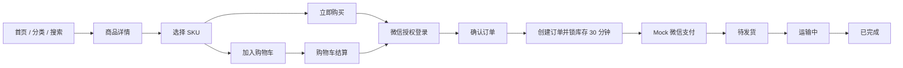

# 洗化产品私域商城原型设计方案

## 1. 文档目的

本文定义洗化产品私域商城 MVP 的页面原型、交互范围、视觉规范与 Figma 交付规则。原型用于产品评审、研发对齐和后续视觉深化，不替代 PRD 中的业务规则与验收标准。

关联文档：

- `docs/01-需求调研/MVP方案.md`
- `docs/02-方案设计/PRD产品需求文档.md`
- `prototype/index.html`
- `prototype/admin.html`
- `prototype/figma-handoff.md`

## 2. 原型交付形式

本阶段交付两套可点击高保真 HTML 原型，并提供可直接导入 Figma 的页面命名、画板尺寸、组件结构和设计令牌。

| 交付物 | 用途 | 基准尺寸 |
| --- | --- | --- |
| 微信小程序交互原型 | 浏览、选购、下单、订单及售后流程评审 | 375 × 812，同时支持 414 宽度 |
| PC 管理后台交互原型 | 经营看板、商品、订单、售后、客户操作评审 | 1440 × 1000，兼容 1024 宽度 |
| PNG 画面导出 | 需求评审、汇报及 Figma 参考图 | 与对应画板一致 |
| Figma 重建规范 | 设计团队建立组件库和页面文件 | Auto Layout + Variables |

说明：当前工作区没有可用的 Figma 写入连接器，因此不直接生成云端 `.fig` 文件。HTML 原型是本阶段的视觉真相来源；设计师可按本文规范重建，或使用 Figma 的网页导入插件导入后整理为组件。

## 3. 体验原则

1. 商品优先：首屏优先呈现真实商品和可执行的购买入口。
2. 安静清晰：使用克制的色彩与紧凑层级，不采用营销落地页式的大卡片堆叠。
3. 状态明确：价格、库存、订单和售后状态必须有明确文字，不只依赖颜色。
4. 操作可恢复：登录、支付、网络异常后保留用户上下文，避免重复填写。
5. MVP 收敛：会员价、优惠券、积分、分销、拼团、秒杀、导出等延期功能不在首期界面出现。

## 4. 品牌与视觉方向

原型统一使用“青序生活”作为视觉占位品牌，不构成最终品牌命名决策。正式开发前可替换品牌名称、Logo 和商品素材，不影响页面结构。

视觉关键词：清新植物、现代日用护理、专业可信、生活方式、克制高级。

### 4.1 色彩令牌

| Token | 色值 | 用途 |
| --- | --- | --- |
| `color/sage/600` | `#496859` | 主操作、选中态、植物护理语义 |
| `color/blue/600` | `#2F6578` | 信息、物流、辅助重点 |
| `color/coral/500` | `#E27766` | 价格、提醒、售后强调 |
| `color/charcoal/900` | `#202522` | 主文本、标题 |
| `color/neutral/600` | `#68706B` | 次要文本 |
| `color/neutral/200` | `#E7EAE8` | 分隔线、输入边框 |
| `color/neutral/050` | `#F7F8F7` | 页面浅背景 |
| `color/white` | `#FFFFFF` | 内容背景 |

禁止使用大面积渐变、装饰性光斑和单一色系铺满界面。商品图承担主要视觉表达。

### 4.2 栅格与尺寸

| 项目 | 小程序 | 管理后台 |
| --- | --- | --- |
| 基础网格 | 4px | 4px |
| 页面边距 | 16px | 24px，宽屏可为 32px |
| 常用间距 | 8 / 12 / 16 / 24px | 8 / 12 / 16 / 24 / 32px |
| 卡片圆角 | 8px | 6-8px |
| 输入框高度 | 44px | 36-40px |
| 最小点击区域 | 44 × 44px | 36 × 36px |
| 分隔线 | 1px | 1px |

### 4.3 字体层级

使用系统中文字体栈：`-apple-system, BlinkMacSystemFont, "Segoe UI", "PingFang SC", "Microsoft YaHei", sans-serif`。

| 层级 | 字号/行高 | 字重 |
| --- | --- | --- |
| 页面主标题 | 24/32，小程序局部为 22/30 | 600-700 |
| 区块标题 | 18/26 | 600 |
| 卡片标题 | 15-16/22 | 600 |
| 正文 | 14/22 | 400 |
| 辅助信息 | 12/18 | 400-500 |
| 价格 | 18-24/28 | 700 |

## 5. 小程序原型

### 5.1 页面矩阵

| 原型导航 | PRD 页面 | 主要内容 | 关键交互 |
| --- | --- | --- | --- |
| 01 首页 | MP-01 | Banner、分类、热销、新品 | 搜索、分类跳转、商品详情 |
| 02 分类选购 | MP-02 | 一级分类、品牌筛选、商品列表 | 分类切换、排序、商品详情 |
| 03 搜索结果 | MP-03 | 关键词、品牌和分类检索 | 搜索、空结果、进入商品 |
| 04 商品详情 | MP-04、MP-05 | 轮播、品牌、介绍、规格、成分、用法、零售价、库存、销量 | 收藏、SKU 弹层、加购、立即购买 |
| 05 购物车 | MP-06 | 有效商品、数量、失效状态、合计 | 选择、改数量、删除、结算 |
| 06 确认订单 | MP-08、MP-09 | 地址、商品、运费、金额、备注 | 地址选择、创建订单、Mock 支付 |
| 07 我的订单 | MP-10 至 MP-12 | 五类订单状态、物流与收货 | 筛选、付款、查看物流、确认收货 |
| 08 退款售后 | MP-13、MP-14 | 仅退款、退货退款、凭证、进度 | 提交申请、填写退货信息 |
| 09 个人中心 | MP-18、MP-15、MP-17 | 用户信息、订单入口、地址、收藏、客服 | 登录、订单跳转、地址与收藏 |

### 5.2 购买主流程



### 5.3 必备状态

- 首页模块无数据时隐藏对应区块，不保留空白占位。
- 商品下架或售罄时禁用购买按钮，并保留基本商品信息。
- SKU 不可售时禁选；库存不足时回退到可购买数量。
- 购物车区分有效与失效商品，失效商品不可结算。
- 创建订单前由服务端重新校验价格、库存和商品状态。
- Mock 支付包含成功、失败、取消、处理中四类反馈。
- 物流未录入时显示“等待商家发货”，不伪造物流轨迹。
- 售后超期、重复申请、审核拒绝和退款失败均需给出原因及下一步。

## 6. 管理后台原型

### 6.1 页面矩阵

| 原型页面 | PRD 页面 | 主要内容 | 关键操作 |
| --- | --- | --- | --- |
| 登录 | ADM-01 | 账号、密码、登录状态 | 登录、显示密码、错误提示 |
| 数据看板 | ADM-02 | 销售额、订单、客户、排行、待办 | 日期查看、跳转待处理任务 |
| 商品列表 | ADM-03 | 搜索、品牌、分类、状态、库存、推荐 | 新增、编辑、上下架、推荐 |
| 商品编辑 | ADM-04 | 基本信息、图片、详情、SKU、库存 | 草稿、保存并上架 |
| 订单列表 | ADM-09 | 状态筛选、客户、商品、实付、时间 | 查询、查看、发货 |
| 订单详情 | ADM-10、ADM-11 | 商品快照、金额、地址、支付、物流、日志 | 填写承运商和运单号 |
| 售后审核 | ADM-12、ADM-13 | 申请、凭证、可退金额、退货信息 | 同意、拒绝、确认收货退款 |
| 客户管理 | ADM-14、ADM-15 | 注册时间、订单次数、净消费、最近购买 | 搜索、查看详情 |

品牌、分类、Banner、库存、管理员与审计在 PRD 中完整定义，本轮高保真原型以交易与日常运营主路径为重点；开发阶段按统一列表和表单组件扩展。

### 6.2 后台操作原则

- 删除、下架、关闭订单、拒绝售后和确认退款使用二次确认。
- 表格筛选条件在返回列表时保留，分页默认每页 20 条。
- 商品价格和库存按 SKU 维护，首期仅零售价，不出现会员价字段。
- 订单状态由合法动作推进，管理员不能任意修改状态字符串。
- 手机号和完整地址按角色权限脱敏；关键操作写入审计日志。
- 窄屏折叠侧栏，表格允许水平滚动，操作按钮不覆盖字段内容。

## 7. Figma 文件结构

建议建立一个 Figma 文件，页面结构如下：

```text
00_Cover
01_Foundations
02_Components_MiniProgram
03_Components_Admin
10_MiniProgram_Flow
20_Admin_Flow
90_Archive
```

### 7.1 画板命名

小程序：`MP/01/Home/Default`、`MP/04/Product/Default`、`MP/04/Product/SKU-Sheet`、`MP/06/Cart/Default`、`MP/08/Checkout/Default`。

后台：`ADM/01/Login/1440`、`ADM/02/Dashboard/1440`、`ADM/03/ProductList/1440`、`ADM/04/ProductEdit/1440`、`ADM/09/OrderList/1440`。

状态画板统一使用：`Default`、`Loading`、`Empty`、`Error`、`Disabled`、`Success`。

### 7.2 组件命名

```text
MP/Button/{Primary|Secondary|Text}/{Default|Pressed|Disabled}
MP/ProductCard/{Grid|List}/{Default|SoldOut}
MP/OrderCard/{PendingPayment|PendingShipment|Shipping|Completed|AfterSale}
MP/Sheet/SkuSelector
ADM/Button/{Primary|Secondary|Danger}/{Default|Hover|Disabled}
ADM/Table/{Header|Row|Empty|Loading}
ADM/Form/{Input|Select|Upload|SkuRow}
ADM/StatusTag/{Order|Payment|Shipment|AfterSale}
```

组件采用 Auto Layout；颜色、字体、间距和圆角建立 Variables。商品图片使用 Fill，不转为矢量；图标保持 20 或 24px，并设置明确的 hover tooltip。

## 8. 素材说明

原型素材位于 `prototype/assets/`：

- `hero-banner.png`：首页植物系洗化组合主视觉。
- `product-sheet.png`：八类商品包装的统一生成底图。
- `product-1.png` 至 `product-8.png`：按品类裁切的商品图。

素材为本阶段通过内置图像生成模型创建的无品牌占位图，只用于原型与内部评审。正式上线前必须替换为拥有使用权的品牌商品图，并完成图片压缩、CDN 和内容审核。

### 8.1 生成提示词

Banner 提示词：高端洗化与家庭护理组合场景，产品陈列在画面右侧，左侧保留文案负空间；白色、植物绿、灰蓝与珊瑚色平衡配色；真实摄影质感；不包含人物、品牌 Logo、文字或渐变。

商品图提示词：严格 4 × 2 网格的八款独立棚拍包装，依次为精华液、洗发水、沐浴露、防晒乳、香水、彩妆粉盒、男士洁面和家庭清洁喷雾；统一白色背景、柔和阴影、正面完整包装；不包含人物、品牌 Logo 或文字。

## 9. 评审检查清单

- 页面信息、状态与 PRD 编号一致。
- 小程序 375 和 414 宽度无文字截断或控件重叠。
- 后台 1440 和 1024 宽度可完成核心操作。
- 所有主要按钮可点击并获得明确反馈。
- 商品图、价格、库存、销量和订单状态均有真实感示例。
- 无会员价、优惠券、积分、分销、拼团、秒杀和 Excel 导出入口。
- 支付、物流和退款明确标注为 Mock 或人工录入边界。
- 高风险操作有确认、失败和防重复提交设计。

## 10. 下一阶段输入

进入开发前需由业务方补充或确认：正式品牌名称与 Logo、商品主数据、真实图片版权、微信小程序主体与 AppID、商户号、运费规则、售后地址、隐私政策和客服联系方式。
