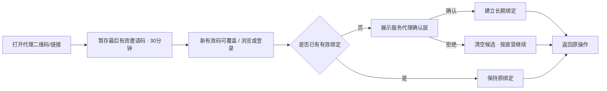

# 洗化产品私域商城三端原型设计方案

## 1. 文档目的

本文定义洗化产品私域商城当前版本的三端页面原型、关键交互、响应式规则与 Figma 重建设计规范。原型用于需求评审、角色权限核对和后续技术设计输入，不是生产前端工程，也不替代 PRD 的业务规则。

关联文档：

- `docs/01-需求调研/MVP方案.md`
- `docs/01-需求调研/三端角色与代理需求确认.md`
- `docs/02-方案设计/PRD产品需求文档.md`
- `docs/04-风控管理/需求变更记录.md`
- `prototype/index.html`
- `prototype/admin.html`
- `prototype/agent.html`
- `prototype/figma-handoff.md`
- `prototype/agent-figma-handoff.md`

## 2. 原型交付范围

本阶段交付三套可点击高保真 HTML 原型与 Figma 重建规范，仅用于设计验证。

| 交付物 | 用户 | 基准尺寸 | 重点验证 |
|---|---|---|---|
| 消费者小程序原型 | `CUSTOMER` | 375 × 812，兼容 414 宽度 | 浏览、购买、履约、售后、首次代理绑定 |
| 一级代理工作台原型 | `AGENT_ADMIN` | 1440 × 1000、1024 宽度、390 移动 H5 | 推广、脱敏客户与订单、佣金、银行卡、提现 |
| 总部管理后台原型 | `SUPER_ADMIN` | 1440 × 1000，兼容 1024 宽度 | 统一经营、代理管理、归属转移、提现审核 |
| PNG 画面导出 | 评审参与者 | 与画板一致 | 评审、汇报和视觉对照 |
| Figma 重建规范 | 设计师 | Auto Layout + Variables | 组件库、页面和状态重建 |

当前不直接生成云端 `.fig` 文件。HTML 原型和本规范共同作为视觉真相来源，设计师可使用网页导入工具导入后整理为 Figma 组件。

## 3. 三端体验原则

1. 角色清楚：消费者、一级代理与总部超级管理员拥有独立入口和导航，不混用角色名称。
2. 总部统一经营：消费者始终向总部商城购买，代理界面不出现改价、库存、收款、发货或售后处理动作。
3. 单层代理：所有页面只出现一级代理，不设计下级、团队或层级树。
4. 数据最小化：代理端客户手机号只显示后四位，订单地址只显示城市，不设计查看明文入口。
5. 账务可解释：预计佣金、可提现、冻结、退款冲正和负余额使用明确名称和流水，不用单一“收益”模糊表达。
6. 状态可恢复：网络失败、登录中断、二维码生成失败和提现上传失败均保留上下文并支持重试。
7. 界面克制：运营工具保持紧凑、可扫描；消费者端由商品视觉承担主要表达。

## 4. 品牌与视觉方向

原型继续使用“青序生活”作为视觉占位品牌，不构成最终命名。视觉关键词：清新植物、现代日用护理、专业可信、克制高级。

### 4.1 色彩令牌

| Token | 色值 | 用途 |
|---|---|---|
| `color/sage/600` | `#496859` | 主操作、选中态、植物护理语义 |
| `color/blue/600` | `#2F6578` | 信息、物流、代理渠道辅助重点 |
| `color/coral/500` | `#E27766` | 价格、负向冲正、风险提醒 |
| `color/amber/600` | `#A66B18` | 待审核、预计佣金、冻结状态 |
| `color/charcoal/900` | `#202522` | 标题和主文本 |
| `color/neutral/600` | `#68706B` | 次要文本 |
| `color/neutral/200` | `#E7EAE8` | 边框和分隔线 |
| `color/neutral/050` | `#F7F8F7` | 页面浅背景 |
| `color/white` | `#FFFFFF` | 内容背景 |

禁止大面积渐变、装饰性光斑、过度圆角和单一色系铺满界面。状态除颜色外必须包含文字或图标。

### 4.2 栅格与尺寸

| 项目 | 小程序 | 代理工作台 | 总部后台 |
|---|---|---|---|
| 基础网格 | 4px | 4px | 4px |
| 页面边距 | 16px | PC 24-32px；H5 16px | 24-32px |
| 常用间距 | 8/12/16/24px | 8/12/16/24/32px | 8/12/16/24/32px |
| 卡片圆角 | 8px | 6-8px | 6-8px |
| 输入框高度 | 44px | PC 40px；H5 44px | 36-40px |
| 最小点击区域 | 44 × 44px | H5 44 × 44px；PC 36 × 36px | 36 × 36px |
| 表格最小行高 | 不适用 | 48px | 48px |

### 4.3 字体层级

使用系统中文字体栈：`-apple-system, BlinkMacSystemFont, "Segoe UI", "PingFang SC", "Microsoft YaHei", sans-serif`。

| 层级 | 字号/行高 | 字重 |
|---|---|---|
| 页面主标题 | 22-24/30-32 | 600-700 |
| 区块标题 | 18/26 | 600 |
| 卡片/表格标题 | 14-16/22 | 600 |
| 正文 | 14/22 | 400 |
| 辅助信息 | 12/18 | 400-500 |
| 关键金额 | 20-28/32 | 700 |

页面标题在紧凑经营端不使用超大字号，不通过视口宽度动态缩放字体。

## 5. 消费者小程序原型

### 5.1 页面矩阵

| 原型导航 | PRD 页面 | 主要内容 | 关键交互 |
|---|---|---|---|
| 01 首页 | MP-01 | Banner、分类、热销、新品 | 搜索、分类与商品跳转 |
| 02 分类选购 | MP-02 | 分类、品牌、商品列表 | 切换、排序、详情 |
| 03 搜索结果 | MP-03 | 关键词、品牌、分类 | 搜索、清空筛选、详情 |
| 04 商品详情 | MP-04、MP-05 | 图集、品牌、规格、成分、用法、价格、库存 | 收藏、SKU、加购、立即购买 |
| 05 购物车 | MP-06 | 有效/失效商品、数量、合计 | 选择、修改、删除、结算 |
| 06 确认订单 | MP-08、MP-09 | 地址、商品、金额、Mock 支付 | 创建、支付反馈 |
| 07 我的订单 | MP-10 至 MP-12 | 订单状态、物流和收货 | 筛选、付款、物流、确认收货 |
| 08 退款售后 | MP-13、MP-14 | 两类售后、凭证、进度 | 提交、退货物流、查看原因 |
| 09 个人中心 | MP-18、MP-15 至 MP-17 | 用户、订单、地址、收藏 | 登录和功能跳转 |
| 10 服务代理 | MP-07、MP-19 | 首次绑定确认、当前服务代理 | 确认/取消首次绑定，只读查看 |

### 5.2 代理绑定交互

首次有效来源流程：



确认层必须包含：代理名称、候选剩余有效时间、总部商城标识、“价格、发货和售后由总部商城统一负责”、明确确认和拒绝。未绑定游客只保留最后一个有效候选，TTL 30 分钟；拒绝立即清空。不得使用“成为下级”“团队”或分佣文案。

个人中心“服务代理”使用只读详情行。消费者不可改绑或查看佣金；需要变更时提示联系商城客服。

### 5.3 购买主流程


### 5.4 必备状态

- 邀请码无效或代理停用：不覆盖仍有效候选，不阻断购物，不展示内部停用原因。
- 已绑定用户打开其他代理链接：维持原关系，不展示改绑按钮。
- 商品下架、售罄、SKU 不可售、价格变化和库存不足。
- 购物车有效/失效分组，创建订单前服务端复核。
- Mock 支付成功、失败、取消和处理中。
- 物流未录入、运输中、已签收和状态更新失败。
- 售后超期、重复申请、拒绝、待退货、退款中和退款失败。

## 6. 一级代理工作台原型

### 6.1 页面矩阵

| 原型页面 | PRD 页面 | 主要内容 | 关键操作 |
|---|---|---|---|
| 登录与改密 | AGT-01 | 账号、密码、停用、首次改密 | 登录、显示密码、强制改密 |
| 概览 | AGT-02 | 归属销售、订单、客户、预计、可提现、冻结、趋势 | 日期切换、跳转明细 |
| 推广中心 | AGT-03 | 默认全部当前/未来在售商品或自定义白名单、主页推广、二维码与链接 | 搜索、生成、复制、下载 |
| 客户 | AGT-04 | 当前归属脱敏客户、绑定、消费汇总、最近商品 | 筛选、查看只读详情；转出后移除 |
| 订单 | AGT-05 | 归属订单、商品、金额、状态、售后 | 筛选、查看只读详情 |
| 佣金 | AGT-06 | 预计、入账、退款冲正、关联订单 | 日期/类型筛选、查看口径 |
| 钱包与提现 | AGT-07 | 可提现、冻结、负余额、银行卡和申请 | 填写金额、二次确认、提交 |
| 提现记录 | AGT-08 | 四种状态、时间、原因、凭证摘要 | 筛选、查看详情 |
| 账户安全 | AGT-09 | 档案、比例、密码、银行卡 | 改密、绑卡/换卡、退出 |

### 6.2 桌面布局

- 左侧固定 216-232px 导航，内容区最大宽度 1440px 内自适应。
- 顶部显示代理名称、账号状态和用户菜单，不显示总部管理功能。
- 概览首行使用稳定四列指标，1024px 时重排为两列。
- 表格筛选区保持单层；金额、订单和客户字段按扫描优先级排列。
- 列表详情使用侧边抽屉或独立页，不在卡片内再嵌套卡片。

### 6.3 移动 H5 布局

- 390px 使用单列布局，底部主导航固定为概览、推广、订单、钱包、更多。
- 客户、佣金与账户放入“更多”，保留清晰返回路径。
- 桌面表格在移动端转换为摘要行，不直接缩小整个表格。
- 摘要行固定展示订单号/客户掩码、金额、状态和日期，点击进入详情。
- 二维码以完整正方形显示，复制和下载使用图标按钮并提供 tooltip/反馈。
- 提现确认使用底部操作层，长银行卡号必须掩码并换行，不允许撑出容器。

### 6.4 隐私与权限呈现

- 客户示例格式：`周** · 手机尾号 4821 · 杭州`。
- 订单地址仅显示城市，例如“浙江省杭州市”，不展示街道和门牌。
- 页面不提供“查看完整手机号”“查看完整地址”或任何越权入口。
- 商品卡没有改价、改库存、上下架、发货和售后按钮。
- 订单详情没有代付款、代客下单、发货、退款或改状态按钮。
- 客户转出后从当前列表和详情移除；原代理仅在历史订单看到支付时冻结的昵称、手机后四位和城市快照。
- 停用状态只允许显示联系总部的静态说明，不展示业务数据。

### 6.5 佣金与钱包状态

- 预计佣金使用琥珀色信息标签，文案“待订单完成后转为可提现”。
- 可提现余额使用主色，并直接提供“申请提现”按钮。
- 完成前全退显示 `CANCELLED`；完成后退款使用 `REFUND_DEBIT` 珊瑚色负数和关联原因，原 `AVAILABLE` 正向记录仍可查看。
- 负余额必须显示金额、原因和“当前不可提现，后续佣金将优先抵扣”。
- 冻结金额显示关联提现单，不与预计佣金混为一项。

### 6.6 提现状态

| 状态 | 页面表现 | 可执行动作 |
|---|---|---|
| `PENDING` | 琥珀标签“待审核” | 只读；当前版本不可撤回 |
| `APPROVED` | 蓝色标签“已通过，待打款” | 只读 |
| `REJECTED` | 珊瑚标签“已拒绝”并显示原因 | 可返回钱包重新申请 |
| `PAID` | 绿色标签“已支付”并显示支付时间 | 查看凭证摘要 |

## 7. 总部管理后台原型

### 7.1 页面矩阵

| 原型页面 | PRD 页面 | 主要内容 | 关键操作 |
|---|---|---|---|
| 登录 | ADM-01 | 超级管理员账号、密码 | 登录、错误和安全提示 |
| 数据看板与销售分析 | ADM-02 | 概览、日/月销售报表、商品销量排行、客户消费排行、渠道和待办 | 标签切换、日期筛选、加载/空/错误/重试 |
| 商品与库存 | ADM-03 至 ADM-08 | 商品、SKU、价格、库存、内容 | 增删改、上下架、调整 |
| 订单与发货 | ADM-09 至 ADM-11 | 订单、代理快照、支付、物流 | 查询、发货、兜底完成 |
| 售后 | ADM-12、ADM-13 | 申请、退款和佣金影响 | 审核、确认退货、退款 |
| 客户 | ADM-14、ADM-15 | 消费、当前代理、绑定历史 | 查看、转移归属 |
| 账户与业务规则 | ADM-16 | 账户安全、最低提现金额、售后申请天数 | 改密、规则校验、保存与审计提示 |
| 一级代理 | ADM-18、ADM-19 | 账号、比例、邀请码、状态、全部在售/白名单授权、经营与钱包 | 创建、编辑、调比、授权、停用、重置密码 |
| 提现审核 | ADM-20、ADM-21 | 申请、余额、银行卡快照、短时收款账号、凭证 | 通过、拒绝、二次验证查看/复制、上传凭证、标记已支付 |
| 审计 | ADM-17 | 关键操作与前后值 | 搜索、查看详情 |

### 7.2 代理管理交互

- 代理列表主列：代理名称/编号、状态、当前比例、绑定客户、归属净销售、可提现余额、创建时间。
- 创建成功后临时密码只展示一次，支持复制，不在列表回显。
- 调整比例明确提示“以支付成功时比例为准，已支付订单不变”，保存前展示旧值与新值。
- 商品授权默认“全部在售商品”，说明自动包含未来上架商品；切换“自定义白名单”后提供商品搜索、批量选择和空白名单警告。
- 停用确认提示：禁止登录和新绑定、支付前候选转直营；已支付冻结佣金不受影响。重新启用不追溯停用期订单，邀请码还需自身有效。
- 代理详情包含概览、客户、订单、佣金、提现、操作日志标签页，不出现下级或团队标签页。

### 7.3 客户归属转移交互

- 客户详情展示当前归属、绑定时间和历史绑定时间线。转出后，原代理当前客户视图立即移除该客户。
- 转移弹窗支持选择 ACTIVE 一级代理或“转为直营”。
- 必须填写原因，并明确“仅影响转移后提交的新订单；既有候选、历史订单与佣金不变”。
- 二次确认后显示成功反馈和新的有效起始时间。

### 7.4 提现审核交互

- 列表默认突出待审核和已通过待付款，可按代理、金额、状态、时间筛选。
- 详情默认显示申请金额、申请时余额、当前余额、银行卡掩码和状态时间线。
- “审核通过”和“标记已支付”是两个独立按钮与权限动作。
- 仅 `APPROVED` 待付款状态显示“查看收款账号”；点击后先二次验证，再在带倒计时的受控区域短时显示并允许一次性复制，超时或离页自动遮蔽。
- 拒绝原因必填，确认后提示金额会解冻。
- 标记已支付必须先上传凭证；上传失败时保持 `APPROVED`。
- 已支付后金额、银行卡快照和凭证均只读，不允许覆盖历史。

### 7.5 高风险动作

| 动作 | 交互保护 |
|---|---|
| 停用代理 | 二次确认 + 影响说明 + 审计 |
| 重置代理密码 | 二次确认 + 临时密码仅展示一次 |
| 修改佣金比例 | 显示前后值 + 支付时冻结/已支付不变说明 |
| 转移客户归属 | 原/新代理 + 原因 + 历史不变说明 |
| 拒绝提现 | 原因必填 + 解冻金额说明 |
| 查看/复制完整收款账号 | 仅待付款 + 二次验证 + 倒计时 + 超时遮蔽 + 全审计 |
| 标记已支付 | 付款凭证必填 + 金额/银行卡二次核对 |
| 退款 | 显示订单退款金额和佣金冲正影响 |

## 8. Figma 文件结构

建议建立一个 Figma 文件：

```text
00_Cover
01_Foundations
02_Components_MiniProgram
03_Components_Agent
04_Components_Admin
10_MiniProgram_Flow
20_Agent_Desktop_Flow
21_Agent_Mobile_Flow
30_Admin_Flow
80_Edge_Cases
90_Archive
```

### 8.1 画板命名

小程序示例：

- `MP/01/Home/Default`
- `MP/04/Product/SKU-Sheet`
- `MP/07/Login/Agent-Binding`
- `MP/19/Service-Agent/Bound`

代理工作台示例：

- `AGT/01/Login/Desktop`
- `AGT/01/Force-Password/Desktop`
- `AGT/02/Dashboard/1440`
- `AGT/03/Promotion/QR-Modal`
- `AGT/06/Commission/Refund-Reversal`
- `AGT/07/Wallet/Negative-Balance`
- `AGT/07/Withdrawal/390`

总部后台示例：

- `ADM/18/Agent-List/1440`
- `ADM/19/Agent-Detail/Commission`
- `ADM/19/Agent-Detail/Product-Whitelist`
- `ADM/16/Business-Rules/Default`
- `ADM/02/Sales-Report/Month`
- `ADM/15/Customer/Transfer-Agent`
- `ADM/20/Withdrawal-List/1440`
- `ADM/21/Withdrawal/Mark-Paid`
- `ADM/21/Withdrawal/Reauth-Reveal`

状态后缀统一为：`Default`、`Loading`、`Empty`、`Error`、`Disabled`、`Success`、`Permission-Denied`。

### 8.2 组件命名

```text
MP/Button/{Primary|Secondary|Text}/{Default|Pressed|Disabled}
MP/ProductCard/{Grid|List}/{Default|SoldOut}
MP/Sheet/AgentBinding/{Prompt|Bound|Invalid}
AGT/Nav/{Sidebar|BottomBar}
AGT/Metric/{Sales|Order|Customer|Expected|Available|Frozen|Negative}
AGT/CustomerRow/{Desktop|Mobile}
AGT/CommissionRow/{Expected|Available|Reversal}
AGT/WithdrawalStatus/{Pending|Approved|Rejected|Paid}
ADM/Table/{Header|Row|Empty|Loading}
ADM/Form/{Input|Select|Upload|SkuRow}
ADM/Dialog/{AgentDisable|RateChange|BindingTransfer|WithdrawalReview|PaymentProof}
ADM/StatusTag/{Order|AfterSale|Agent|Withdrawal}
```

组件使用 Auto Layout；颜色、字体、间距、圆角和响应式断点建立 Variables。图标优先使用现有图标库，陌生图标提供 tooltip。

## 9. 原型数据要求

- 所有商品、订单、客户、代理、银行卡和付款凭证均为演示数据。
- 代理端客户手机号必须使用后四位样例，地址只到城市。
- 默认银行卡示例格式：`招商银行 · 尾号 6288`。仅“二次验证后短时查看”专用状态可使用明确标注为演示数据的完整虚构账号，并同时显示倒计时与自动遮蔽提示。
- 佣金示例必须同时包含预计、可提现和退款负向流水。
- 钱包示例至少包含正常余额、冻结金额和负余额三种状态。
- 总部代理列表至少包含 ACTIVE 与 DISABLED；提现至少包含四种状态。
- 消费者示例必须包含首次绑定确认和已绑定只读两种状态。

## 10. 素材说明

商品与 Banner 素材继续使用 `prototype/assets/` 中的无品牌占位图片，仅用于内部评审。正式上线前必须替换为具有使用权的真实品牌商品图，并完成压缩、CDN 与内容审核。

二维码由原型生成演示图形，仅验证版式和交互，不应作为真实可追踪二维码投放。

## 11. 评审检查清单

- 三端原型对 PRD 页面 ID 保持可追踪覆盖；一个综合画板可以覆盖多个相关页面 ID，不要求机械的一页一画板。
- 全部角色使用超级管理员、一级代理和消费者，游客只作为状态。
- 页面没有旧版后台角色、二级代理、下级、团队佣金或代理进货文案。
- 消费者可看见服务代理，但看不见佣金或改绑入口。
- 代理只能推广和只读查看本人脱敏数据，没有经营、履约和售后写操作。
- 收货/总部兜底完成后佣金立即可提现，不出现 7 天等待期。
- 完成前全退以 `CANCELLED` 呈现；完成后退款以 `REFUND_DEBIT` 负向流水呈现；负余额有禁用提现与未来抵扣说明。
- 提现区分待审核、已通过待打款、已拒绝和已支付。
- 总部审核通过与上传凭证标记支付是两个独立动作。
- 完整收款账号默认掩码，仅在付款环节二次验证后短时一次性查看/复制，并有倒计时、自动遮蔽和审计反馈。
- ADM-02 覆盖固定日/月销售、商品销量、客户消费排行；ADM-16 覆盖最低提现和售后天数配置；ADM-19 覆盖商品授权模式。
- 小程序 375/414、代理 390/1024/1440、总部 1024/1440 无关键重叠和页面横向溢出。
- 高风险动作具备确认、原因、失败、防重复和审计提示。

## 12. 下一阶段门禁

当前阶段只完成需求与原型设计。进入技术设计前，业务方需评审：

1. 三端角色和单层代理边界；
2. 首次绑定与人工转移规则；
3. 佣金基数、完成即入账、退款冲正和负余额；
4. 提现门槛、线下银行转账和凭证流程；
5. 三端页面范围、关键状态和隐私样例。

上述内容签字或书面确认后，才进入系统架构、数据库 ERD、API 契约和开发任务拆分。
