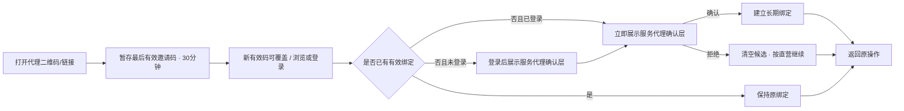
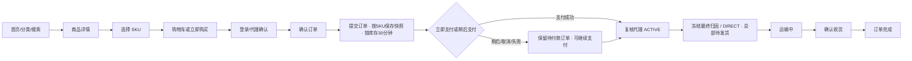

# 洗化产品私域商城三端原型设计方案

> 设计基线：PRD v2.3 / CH-004
> 更新日期：2026-08-11

## 1. 文档目的

本文定义洗化产品私域商城当前版本的三端页面原型、关键交互、响应式规则与 Figma 重建设计规范。原型用于需求评审、角色权限核对和后续技术设计输入，不是生产前端工程，也不替代 PRD 的业务规则。

CH-004 只调整数据库托管选型，不改变任何端内页面、交互、功能 ID、状态样例或验收统计；现有三端原型继续作为 v2.3 的视觉与交互基线。Supabase Auth、Storage、Data API/PostgREST/Realtime 均不进入原型范围。

关联文档：

- `docs/01-需求调研/MVP方案.md`
- `docs/01-需求调研/三端角色与代理需求确认.md`
- `docs/02-方案设计/PRD产品需求文档.md`
- `docs/04-风控管理/需求变更记录.md`
- `prototype/index.html`
- `prototype/admin.html`
- `prototype/agent.html`
- `prototype/figma-handoff.md`
- `prototype/agent-figma-handoff.md`

## 2. 原型交付范围

本阶段交付三套可点击高保真 HTML 原型与 Figma 重建规范，仅用于设计验证。

| 交付物 | 用户 | 基准尺寸 | 重点验证 |
|---|---|---|---|
| 消费者小程序原型 | `CUSTOMER` | 375 × 812，兼容 414 宽度 | 浏览、购买、履约、售后、首次代理绑定 |
| 一级代理工作台原型 | `AGENT_ADMIN` | 1440 × 1000、1024 宽度、390 移动 H5 | 推广、SKU 预计佣金、脱敏客户与订单、订单项佣金快照、银行卡、提现 |
| 总部管理后台原型 | `SUPER_ADMIN` | 1440 × 1000，兼容 1024 宽度 | 统一经营、代理管理、统一佣金规则、归属转移、提现审核 |
| PNG 画面导出 | 评审参与者 | 与画板一致 | 评审、汇报和视觉对照 |
| Figma 重建规范 | 设计师 | Auto Layout + Variables | 组件库、页面和状态重建 |

当前不直接生成云端 `.fig` 文件。HTML 原型和本规范共同作为视觉真相来源，设计师可使用网页导入工具导入后整理为 Figma 组件。v2.3 沿用已通过的 CH-003 功能原型验收结果；CH-004 无页面变化，不新增重复视觉验收范围。

## 3. 三端体验原则

1. 角色清楚：消费者、一级代理与总部超级管理员拥有独立入口和导航，不混用角色名称。
2. 总部统一经营：消费者始终向总部商城购买，代理界面不出现改价、库存、收款、发货或售后处理动作。
3. 单层代理：所有页面只出现一级代理，不设计下级、团队或层级树。
4. 数据最小化：代理端只显示已验证账户手机号后四位，未授权显示“未绑定”；订单地址只显示城市，不设计查看明文入口。
5. 账务可解释：预计佣金、可提现、冻结、退款冲正和负余额使用明确名称和流水，不用单一“收益”模糊表达。
6. 规则一致：所有一级代理共用平台商品佣金规则；代理界面不出现独立比例配置，总部通过 `ADM-22` 管理平台默认、一级分类默认和 SKU 覆盖。
7. 授权与佣金分离：自定义商品白名单只限制推广可见和物料生成；绑定客户购买全店任意 SKU 仍按统一规则计佣。
8. 状态可恢复：网络失败、登录中断、支付取消/超时、退款失败、二维码生成失败和提现上传失败均保留上下文并支持重试。
9. 隐私最小化：账户手机号独立可空，未授权显示“未绑定”，不得使用收货地址手机号替代。
10. 界面克制：运营工具保持紧凑、可扫描；消费者端由商品视觉承担主要表达。

## 4. 品牌与视觉方向

原型继续使用“青序生活”作为视觉占位品牌，不构成最终命名。视觉关键词：清新植物、现代日用护理、专业可信、克制高级。

### 4.1 色彩令牌

| Token | 色值 | 用途 |
|---|---|---|
| `color/sage/600` | `#496859` | 主操作、选中态、植物护理语义 |
| `color/blue/600` | `#2F6578` | 信息、物流、代理渠道辅助重点 |
| `color/coral/500` | `#E27766` | 价格、负向冲正、风险提醒 |
| `color/amber/600` | `#A66B18` | 待审核、预计佣金、冻结状态 |
| `color/charcoal/900` | `#202522` | 标题和主文本 |
| `color/neutral/600` | `#68706B` | 次要文本 |
| `color/neutral/200` | `#E7EAE8` | 边框和分隔线 |
| `color/neutral/050` | `#F7F8F7` | 页面浅背景 |
| `color/white` | `#FFFFFF` | 内容背景 |

禁止大面积渐变、装饰性光斑、过度圆角和单一色系铺满界面。状态除颜色外必须包含文字或图标。

### 4.2 栅格与尺寸

| 项目 | 小程序 | 代理工作台 | 总部后台 |
|---|---|---|---|
| 基础网格 | 4px | 4px | 4px |
| 页面边距 | 16px | PC 24-32px；H5 16px | 24-32px |
| 常用间距 | 8/12/16/24px | 8/12/16/24/32px | 8/12/16/24/32px |
| 卡片圆角 | 8px | 6-8px | 6-8px |
| 输入框高度 | 44px | PC 40px；H5 44px | 36-40px |
| 最小点击区域 | 44 × 44px | H5 44 × 44px；PC 36 × 36px | 36 × 36px |
| 表格最小行高 | 不适用 | 48px | 48px |

### 4.3 字体层级

使用系统中文字体栈：`-apple-system, BlinkMacSystemFont, "Segoe UI", "PingFang SC", "Microsoft YaHei", sans-serif`。

| 层级 | 字号/行高 | 字重 |
|---|---|---|
| 页面主标题 | 22-24/30-32 | 600-700 |
| 区块标题 | 18/26 | 600 |
| 卡片/表格标题 | 14-16/22 | 600 |
| 正文 | 14/22 | 400 |
| 辅助信息 | 12/18 | 400-500 |
| 关键金额 | 20-28/32 | 700 |

页面标题在紧凑经营端不使用超大字号，不通过视口宽度动态缩放字体。

## 5. 消费者小程序原型

### 5.1 页面矩阵

| 原型导航 | PRD 页面 | 主要内容 | 关键交互 |
|---|---|---|---|
| 01 首页 | MP-01 | Banner、分类、热销、新品 | 搜索、分类与商品跳转 |
| 02 分类选购 | MP-02 | 分类、品牌、商品列表 | 切换、排序、详情 |
| 03 搜索结果 | MP-03 | 关键词、品牌、分类 | 搜索、清空筛选、详情 |
| 04 商品详情 | MP-04、MP-05 | 图集、品牌、规格、成分、用法、价格、库存 | 收藏、SKU、加购、立即购买 |
| 05 购物车 | MP-06 | 按 SKU 分行的有效/失效商品、数量、合计 | 选择、修改、删除、结算 |
| 06 登录与协议 | MP-07 | Mock 微信登录、协议、来源代理、返回原操作 | 同意、登录、失败重试 |
| 07 确认订单 | MP-08 | 地址、SKU 商品项、金额、归因候选 | 创建待付款订单、稍后支付 |
| 08 支付结果 | MP-09 | 成功、失败、取消、处理中、超时/迟到退款 | 继续支付、查看订单、查看异常 |
| 09 我的订单 | MP-10 | 独立状态轴映射后的订单列表 | 筛选、继续付款、进入详情 |
| 10 订单详情 | MP-11 | 快照、四状态轴、`display_status`、金额与时间线 | 付款、取消、售后、确认收货 |
| 11 物流详情 | MP-12 | 包裹项、承运商、运单号、人工节点 | 复制、刷新、失败重试 |
| 12 售后申请 | MP-13 | 类型、SKU 项、剩余可退/占用数量金额、凭证 | 提交、防重复 |
| 13 售后详情 | MP-14 | 审核、取消、退货、`REFUND_FAILED` 和退款时间线 | 取消、填退货物流、查看重试状态 |
| 14 地址列表 | MP-15 | 默认地址、选择、空状态 | 选择、新增、编辑、删除 |
| 15 地址编辑 | MP-16 | 收货人、地址手机号、省市区、详细地址 | 保存、校验、删除 |
| 16 收藏 | MP-17 | 收藏商品及当前状态 | 取消收藏、进入详情 |
| 17 个人中心 | MP-18 | 用户、订单、地址、收藏、服务代理和隐私 | 登录和功能跳转 |
| 18 服务代理 | MP-19 | 首次绑定确认、当前服务代理 | 确认/拒绝首次绑定，只读查看 |
| 19 手机号授权 | MP-20 | 可选账户手机号、验证来源和隐私说明 | 授权、重新授权、失败重试 |
| 20 账号删除 | MP-21 | 资格检查、阻断事项、影响和处理状态 | 二次确认、提交、返回 |

### 5.2 代理绑定交互

首次有效来源流程：



确认层必须包含：代理名称、候选剩余有效时间、总部商城标识、“价格、发货和售后由总部商城统一负责”、明确确认和拒绝。未绑定游客只保留最后一个有效候选，TTL 30 分钟；拒绝立即清空。不得使用“成为下级”“团队”或分佣文案。

邀请码轮换、白名单撤权或商品下架后的旧推广链接仍可展示总部普通商品页，但不显示绑定确认、不设置新候选。页面不得把“该代理无权推广”原因暴露给消费者；已有长期绑定不受影响。

个人中心“服务代理”使用只读详情行。消费者不可改绑或查看佣金；需要变更时提示联系商城客服。

### 5.3 购买主流程



超时分支单独设计：支付意图关闭后释放库存；迟到支付成功进入“已关闭订单收到付款，正在原路退款”页面，不恢复发货按钮。自动退款失败显示“退款处理中，客服正在处理”，后台进入财务异常，不向用户要求重复付款。

### 5.4 必备状态

- 邀请码无效或代理停用：不覆盖仍有效候选，不阻断购物，不展示内部停用原因。
- 已绑定用户打开其他代理链接：维持原关系，不展示改绑按钮。
- 商品下架、售罄、SKU 不可售、价格变化和库存不足。
- 购物车按 SKU 分行，有效/失效分组；同商品不同 SKU 不合并，创建订单前服务端复核。
- 待付款订单、稍后支付、继续支付、Mock 支付成功/失败/取消/处理中、支付超时和迟到支付自动退款。
- 物流未录入、运输中、已签收和状态更新失败。
- 售后剩余可退、进行中占用、并发额度不足、允许阶段取消、拒绝、待退货、退款中、`REFUND_FAILED` 和重试中。
- 未发货部分退款后剩余数量可发货；全额退款显示“退款完成”且无发货/确认收货操作。
- 账户手机号未绑定、授权中、授权失败、已验证；地址手机号在地址页独立展示，不作为账户手机号。
- 账号删除资格检查中、存在交易阻断、可提交、处理中和已完成。

## 6. 一级代理工作台原型

### 6.1 页面矩阵

| 原型页面 | PRD 页面 | 主要内容 | 关键操作 |
|---|---|---|---|
| 登录与改密 | AGT-01 | 账号、密码、停用、首次改密 | 登录、显示密码、强制改密 |
| 概览 | AGT-02 | 归属销售、订单、客户、预计、可提现、冻结、趋势 | 日期切换、跳转明细 |
| 推广中心 | AGT-03 | 默认全部当前/未来在售商品或自定义推广白名单、各 SKU 当前预计比例/佣金、主页推广、二维码与链接 | 搜索、切换 SKU、生成、复制、下载；固定说明白名单仅限制推广 |
| 客户 | AGT-04 | 当前归属脱敏客户、绑定、消费汇总、最近商品 | 筛选、查看只读详情；转出后移除 |
| 订单 | AGT-05 | 归属订单、商品、金额、状态、售后 | 筛选、查看只读详情 |
| 佣金 | AGT-06 | 预计、入账、退款冲正、订单项规则来源与支付快照 | 日期/类型筛选、按订单项查看计算口径 |
| 钱包与提现 | AGT-07 | 可提现、冻结、负余额、银行卡和申请 | 填写金额、二次确认、提交 |
| 提现记录 | AGT-08 | 四种状态、时间、原因、凭证摘要 | 筛选、查看详情 |
| 账户安全 | AGT-09 | 档案、统一商品规则说明、密码、银行卡 | 改密、绑卡/换卡、退出 |

### 6.2 桌面布局

- 左侧固定 216-232px 导航，内容区最大宽度 1440px 内自适应。
- 顶部显示代理名称、账号状态和用户菜单，不显示总部管理功能。
- 概览首行使用稳定四列指标，1024px 时重排为两列。
- 表格筛选区保持单层；金额、订单和客户字段按扫描优先级排列。
- 列表详情使用侧边抽屉或独立页，不在卡片内再嵌套卡片。

### 6.3 移动 H5 布局

- 390px 使用单列布局，底部主导航固定为概览、推广、订单、钱包、更多。
- 客户、佣金与账户放入“更多”，保留清晰返回路径。
- 桌面表格在移动端转换为摘要行，不直接缩小整个表格。
- 摘要行固定展示订单号/客户掩码、金额、状态和日期，点击进入详情。
- 二维码以完整正方形显示，复制和下载使用图标按钮并提供 tooltip/反馈。
- 提现确认使用底部操作层，长银行卡号必须掩码并换行，不允许撑出容器。

### 6.4 隐私与权限呈现

- 客户示例格式：`周** · 手机尾号 4821 · 杭州`；未授权账户手机号使用 `周** · 手机未绑定 · 杭州`。
- 订单地址仅显示城市，例如“浙江省杭州市”，不展示街道和门牌。
- 页面不提供“查看完整手机号”“查看完整地址”或任何越权入口。
- 商品卡没有改价、改库存、上下架、发货和售后按钮。
- 订单详情没有代付款、代客下单、发货、退款或改状态按钮。
- 客户转出后从当前列表和详情移除；原代理仅在历史订单看到支付时冻结的昵称、手机后四位和城市快照。
- 停用状态只允许显示联系总部的静态说明，不展示业务数据。
- 禁止从订单地址手机号生成代理端尾号；尾号只能来自支付时已验证账户手机号快照。

### 6.5 佣金与钱包状态

- 预计佣金使用琥珀色信息标签，文案“待订单完成后转为可提现”。
- 推广商品按 SKU 显示当前有效预计比例和单件预计佣金，固定附注“最终以订单支付时规则为准”；空值继承不向代理暴露配置空值，`0%` 明确显示“无佣金”。
- 多 SKU 订单的佣金详情按订单项展示 SKU、命中来源（SKU/一级分类/平台默认）、支付比例、净商品实付和佣金金额；订单顶部只显示各项金额之和，不展示平均比例。
- 可提现余额使用主色，并直接提供“申请提现”按钮。
- 完成前退款保留原订单项佣金快照，另列 `EXPECTED_REDUCED`/`EXPECTED_CANCELLED` 流水；全退汇总显示 `CANCELLED`。完成后退款使用 `REFUND_DEBIT` 珊瑚色负数和关联原因，原 `AVAILABLE` 正向记录仍可查看，禁止将原金额直接改成负数。
- 负余额必须显示金额、原因和“当前不可提现，后续佣金将优先抵扣”。
- 冻结金额显示关联提现单，不与预计佣金混为一项。

### 6.6 提现状态

| 状态 | 页面表现 | 可执行动作 |
|---|---|---|
| `PENDING` | 琥珀标签“待审核” | 只读；当前版本不可撤回 |
| `APPROVED` | 蓝色标签“已通过，待打款” | 只读 |
| `REJECTED` | 珊瑚标签“已拒绝”并显示原因 | 可返回钱包重新申请 |
| `PAID` | 绿色标签“已支付”并显示支付时间 | 查看凭证摘要 |

演示数据必须同时包含 `APPROVED` 待打款、负余额钱包、`CANCELLED` 预计佣金，以及原 `AVAILABLE` 与 `REFUND_DEBIT` 并列记录。桌面与移动 H5 的主导航名称和顺序保持一致，移动端“更多”只承载低频入口。

## 7. 总部管理后台原型

### 7.1 页面矩阵

| 原型页面 | PRD 页面 | 主要内容 | 关键操作 |
|---|---|---|---|
| 登录 | ADM-01 | 超级管理员账号、密码 | 登录、错误和安全提示 |
| 数据看板与销售分析 | ADM-02 | 概览、日/月销售报表、商品销量排行、客户消费排行、渠道和待办 | 标签切换、日期筛选、加载/空/错误/重试 |
| 商品列表/编辑 | ADM-03、ADM-04 | 商品、SKU、价格、软删除、推荐 | 新增、编辑、上下架、软删除 |
| 品牌管理 | ADM-05 | 品牌、排序、状态和引用 | 新增、编辑、软删除 |
| 分类管理 | ADM-06 | 一级分类、排序、在售商品引用 | 新增、编辑、停用阻断、迁移提示 |
| Banner 管理 | ADM-07 | 图片、跳转、排序、有效期和状态 | 新增、编辑、启停 |
| 库存管理 | ADM-08 | SKU 实物、锁定、可售、退款回库和流水 | 检索、调整、查看流水 |
| 订单列表/详情 | ADM-09、ADM-10 | 动态订单记录、四状态轴、代理/佣金/支付快照 | 查询、查看、异常处理 |
| 发货操作 | ADM-11 | 实际可发 SKU 数量、包裹项、物流 | 排除售后占用/退款数量后发货 |
| 售后列表/详情 | ADM-12、ADM-13 | 额度占用、申请、退款、`REFUND_FAILED` 和佣金影响 | 审核、取消反馈、确认退货、退款、重试 |
| 客户 | ADM-14、ADM-15 | 消费、当前代理、绑定历史 | 查看、转移归属 |
| 账户与业务规则 | ADM-16 | 账户安全、最低提现金额、售后申请天数、交易状态说明 | 改密、规则校验、保存与审计提示 |
| 一级代理 | ADM-18、ADM-19 | 账号、邀请码、状态、全部在售/白名单授权、经营与钱包 | 创建、编辑、授权、停用、重置密码；无独立比例 |
| 佣金规则 | ADM-22 | 平台默认、一级分类默认、SKU 覆盖、有效比例/来源、版本与影响预览 | 搜索、设置、清空继承、保存新版本、查看审计 |
| 提现审核 | ADM-20、ADM-21 | 申请、余额、银行卡快照、短时收款账号、凭证 | 通过、拒绝、二次验证查看/复制、上传凭证、标记已支付 |
| 审计 | ADM-17 | 关键操作、原因、影响、前后值、幂等/冲突和结果 | 搜索、筛选、查看详情 |

### 7.2 代理管理交互

- 代理列表主列：代理名称/编号、状态、绑定客户、归属净销售、可提现余额、创建时间；不显示可编辑的代理比例。
- 创建成功后临时密码只展示一次，支持复制，不在列表回显。
- 创建/编辑表单仅包含账号、名称、联系方式和状态，不出现佣金比例；只读说明“所有一级代理共用商品佣金规则”，可跳转 `ADM-22`。
- 商品授权默认“全部在售商品”，说明自动包含未来上架商品；切换“自定义白名单”后提供商品搜索、批量选择和空白名单警告。
- 授权区域固定提示：“白名单仅控制代理可见及推广物料；已绑定客户购买全店商品仍按统一规则计佣。”白名单变更预览不显示佣金清零影响。
- 停用确认提示：禁止登录和新绑定、支付前候选转直营；已支付冻结佣金不受影响。重新启用不追溯停用期订单，邀请码还需自身有效。
- 邀请码提供轮换、单独停用和有效期管理；轮换确认展示旧码立即失效、已有绑定不变，并要求原因和二次确认。
- 代理详情包含概览、客户、订单、佣金、提现、操作日志标签页，不出现下级或团队标签页。

### 7.3 客户归属转移交互

- 客户详情展示当前归属、绑定时间和历史绑定时间线。转出后，原代理当前客户视图立即移除该客户。
- 转移弹窗支持选择 ACTIVE 一级代理或“转为直营”。
- 必须填写原因，并明确“仅影响转移后提交的新订单；既有候选、历史订单与佣金不变”。
- 二次确认后显示成功反馈和新的有效起始时间。

### 7.4 提现审核交互

- 列表默认突出待审核和已通过待付款，可按代理、金额、状态、时间筛选。
- 详情默认显示申请金额、申请时余额、当前余额、银行卡掩码和状态时间线。
- “审核通过”和“标记已支付”是两个独立按钮与权限动作。
- 仅 `APPROVED` 待付款状态显示“查看收款账号”；点击后先二次验证，再在带倒计时的受控区域短时显示并允许一次性复制，超时或离页自动遮蔽。
- 倒计时固定 60 秒且授权绑定当前管理员和提现申请；复制后立即失效。二次验证连续失败 5 次时展示 15 分钟锁定状态和剩余时间。
- 拒绝原因必填，确认后提示金额会解冻。
- 标记已支付必须先上传凭证；上传失败时保持 `APPROVED`。
- 已支付后金额、银行卡快照和凭证均只读，不允许覆盖历史。

### 7.5 佣金规则管理交互

- 页面顶部为平台默认比例，保存后生成新规则版本。比例输入支持 0% 至 100%；`0%` 显示“无佣金”，空值只允许出现在分类和 SKU 层并显示“继承”。
- 一级分类区直接读取现有商品一级分类，字段为分类、配置比例、有效比例、来源、覆盖 SKU 数和操作；清空后继承平台默认。所有设置和清空操作均要求原因、影响预览和确认。
- SKU 区展示全部 SKU，包括当前继承的 SKU；支持按一级分类、商品名称和 SKU 编码检索，字段为商品/SKU、分类、SKU 覆盖值、有效比例、来源和操作。搜索继承 SKU 后可直接设置自定义比例、`0%` 或恢复继承。
- 页面固定展示优先级 `SKU 覆盖 > 商品一级分类默认 > 平台默认`，不提供代理选择器、固定金额、阶梯或活动条件。
- 保存前弹窗展示目标、旧值、新值、受影响 SKU 数和“只影响保存后支付订单”的提示；二次确认后生成新版本并展示版本号、操作人和生效时间。
- 规则历史抽屉只读展示版本、目标、前后值和审计。订单项解释抽屉展示支付时版本、命中来源、分类、商品、SKU、比例、基数、舍入和金额。
- 空值、0%、加载、无搜索结果、保存冲突、权限拒绝和规则解析异常均有独立状态。

### 7.6 高风险动作

| 动作 | 交互保护 |
|---|---|
| 停用代理 | 二次确认 + 影响说明 + 审计 |
| 轮换/停用邀请码 | 原/新状态 + 旧链接失效说明 + 已有绑定不变 + 原因 + 二次确认 + 审计 |
| 重置代理密码 | 二次确认 + 临时密码仅展示一次 |
| 修改平台/分类/SKU 佣金规则 | 显示目标、前后值、继承/0% 语义、影响 SKU 数 + 支付时冻结/历史不变说明 |
| 转移客户归属 | 原/新代理 + 原因 + 历史不变说明 |
| 拒绝提现 | 原因必填 + 解冻金额说明 |
| 查看/复制完整收款账号 | 仅待付款 + 二次验证 + 倒计时 + 超时遮蔽 + 全审计 |
| 标记已支付 | 付款凭证必填 + 金额/银行卡二次核对 |
| 退款 | 显示订单退款金额和佣金冲正影响 |
| 售后拒绝 | 原因必填 + 可退额度释放和用户通知说明 |
| 分类停用/软删除 | 在售商品引用检查 + 迁移/下架提示 + 历史保留说明 |

所有表格详情抽屉必须绑定当前选中记录。订单、发货、客户、代理、佣金和售后抽屉切换记录时，标题、商品项、状态、地址、代理、佣金和操作按钮必须整体更新，不得保留静态跨记录示例。

## 8. Figma 文件结构

建议建立一个 Figma 文件：

```text
00_Cover
01_Foundations
02_Components_MiniProgram
03_Components_Agent
04_Components_Admin
10_MiniProgram_Flow
20_Agent_Desktop_Flow
21_Agent_Mobile_Flow
30_Admin_Flow
80_Edge_Cases
90_Archive
```

### 8.1 画板命名

小程序示例：

- `MP/01/Home/Default`
- `MP/04/Product/SKU-Sheet`
- `MP/07/Login/Agent-Binding`
- `MP/09/Payment/Late-Success-Refunding`
- `MP/11/Order/Full-Refund-Completed`
- `MP/14/AfterSale/Refund-Failed`
- `MP/20/Phone/Unbound`
- `MP/21/Account-Deletion/Blocked`
- `MP/19/Service-Agent/Bound`

代理工作台示例：

- `AGT/01/Login/Desktop`
- `AGT/01/Force-Password/Desktop`
- `AGT/02/Dashboard/1440`
- `AGT/03/Promotion/QR-Modal`
- `AGT/06/Commission/Refund-Reversal`
- `AGT/07/Wallet/Negative-Balance`
- `AGT/07/Withdrawal/390`

总部后台示例：

- `ADM/18/Agent-List/1440`
- `ADM/19/Agent-Detail/Commission-Ledger`
- `ADM/19/Agent-Detail/Product-Whitelist`
- `ADM/22/Commission-Rules/Default`
- `ADM/22/Commission-Rules/Category-Inherit`
- `ADM/22/Commission-Rules/SKU-Zero`
- `ADM/22/Commission-Rules/SKU-Inherited-Search`
- `ADM/22/Commission-Rules/Save-Confirm`
- `ADM/22/Commission-Rules/Version-Detail`
- `ADM/16/Business-Rules/Default`
- `ADM/02/Sales-Report/Month`
- `ADM/15/Customer/Transfer-Agent`
- `ADM/20/Withdrawal-List/1440`
- `ADM/21/Withdrawal/Mark-Paid`
- `ADM/21/Withdrawal/Reauth-Reveal`
- `ADM/21/Withdrawal/Reauth-Locked`
- `ADM/13/AfterSale/Refund-Failed`
- `ADM/06/Category/Disable-Blocked`

状态后缀统一为：`Default`、`Loading`、`Empty`、`Error`、`Disabled`、`Success`、`Permission-Denied`。

### 8.2 组件命名

```text
MP/Button/{Primary|Secondary|Text}/{Default|Pressed|Disabled}
MP/ProductCard/{Grid|List}/{Default|SoldOut}
MP/Sheet/AgentBinding/{Prompt|Bound|Invalid|RevokedLink}
MP/Payment/{Pending|Success|Cancelled|Expired|LateRefunding|LateRefundFailed}
MP/AfterSale/{QuotaAvailable|QuotaReserved|RefundFailed|Cancelled}
AGT/Nav/{Sidebar|BottomBar}
AGT/Metric/{Sales|Order|Customer|Expected|Available|Frozen|Negative}
AGT/CustomerRow/{Desktop|Mobile}
AGT/CommissionRow/{Expected|ExpectedReduced|Cancelled|Available|Reversal}
AGT/WithdrawalStatus/{Pending|Approved|Rejected|Paid}
ADM/Table/{Header|Row|Empty|Loading}
ADM/Form/{Input|Select|Upload|SkuRow}
ADM/Dialog/{AgentDisable|InviteRotate|CommissionRuleChange|BindingTransfer|AfterSaleReject|Refund|WithdrawalReview|PaymentProof|CategoryDisableBlocked}
ADM/CommissionRule/{PlatformDefault|CategoryRow|SkuRow|SourceTag|VersionRow}
ADM/StatusTag/{Order|AfterSale|Agent|Withdrawal}
```

组件使用 Auto Layout；颜色、字体、间距、圆角和响应式断点建立 Variables。图标优先使用现有图标库，陌生图标提供 tooltip。

## 9. 原型数据要求

- 所有商品、订单、客户、代理、银行卡和付款凭证均为演示数据。
- 代理端客户手机号只使用已验证账户手机号后四位或“未绑定”样例，地址只到城市；不得从地址手机号生成尾号。
- 默认银行卡示例格式：`招商银行 · 尾号 6288`。仅“二次验证后短时查看”专用状态可使用明确标注为演示数据的完整虚构账号，并同时显示倒计时与自动遮蔽提示。
- 佣金示例必须同时包含预计、可提现和退款负向流水，以及一个多 SKU 订单的不同规则来源快照。
- 佣金示例不得修改原订单项快照；完成前减少/取消和完成后冲正均以新增流水并列展示。
- ADM-22 数据至少覆盖：平台默认、分类继承、分类 0%、SKU 覆盖、SKU 0% 和 SKU 空值继承；所有一级代理共享同一结果。
- 钱包示例至少包含正常余额、冻结金额和负余额三种状态。
- 总部代理列表至少包含 ACTIVE 与 DISABLED；提现至少包含四种状态。
- 消费者示例必须包含首次绑定确认和已绑定只读两种状态。
- 小程序至少包含两个同商品不同 SKU 的购物车/订单数据、待付款继续支付、超时关单、迟到支付退款、未发货部分/全额退款、售后额度占用与 `REFUND_FAILED`。
- 账户手机号示例同时覆盖已验证和未绑定，任何收货地址手机号均不得出现在代理客户资料中。
- 总部抽屉至少使用两条字段明显不同的订单/客户/代理记录验证动态绑定；高风险操作包含原因、影响、确认、版本冲突与成功反馈。

## 10. 素材说明

商品与 Banner 素材继续使用 `prototype/assets/` 中的无品牌占位图片，仅用于内部评审。正式上线前必须替换为具有使用权的真实品牌商品图，并完成压缩、CDN 与内容审核。

二维码由原型生成演示图形，仅验证版式和交互，不应作为真实可追踪二维码投放。

## 11. 评审检查清单

- 三端原型对 PRD 页面 ID 保持可追踪覆盖；一个综合画板可以覆盖多个相关页面 ID，不要求机械的一页一画板。
- 全部角色使用超级管理员、一级代理和消费者，游客只作为状态。
- 页面没有旧版后台角色、二级代理、下级、团队佣金或代理进货文案。
- 代理列表、代理详情和代理账户页没有独立佣金比例；所有代理共用商品规则的文案一致。
- 消费者可看见服务代理，但看不见佣金或改绑入口。
- 已登录未绑定用户打开有效代理链接可立即确认；撤权旧链接退化为普通商品页且不建立候选。
- 代理只能推广和只读查看本人脱敏数据，没有经营、履约和售后写操作。
- 收货/总部兜底完成后佣金立即可提现，不出现 7 天等待期。
- 完成前全退以 `CANCELLED` 呈现；完成后退款以 `REFUND_DEBIT` 负向流水呈现；负余额有禁用提现与未来抵扣说明。
- 推广中心按 SKU 展示预计佣金；佣金详情按订单项展示支付时规则版本/来源、比例、基数与金额，不展示订单平均比例。
- 白名单只限制推广的说明在代理和总部端一致；绑定客户购买白名单外 SKU 的订单仍显示正确佣金。
- 购物车、结算和订单项均按 `sku_id` 展示规格与价格；“稍后支付”和支付取消均保留可继续支付的待付款订单。
- 订单详情能表达四条独立状态轴、支付超时、迟到支付退款和未发货全额退款完成。
- 售后能表达可退额度、进行中占用、允许阶段取消、发货阻断、`REFUND_FAILED` 和重试。
- ADM-22 覆盖平台默认、一级分类默认、SKU 覆盖、空值继承、0% 无佣金、影响预览、版本审计与订单项解释。
- ADM-22 可检索当前继承的 SKU 并新建覆盖，设置比例、0% 和恢复继承均要求原因、影响预览、二次确认和新版本。
- 分次退款示例可验证累计冲减不超原订单项佣金，尾笔全退清除舍入尾差。
- 提现区分待审核、已通过待打款、已拒绝和已支付。
- 总部审核通过与上传凭证标记支付是两个独立动作。
- 完整收款账号默认掩码，仅在付款环节二次验证后短时一次性查看/复制，并有倒计时、自动遮蔽和审计反馈。
- 完整收款账号仅在 `APPROVED` 出现；60 秒单次授权、失败 5 次锁定 15 分钟和离页清除状态均可演示。
- ADM-02 覆盖固定日/月销售、商品销量、客户消费排行；ADM-16 覆盖最低提现和售后天数配置；ADM-19 覆盖商品授权模式。
- 小程序 375/414、代理 390/1024/1440、总部 1024/1440 无关键重叠和页面横向溢出。
- 高风险动作具备确认、原因、失败、防重复和审计提示。
- 品牌、分类、商品和 SKU 软删除，以及在售商品阻断分类停用可演示；历史引用不被删除。
- 手机号授权与账号删除页面具备可选、阻断、成功和隐私说明状态。
- 订单、发货、客户、代理、佣金和售后抽屉随当前记录动态更新，不出现跨记录静态数据。
- 三端至少各有一组加载、空、网络错误、权限拒绝、版本冲突、重复提交和成功反馈状态。

## 12. 技术设计准入结果

以下内容已纳入 v2.3 原型与自动验收基线：

1. 三端角色和单层代理边界；
2. 首次绑定与人工转移规则；
3. 全代理统一商品佣金规则、推广白名单仅限推广、优先级、空值/0% 语义、支付订单项快照、完成即入账、退款冲正和负余额；
4. 提现门槛、线下银行转账和凭证流程；
5. SKU 交易、待付款、支付超时/迟到退款、独立状态轴、售后额度占用和未发货退款回库；
6. 可选账户手机号、账号删除、邀请码轮换、软删除和高风险操作保护；
7. 三端页面范围、动态数据绑定、关键状态和隐私样例。

三端原型已通过页面 ID/FR/AC/状态枚举一致性、75 个渲染视图、8 条小程序流程、6 条管理/代理流程、响应式、破图和敏感明文检查；这些统计在 CH-004 下保持不变。后续数据库与 API 技术契约必须采用 Supabase 托管 PostgreSQL，生产开发仍需单独批准。
