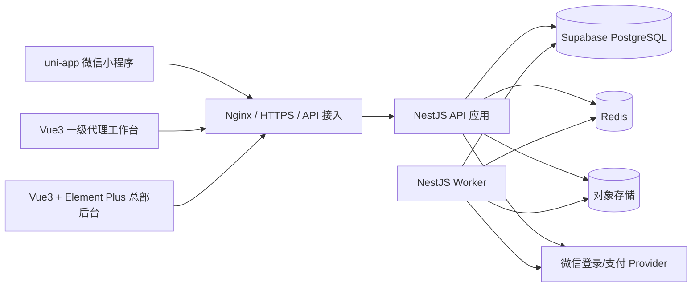

# 洗化产品私域商城技术架构说明

## 1. 架构结论

首期采用“模块化单体 + 独立异步 Worker”，不拆微服务：

- 消费者端：uni-app 微信小程序；
- 总部管理后台：Vue 3 + TypeScript + Element Plus；
- 一级代理工作台：Vue 3 + TypeScript 响应式 Web/H5，可与后台共享基础组件但独立路由和权限入口；
- 后端：Node.js Active LTS + NestJS + Prisma；
- 主数据：Supabase 托管 PostgreSQL；Supabase 只承担数据库托管，不承接认证、业务授权、对象存储或前端数据 API；
- 短期状态：Redis，用于会话辅助、限流、30 分钟推广候选缓存和短时锁；所有业务真相仍落 PostgreSQL；
- 文件：S3 兼容对象存储，售后与财务凭证默认私有；
- 异步任务：同一代码仓库中的 Worker 消费 Outbox，处理订单超时、回调、自动退款、报表和告警。

模块化单体可以在一个数据库事务中完成库存、支付归因、佣金与钱包的一致性处理，避免首期过早引入分布式事务。未来订单量或团队规模需要拆分时，以 Outbox 事件和模块边界为迁移契约。

## 2. 逻辑架构



### 2.1 Supabase 使用边界

- NestJS API 与 Worker 是 `public` schema 中 64 张应用表的唯一访问入口；三端只通过 HTTPS 调用 NestJS。
- 小程序、代理端和总部端禁止初始化 Supabase client，禁止调用 Data API，禁止持有 `anon`、`authenticated` 或 `service_role` 密钥，也不得持有数据库连接串。
- Supabase 项目在 API Settings 中关闭 Data API；撤销前端角色权限和 RLS 默认拒绝仍须保留，作为误配置时的纵深防护。
- 微信授权登录、管理员密码登录、会话、手机号授权和 RBAC 均由现有 Auth/Access Control 模块实现，不使用 Supabase Auth。
- 应用表只放在 `public`，业务外键不得指向 `auth` 或 `storage` schema。文件仍由 NestJS File 模块接入 S3 兼容对象存储，不使用 Supabase Storage 记录作为业务外键。
- `anon`、`authenticated` 对全部应用表和序列默认无权限且无 RLS policy；即使误开 Data API 也不能读取或修改业务数据。应用行级授权仍只在 NestJS 校验，数据库 RLS 仅隔离连接角色。

### 2.2 连接、角色与密钥

| 用途 | 连接模式 | 端口与限制 |
|---|---|---|
| 长驻 API/Worker，运行环境支持 IPv6 | PostgreSQL direct | `5432`；首选，允许连接池和 prepared statements |
| 长驻 API/Worker，仅支持 IPv4 | Supavisor session mode | `5432`；允许 prepared statements，连接池上限须低于项目配额 |
| Prisma migration、`pg_dump`/恢复 | PostgreSQL direct | `5432`；只能由支持 IPv6 或已配置 IPv4 add-on 的受控 CI/运维环境执行 |
| 未来 serverless/edge | Supavisor transaction mode | `6543`；当前容器不得使用；不支持 prepared statements，Prisma 连接需配置 `pgbouncer=true` |

- `mall_runtime` 仅拥有业务运行所需的表级 DML、序列使用权和专用 RLS policy；不得拥有 schema、DDL、角色管理或 `BYPASSRLS` 权限。
- `mall_migrator` 仅供受控 CI/运维执行 migration，拥有应用对象的建模权限但不作为运行时账号；两类凭据独立存储和轮换，日常运行不得使用 `postgres` 或 Supabase `service_role`。
- 按 Prisma ORM 7 连接约定，`schema.prisma` 不保存 URL；`prisma.config.ts` 的 `datasource.url=env('DIRECT_URL')` 只供 CLI/migration 使用，NestJS API/Worker 通过 `@prisma/adapter-pg` 读取 `DATABASE_URL`。`DATABASE_URL` 指向 runtime direct/session，`DIRECT_URL` 指向 migration/`pg_dump` 使用的 direct；两者使用独立最小权限凭据。
- 数据库密码、项目引用、CA 证书、Provider 密钥和信封加密密钥进入 Secret Manager，不进入前端构建产物、日志或仓库。
- 所有数据库连接必须启用 TLS 并校验服务端证书，生产建议 `sslmode=verify-full` 并使用 Supabase 项目 CA；禁止 `sslmode=disable` 或跳过证书校验。

## 3. 后端模块边界

| 模块 | 职责 | 禁止事项 |
|---|---|---|
| Auth | 三端登录、会话、密码、手机号授权、二次验证 | 不直接决定代理数据范围 |
| Access Control | RBAC、代理行级作用域、敏感字段投影 | 不依赖前端隐藏菜单 |
| Catalog | 品牌、一级分类、商品、SKU、Banner、素材 | 不直接修改历史订单快照 |
| Cart | 匿名/登录购物车与 SKU 合并 | 不锁库存、不保存可信价格 |
| Attribution | 邀请码、推广素材、候选、长期绑定与转移 | 白名单不得参与已绑定订单佣金资格 |
| Order | 试算、订单、订单项快照和聚合状态 | 不信任客户端价格或代理 ID |
| Inventory | 实物、锁定、预占和库存流水 | 不允许无流水直接改余额 |
| Payment | 支付意图、回调 Inbox、迟到支付与自动退款 | 不覆盖 Provider 已成功事实 |
| Fulfillment | 包裹、包裹项、物流节点、确认收货 | 不发出被退款或售后占用数量 |
| Aftersale | 售后资格、额度占用、审核、退货和退款 | 不按当前商品价反算历史退款 |
| Commission | 全局规则版本、支付快照、入账和冲正 | 不保存代理专属比例，不修改原快照 |
| Wallet | 代理余额缓存、不可变流水和提现冻结 | 不允许余额脱离账本单独修改 |
| Withdrawal | 银行卡、提现审核、受控查看与付款凭证 | 常规接口不得返回完整卡号 |
| Reporting | 日/月报表和排行缓存 | 不作为支付、退款或佣金真相来源 |
| File | 上传意图、文件权限、签名下载 | 不接受任意本地路径和公共财务文件 |
| Audit | 关键动作、安全事件与差异记录 | 不记录密码、完整手机号、地址或银行卡 |

## 4. 推荐代码结构

```text
apps/
  miniapp/              # uni-app
  agent-web/            # Vue3 响应式代理端
  admin-web/            # Vue3 + Element Plus
  api/                  # NestJS HTTP API
  worker/               # 超时、Outbox、回调和报表任务
packages/
  contracts/            # OpenAPI 生成类型、枚举和错误码
  ui-tokens/            # 三端共享设计令牌，不共享业务权限组件
  config/               # 环境配置校验
prisma.config.ts        # Prisma 7 CLI/migration 只读取 DIRECT_URL
prisma/
  schema.prisma
  migrations/
docs/
```

API 与 Worker 共用领域模块，但启动入口、资源限制和扩缩容策略分离。消费者、代理和总部前端分别构建，禁止通过同一个前端包仅隐藏菜单来模拟权限隔离。

## 5. 关键一致性设计

### 5.1 本地事务

以下动作必须使用 Prisma interactive transaction，并通过固定锁顺序避免死锁：

1. SKU/库存余额；
2. 订单/订单项；
3. 支付或退款事实；
4. 佣金快照与账本；
5. 代理钱包；
6. Outbox 和审计。

库存、钱包和订单均使用 `version` 乐观锁；最后一件库存、售后额度和提现余额等争用路径额外使用 PostgreSQL `SELECT ... FOR UPDATE`。

### 5.2 Inbox 与 Outbox

- 微信支付和退款回调先按 Provider event ID 写入 Inbox，验签失败不进入业务处理。
- 领域事务同时写 Outbox，提交后由 Worker 发布或执行副作用。
- 消费者以事件 ID 幂等；失败按指数退避重试，超过阈值转人工待办。
- 订单创建只落订单、快照、归因候选和库存预占，不创建支付意图、不调用 Provider。首次/重试支付在订单锁下创建或复用唯一 OPEN 本地意图，再以稳定商户支付号幂等调用 Provider。
- 订单超时任务对存在的 OPEN 意图先关闭 Provider，成功后才在本地释放库存；从未发起支付、没有意图的订单直接本地关单。
- 退款首次提交和重试共享稳定商户退款号，每次新幂等键追加独立 `refund_attempt`；支付与退款回调统一先入 Inbox。

### 5.3 缓存边界

Redis 可保存候选副本、登录限流、验证码失败计数、短时 reauth grant 和只读热点缓存。候选确认、支付、售后、佣金和提现必须回到 PostgreSQL 再校验，Redis 丢失不得造成资金或归属错误。

## 6. Provider 抽象

```ts
interface AuthProvider {
  exchangeLoginCode(code: string): Promise<ExternalIdentity>;
  decryptPhoneCredential(credential: string): Promise<VerifiedPhone>;
}

interface PaymentProvider {
  createPaymentIntent(input: PaymentIntentInput): Promise<ProviderPaymentIntent>;
  closePaymentIntent(providerIntentId: string): Promise<CloseResult>;
  verifyCallback(headers: Record<string, string>, body: unknown): Promise<VerifiedEvent>;
  createRefund(input: RefundInput): Promise<ProviderRefund>;
}
```

首期提供 Mock Provider 完成原型与集成测试；正式微信资质就绪后替换 Adapter，不修改订单、退款、佣金和库存领域模型。

## 7. 安全设计

- 登录令牌使用短期 access token + 可轮换 refresh token；refresh token 只保存哈希。
- 密码使用成熟密码哈希算法，管理员与代理登录独立限流；代理停用立即撤销全部会话。
- 数据库敏感字段使用信封加密并保存 key id；密钥由云密钥管理服务托管。
- API/Worker 使用自建微信认证和应用 RBAC；Supabase RLS 不替代租户、角色或代理数据范围校验。
- Supabase `anon`、`authenticated` 和 `service_role` 不进入任何前端或后端应用配置；运维管理令牌仅允许受控 CI/运维使用。
- 完整银行卡查看采用密码 + 一次性验证码的 reauth 接口，连续失败 5 次锁 15 分钟，grant 60 秒且单次消费。
- 高风险写操作使用短时预览 token、确认哈希和 `If-Match` 绑定主体、会话、动作、目标、请求体与资源版本，确认成功时单次消费。
- 完整银行卡响应强制 `no-store`，不得写入幂等响应体、日志或审计前后值。
- 上传文件校验 MIME、大小、哈希和业务归属；私有文件只使用短时签名 URL。
- 日志采用字段白名单，集中脱敏；错误响应不返回 ORM、SQL、堆栈和 Provider 原报文。

## 8. 性能与可观测

- 核心 API 初始目标为约定 50 并发下 P95 小于 500ms；订单创建、支付和退款单独监控事务耗时与锁等待。
- 商品、订单、客户、佣金、提现和审计全部分页；图片生成缩略图并懒加载。
- 指标至少覆盖请求率、错误率、P95、数据库连接/慢查询、锁等待、Outbox/Inbox 积压、自动退款失败、库存差异和钱包差异。
- 每个请求携带 request ID；业务日志同时记录 order/refund/withdrawal 等对象 ID，但不记录敏感内容。
- 建立库存、钱包、销售日报三类每日复算任务和差异告警。

## 9. 部署拓扑

首期建议两类无状态容器：API 至少 2 副本、Worker 至少 1 副本；PostgreSQL 使用 Supabase 托管，Redis 和对象存储使用独立托管服务。长驻 API/Worker 优先走 direct `5432`，IPv4-only 环境改用 Supavisor session `5432`；migration、`pg_dump` 和恢复固定走 direct。Nginx/云负载均衡终止 HTTPS，管理后台和代理端静态资源通过 CDN 发布，小程序仅访问已备案且配置到微信后台的 HTTPS 域名。

环境至少区分 development、staging、production，每个环境使用独立 Supabase 项目与凭据。生产环境禁止启用 Mock 支付成功入口；Provider 密钥、数据库凭据、加密密钥、CA 证书和对象存储凭据全部由 Secret 管理，不写入仓库。上线前按所选 Supabase 套餐确认自动备份保留期和 PITR 可用性，并完成 staging 恢复演练。生产项目区域必须在真实微信用户网络下完成延迟测试，并经隐私、数据驻留与跨境传输合规评审后确定；评审完成前不得写入真实手机号、地址或银行卡数据。

## 10. 扩展边界

- 多级代理：新增代理关系和分佣链，不改现有订单项佣金快照的不可变原则。
- 多仓：库存余额增加 warehouse 维度，订单预占和包裹项保留现有结构。
- 多包裹：解除订单单包裹唯一约束，现有 `shipment_item` 已支持拆分。
- 优惠券/积分：增加订单项级优惠分摊事实，再将净商品实付作为佣金基数。
- 正式支付：替换 Provider Adapter，保留 Inbox、幂等、迟到成功和自动退款机制。

## 11. 技术设计验收

- API、数据库和 Prisma 中的状态枚举、金额精度、角色和表述一致。
- 订单创建、正常支付、超时关闭、迟到支付、退款、售后占用、佣金入账和提现均有明确事务边界。
- 白名单只影响推广接口，支付与佣金模型不存在商品授权快照或代理专属规则。
- 原型中的 SKU、订单和状态可以一一映射到 API 字段与数据库事实。
- Provider、缓存和异步任务失败均有可重试、告警和人工补偿路径。

## 12. 官方实现依据

- [Supabase：连接 PostgreSQL](https://supabase.com/docs/guides/database/connecting-to-postgres)
- [Supabase：Prisma 集成](https://supabase.com/docs/guides/database/prisma)
- [Supabase：保护或关闭 Data API](https://supabase.com/docs/guides/api/securing-your-api)
- [Supabase：数据库备份](https://supabase.com/features/database-backups)
- [Prisma：PostgreSQL 与 Prisma 7 连接配置](https://www.prisma.io/docs/orm/core-concepts/supported-databases/postgresql)
