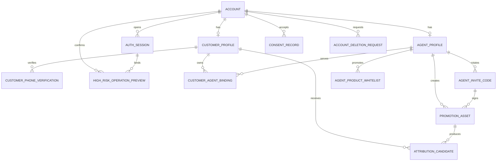
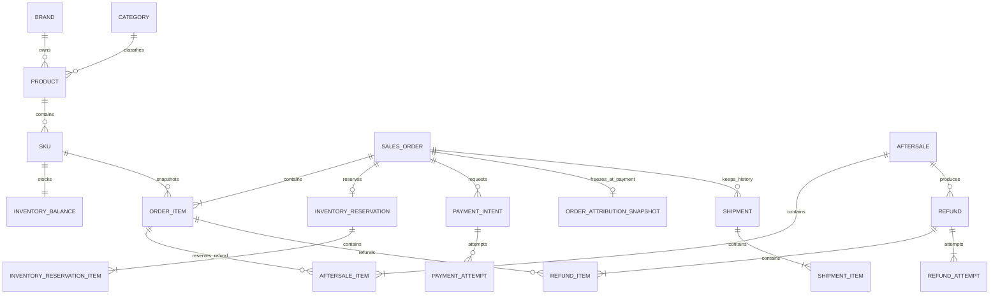
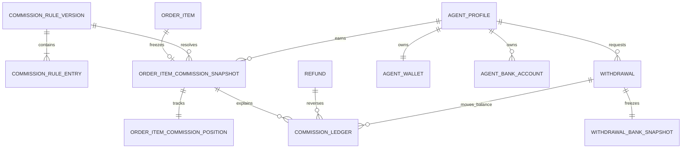

# 洗化产品私域商城数据库设计

## 文档控制

| 项目 | 内容 |
|---|---|
| 文档版本 | v1.1 |
| 对应基线 | MVP/PRD v2.3、CH-001 至 CH-004 |
| 数据库 | Supabase 托管 PostgreSQL，生产时间统一为 UTC |
| ORM | Prisma，64 个实体、45 个枚举的字段级逻辑草案见 `schema.prisma` |
| 状态 | 技术设计冻结稿，尚未执行迁移 |
| 更新时间 | 2026-08-11 |

## 1. 设计原则

- 使用一个 Supabase 托管 PostgreSQL 主库承载首期单商户、单仓、单层代理业务；按领域划分表，不按三端重复建表。
- 主键统一为应用生成的 ULID，PostgreSQL 使用 `CHAR(26)` 并校验格式；订单号、售后号和提现号另设可读业务编号。
- 金额使用 `NUMERIC(18,2)`，佣金百分比使用 `NUMERIC(7,4)`，比例值范围为 0 至 100。
- 时间使用 `TIMESTAMPTZ(3)` 保存 UTC 时刻；报表查询转换为 `Asia/Shanghai`，业务自然日另存 `DATE`。
- 商品成交、库存和订单均以 SKU 为最小单位；历史展示只读订单快照，不回查当前商品资料。
- 支付、退款、佣金和钱包流水只追加事实记录；修正使用反向或补偿记录，不覆盖历史。
- 分类、品牌、商品、SKU、Banner 和代理资料采用软删除或状态归档；订单、支付、退款、佣金、提现和审计禁止物理删除。
- JSON 只保存 Provider 原始报文、审计前后值和非查询型快照；金额、状态、归属和规则来源必须是结构化字段。
- 所有关键写操作使用幂等记录；外部回调使用 Inbox，领域事件使用事务 Outbox。

### 1.1 Supabase 边界与连接

- Supabase 仅提供托管 PostgreSQL；项目必须关闭 Data API，不使用 Supabase Auth、Storage 或 Data API 承担业务能力。微信自建认证、会话和 RBAC 的唯一身份源仍是 `account` 等 `public` 应用表。
- 64 张应用表全部位于 `public`，不得创建指向 `auth` 或 `storage` schema 的外键、触发器或业务查询依赖。三端不得使用 Supabase client、Data API、数据库连接串或 `service_role`。
- NestJS API/Worker 是唯一数据访问入口，运行时只使用 `mall_runtime`；该角色仅获所需 DML、序列使用权及专用 RLS policy，无 DDL、schema ownership、角色管理或 `BYPASSRLS`。
- `mall_migrator` 只供受控 CI/运维执行 migration，拥有应用对象的建模权限但不作为运行时账号。两类凭据分别存入 Secret Manager 并独立轮换，禁止以 `postgres` 或 `service_role` 运行应用。
- 所有应用表启用 RLS。`anon`、`authenticated` 不授予表/序列权限且不创建 policy；`service_role` 也撤销应用表权限。只为 `mall_runtime` 建立允许访问的连接角色 policy，具体客户、代理和管理员数据范围仍由 NestJS RBAC 校验。

| 场景 | 连接 | 约束 |
|---|---|---|
| 长驻 API/Worker，支持 IPv6 | direct `5432` | 首选；使用有界连接池，可使用 prepared statements |
| 长驻 API/Worker，仅 IPv4 | Supavisor session `5432` | 可使用 prepared statements；连接池总量不得超过项目配额 |
| migration、`pg_dump` 与恢复 | direct `5432` | 仅受控 CI/运维；执行环境必须支持 IPv6 或已配置 IPv4 add-on |
| 未来 serverless/edge | Supavisor transaction `6543` | 当前不启用；不支持 prepared statements，Prisma 需 `pgbouncer=true` |

所有连接强制 TLS 并校验证书，生产建议 `sslmode=verify-full` 和 Supabase 项目 CA。按 Prisma ORM 7 约定，`schema.prisma` 不声明 URL；`prisma.config.ts` 的 `datasource.url=env('DIRECT_URL')` 只供 CLI/migration，NestJS API/Worker 通过 `@prisma/adapter-pg` 读取 `DATABASE_URL`。`DATABASE_URL` 指向 runtime direct/session，`DIRECT_URL` 指向 migration/`pg_dump` 使用的 direct；密码、CA、项目引用和加密密钥不得进入仓库、日志或前端构建产物。

## 2. 数据类型与命名

| 类型 | PostgreSQL | 约定 |
|---|---|---|
| 主键 | `CHAR(26)` | ULID，字符串排序与时间大体一致 |
| 业务编号 | `VARCHAR(32)` | 订单、售后、退款、提现等唯一编号 |
| 金额 | `NUMERIC(18,2)` | 禁止 `REAL`/`DOUBLE PRECISION` |
| 百分比 | `NUMERIC(7,4)` | 例如 12.5000 表示 12.5% |
| 时间 | `TIMESTAMPTZ(3)` | UTC 时刻；API 输出 ISO 8601 |
| 状态 | `VARCHAR(40)` 或 Prisma Enum | 数据库和 API 枚举同名 |
| 乐观锁 | `INTEGER CHECK (version >= 1)` | `version` 从 1 开始递增 |
| 非负计数 | `INTEGER`/`BIGINT` + `CHECK` | PostgreSQL 无无符号整数，库存、数量和重试次数显式校验非负 |
| JSON | `JSONB` | 仅用于非检索型快照或外部原文，禁止存明文敏感信息 |
| 软删除 | `deleted_at TIMESTAMPTZ(3) NULL` | 查询默认过滤非空记录 |

所有金额计算采用订单项级 `HALF_UP` 四舍五入保留两位后汇总。数据库不承担业务舍入决策，应用服务和离线复算必须使用同一 Decimal 实现；数据库 `CHECK` 只守住范围和一致性下限。

当前 `schema.prisma` 已按 PostgreSQL `public` schema 表达 64 个实体和 45 个枚举，但仍是未执行迁移的逻辑草案。进入开发前必须生成并评审包含部分唯一索引、`CHECK`、RLS 与角色权限的 SQL migration；完成前不得直接建库。

## 3. 领域表清单

### 3.1 身份、授权与隐私

| 表 | 用途 | 关键约束 |
|---|---|---|
| `account` | 三类人员统一登录主体 | `role` 为 SUPER_ADMIN/AGENT_ADMIN/CUSTOMER；登录名、微信主体分别唯一 |
| `auth_session` | 访问与刷新会话 | refresh token 只存哈希；可按账号全部撤销 |
| `customer_profile` | 消费者当前资料 | 与账户 1:1；不保存地址手机号 |
| `customer_phone_verification` | 自愿授权的账户手机号 | 手机号密文 + 哈希 + 尾号 + 来源 + 协议版本；部分唯一索引保证每客户最多一条未撤回当前记录 |
| `consent_record` | 协议同意记录 | 主体、协议类型、版本和时间不可覆盖 |
| `account_deletion_request` | 账号删除与去标识化流程 | 部分唯一索引保证同一账户最多一笔 SUBMITTED/PROCESSING 活动申请 |
| `admin_reauth_attempt` | 二次验证失败计数 | 用于 5 次失败锁定 15 分钟 |
| `admin_reauth_grant` | 60 秒单次敏感操作授权 | token 只存哈希，绑定管理员、会话、动作和提现单 |

### 3.2 代理、邀请码与归属

| 表 | 用途 | 关键约束 |
|---|---|---|
| `agent_profile` | 一级代理档案和授权模式 | 与 AGENT_ADMIN 账户 1:1；不存在父代理字段 |
| `agent_invite_code` | 邀请码历史、启停和有效期 | code hash 唯一；轮换新增记录并结束旧记录 |
| `agent_product_whitelist` | 自定义商品推广白名单 | 仅控制推广；不得参与支付佣金资格判断 |
| `promotion_asset` | 主页或商品二维码/链接 | 保存目标、邀请码和生成时授权版本；打开时仍实时复核 |
| `attribution_candidate` | 30 分钟待确认候选 | 匿名主体或客户主体只允许一个 ACTIVE 候选 |
| `customer_agent_binding` | 消费者长期代理绑定历史 | 用 `started_at/ended_at` 保留历史；每客户最多一条当前绑定 |
| `binding_change_log` | 确认、转移、转直营和停用影响记录 | 不物理删除，关联管理员原因与审计 |

白名单撤权时不改 `customer_agent_binding`，也不改历史订单佣金。商品推广素材在打开时若目标已撤权，仅返回公开商品跳转，不创建候选。

### 3.3 商品、内容与购物

| 表 | 用途 | 关键约束 |
|---|---|---|
| `brand` | 品牌 | 名称唯一，软删除 |
| `category` | 一级分类兼佣金分类 | 首期无父级字段；存在在售商品时禁止停用 |
| `product` | SPU 商品 | 必须属于一个有效品牌和一级分类 |
| `sku` | 成交、库存和佣金最小单位 | SKU code 唯一；产生订单或库存流水后不可改码 |
| `file_asset` | 商品图、Banner、售后和付款凭证 | 公共/私有权限、对象存储 key、哈希、MIME |
| `product_image` | 商品与素材排序关系 | 商品内 sort 唯一 |
| `banner` | 首页 Banner | 有效期、启停、排序和跳转目标 |
| `favorite` | 消费者收藏 | customer + product 唯一 |
| `cart` | 匿名或登录购物车 | 同一主体一个活动购物车 |
| `cart_item` | SKU 购物车项 | cart + sku 唯一，不保存可信成交价格 |
| `customer_address` | 收货地址 | 联系电话独立加密；与账户手机号无关系 |

### 3.4 库存、订单、支付与履约

| 表 | 用途 | 关键约束 |
|---|---|---|
| `inventory_balance` | 单仓 SKU 实物和锁定库存 | sku 唯一；`physical_qty >= 0`、`locked_qty >= 0` |
| `inventory_reservation` | 待付款订单库存预占 | order 唯一；ACTIVE/CONSUMED/RELEASED/EXPIRED |
| `inventory_reservation_item` | 预占 SKU 数量 | reservation + sku 唯一 |
| `inventory_ledger` | 库存事实流水 | 只追加；保存变更前后与业务原因 |
| `sales_order` | 订单聚合状态与金额 | 六维状态字段、支付截止时间、资源版本 |
| `order_item` | SKU 成交快照和可退/发货计数 | 保存商品、分类、SKU、单价、数量和累计计数 |
| `order_address_snapshot` | 支付/履约地址快照 | 与订单 1:1；敏感字段加密 |
| `order_attribution_candidate` | 提交订单时的归因候选 | 支付前不向代理展示，不保存客户昵称/手机号尾号/城市快照，不生成佣金 |
| `order_attribution_snapshot` | 支付成功时的最终归因与脱敏客户快照 | 支付结转时才写；订单 1:1，后续手机号授权或资料修改不回填 |
| `payment_intent` | 用户点击支付后创建的本地支付意图 | 订单创建阶段不存在；稳定商户支付号唯一，部分唯一索引保证每订单最多一笔 OPEN 意图 |
| `payment_attempt` | Provider 支付事实 | provider + transaction id 唯一；迟到成功记录为 SUCCEEDED_LATE |
| `callback_inbox` | 支付/退款回调收件箱 | provider + event id 唯一 |
| `shipment` | 首期单包裹模型 | 订单当前最多一个非取消包裹 |
| `shipment_item` | 包裹内订单项数量 | 支持发货前部分退款后只发剩余数量 |
| `logistics_event` | 人工物流节点 | 只追加，按发生时间排序 |

### 3.5 售后与退款

| 表 | 用途 | 关键约束 |
|---|---|---|
| `aftersale` | 售后主单 | 类型、状态、原因、审核与退款结果 |
| `aftersale_item` | 售后订单项和额度占用 | 保存请求/占用数量与金额；一个订单项可多次售后但不得超额 |
| `return_shipment` | 用户退货物流 | 一个退货售后最多一条当前记录 |
| `refund` | 退款主记录 | `refund_no` 是稳定商户退款号；provider + refund id 唯一；状态独立于订单并带 version 乐观锁 |
| `refund_attempt` | 首次退款和失败重试尝试 | 每次新幂等键追加一条；同一退款复用原 `refund_no`，不重建退款主单 |
| `refund_item` | 退款订单项事实 | 数量、实际成功金额、是否未发货自动回库 |

创建售后时锁定相关 `order_item`，按以下公式校验并更新累计占用：

```text
remaining_refundable_qty
  = quantity - refunded_qty - aftersale_reserved_qty

remaining_refundable_amount
  = line_paid_amount - refunded_amount - aftersale_reserved_amount
```

驳回或允许阶段取消时减少占用；退款成功时占用转为已退款；退款失败保持占用。创建发货项时必须扣除未解决售后占用数量。

### 3.6 佣金、钱包与提现

| 表 | 用途 | 关键约束 |
|---|---|---|
| `commission_rule_version` | 全局不可变规则集版本 | 每次保存生成新版本；一笔支付只读一个 PUBLISHED 版本 |
| `commission_rule_entry` | 平台、分类、SKU 配置项 | 每版本 target key 唯一；继承表示新版本中不存在覆盖行，0% 是有效行 |
| `order_item_commission_snapshot` | 支付时逐订单项佣金事实 | 与订单项 1:1；原比例、基数和金额永不修改 |
| `order_item_commission_position` | 订单项佣金当前状态缓存 | 保存 EXPECTED/CANCELLED/AVAILABLE、预计剩余和累计冲正；可由流水重建 |
| `commission_ledger` | 预计、可用、退款与提现流水 | 只追加，金额有正负，关联原快照和退款 |
| `agent_wallet` | 可复算余额缓存 | available 可为负；frozen 不得为负；带 version |
| `agent_bank_account` | 代理当前银行卡 | 卡号密文、key id、hash 和 last4；常规查询只返回掩码 |
| `withdrawal` | 提现申请 | 同一代理最多一笔 PENDING/APPROVED |
| `withdrawal_bank_snapshot` | 申请时银行卡快照 | 独立密文，换卡不影响历史申请 |
| `withdrawal_proof` | 付款凭证关系 | PAID 前至少一条有效私有文件 |

佣金规则版本保存完整有效配置：平台默认必须存在且非空；分类和 SKU 只保存非空覆盖。API 中 `configured_rate: null` 表示在新版本删除该覆盖行，`0.0000` 表示保存明确无佣金的覆盖行。

### 3.7 平台可靠性与经营分析

| 表 | 用途 | 关键约束 |
|---|---|---|
| `business_rule` | 最低提现、售后期、法定保留期等配置 | key 唯一，修改有版本和审计 |
| `idempotency_record` | 关键写请求结果缓存 | actor + scope + key 唯一；敏感明文响应不保存 `response_body`，仅存摘要 |
| `high_risk_operation_preview` | 高风险操作短时预览确认 | token 只存哈希，绑定管理员/会话/动作/目标/请求哈希/资源版本，单次消费 |
| `outbox_event` | 事务领域事件 | 状态、重试次数和下次执行时间 |
| `audit_log` | 经营与安全审计 | 只追加，前后值必须脱敏 |
| `sales_daily_aggregate` | 可重建的日报缓存 | `scope_key=DIRECT` 或 `AGENT:<agent_id>`，以 business_date + scope_key 唯一，避免 NULL 破坏直营唯一性 |

## 4. 关键 ERD

### 4.1 身份、代理与归属



### 4.2 商品、交易、售后和库存



### 4.3 佣金、钱包与提现



## 5. 核心状态字段

### 5.1 `sales_order`

| 字段 | 类型 | 说明 |
|---|---|---|
| `order_status` | enum | PENDING_PAYMENT/PENDING_SHIPMENT/SHIPPING/COMPLETED/CLOSED |
| `payment_status` | enum | UNPAID/PROCESSING/PAID |
| `refund_status` | enum | NONE/REFUNDING/PARTIAL/FULL/FAILED |
| `fulfillment_status` | enum | NOT_STARTED/READY_TO_SHIP/SHIPPED/IN_TRANSIT/DELIVERED/CANCELLED |
| `close_reason` | nullable enum | USER_CANCELLED/PAYMENT_TIMEOUT/FULL_REFUND_BEFORE_SHIPMENT |
| `payment_resolution` | enum | NORMAL/LATE_SUCCESS_REFUND_PENDING/LATE_SUCCESS_REFUNDED/MANUAL_REQUIRED |
| `pay_expires_at` | `TIMESTAMPTZ(3)` | 服务端支付截止时刻 |
| `version` | `INTEGER CHECK (version >= 1)` | 订单聚合乐观锁 |

`display_status` 是 API 层派生字段，不单独保存，避免出现六个状态轴与展示状态不一致。计算按下列优先级从上到下首个命中：

| 优先级 | 条件 | 展示状态 |
|---:|---|---|
| 1 | `payment_resolution=MANUAL_REQUIRED` | 支付异常处理中 |
| 2 | `payment_resolution=LATE_SUCCESS_REFUND_PENDING` 或 `refund_status=REFUNDING` | 退款处理中 |
| 3 | `payment_resolution=LATE_SUCCESS_REFUNDED` 或 `refund_status=FULL` | 退款完成 |
| 4 | `refund_status=FAILED` | 退款异常待处理 |
| 5 | `refund_status=PARTIAL` | 部分退款 |
| 6 | `order_status=CLOSED` | 已关闭 |
| 7 | `order_status=PENDING_PAYMENT` | 待付款 |
| 8 | `order_status=PENDING_SHIPMENT` 且 `fulfillment_status=READY_TO_SHIP` | 待发货 |
| 9 | `order_status=SHIPPING` 或履约为 `SHIPPED/IN_TRANSIT` | 运输中 |
| 10 | `order_status=COMPLETED` 或履约为 `DELIVERED` | 已完成 |

`close_reason` 是订单响应必填字段；数据库中非关闭订单必须为 NULL，关闭订单必须非空。

### 5.2 迟到支付

迟到支付不允许把订单从 `CLOSED` 改回待发货。数据库保留三个同时成立的事实：

1. `sales_order.order_status = CLOSED` 且 `close_reason = PAYMENT_TIMEOUT`；
2. `payment_attempt.status = SUCCEEDED_LATE`，真实记录已收款；原 `payment_intent` 保持 `CLOSED/EXPIRED`；
3. `sales_order.payment_resolution` 进入退款处理中、已退款或人工处理。

自动退款使用独立 `refund/refund_item/refund_attempt`，不得伪造支付失败或删除 Provider 交易号。

### 5.3 未发货退款

- 部分退款成功：按 `refund_item.quantity` 增加实物库存并写 `REFUND_RESTOCK`；订单主状态仍为 `PENDING_SHIPMENT`，履约状态仍为 `READY_TO_SHIP`，实际可发数量由订单项退款与售后占用计数决定。
- 全额退款成功：所有可履约数量归零，订单转 `CLOSED/FULL_REFUND_BEFORE_SHIPMENT`，履约为 `CANCELLED`，禁止创建 shipment。
- 已发货退货：退款成功不自动增加实物库存；总部验货后使用 `RETURN_RESTOCK` 或 `RETURN_DAMAGED` 调整流水。

## 6. 关键事务

### 6.1 创建订单

```text
BEGIN
  校验并锁定 SKU、库存余额和当前客户绑定
  服务端重新计价
  创建 sales_order、order_item、address snapshot、attribution candidate
  创建 inventory_reservation 和 items
  inventory_balance.locked_qty += quantity
  写 idempotency_record 和 outbox_event
COMMIT
```

并发争抢最后库存时锁 `inventory_balance` 行；事务内再次计算 `physical_qty - locked_qty`。失败不创建半成品订单。订单创建事务不得创建 `payment_intent`，也不得调用 Provider。

### 6.2 创建或复用支付意图

```text
BEGIN
  锁定 sales_order
  校验 PENDING_PAYMENT、UNPAID/PROCESSING 和 pay_expires_at
  查询该订单由部分唯一索引保护的唯一 OPEN payment_intent
  有效则复用；不存在则创建 intent_no 稳定的新本地意图
COMMIT
以 intent_no 作为商户支付号幂等调用 Provider
写回 provider_intent_id；相同 provider + provider_intent_id 只允许一条
```

Provider 调用失败不创建第二笔 OPEN 意图；同一请求键返回同一意图，新的支付重试也先复用仍有效的 OPEN 意图。只有原意图已关闭/过期且订单仍未过 `pay_expires_at` 时，才允许创建新的 OPEN 意图。

### 6.3 正常支付成功

```text
BEGIN
  插入或幂等读取 callback_inbox/payment_attempt
  锁定 order、reservation、inventory_balance、当前 rule version
  physical_qty -= reserved_qty
  locked_qty -= reserved_qty
  reservation -> CONSUMED
  复核提交时候选代理 ACTIVE
  支付时创建 order_attribution_snapshot，复制当时昵称、已验证账户手机号尾号（可空）和城市
  冻结最终渠道和逐订单项 commission snapshot
  追加 EXPECTED_CREATED
  order -> PENDING_SHIPMENT / PAID
  写 outbox_event
COMMIT
```

整单必须使用同一个 `commission_rule_version_id`。规则解析失败时先持久化支付事实，将订单置于财务/结算异常待办，再由幂等补偿任务重试；禁止使用客户端比例或写入不完整快照。

### 6.4 超时关闭与迟到回调

超时任务先锁订单。若存在 OPEN 支付意图，先调用 Provider 关闭并确认不可继续支付；从未点击支付、无支付意图时跳过 Provider。随后在事务内将订单关闭并释放库存。若关闭与成功回调竞争，基于支付意图/订单行锁只允许一个路径取得正常结转资格。

迟到成功路径只创建自动退款，不改库存和佣金。自动退款失败写 `MANUAL_REQUIRED`、Outbox 告警和后台财务待办。

### 6.5 创建售后与退款

```text
BEGIN
  锁定 order_item
  计算成功退款 + 有效占用后的剩余额度
  创建 aftersale/aftersale_item
  增加 order_item.aftersale_reserved_qty/amount
COMMIT
```

首次退款创建 `refund`、稳定 `refund_no`、`refund_item` 和第 1 条 `refund_attempt`。Provider 调用失败只更新该尝试与退款聚合状态；重试必须使用新的幂等键，在同一 `refund` 下按顺序追加 `refund_attempt`，继续传原 `refund_no`。退款回调先进入 Inbox，再按 Provider event ID 和 `provider + provider_refund_id` 幂等结转。

退款成功处理锁定售后项、订单项、订单、库存余额、佣金快照和钱包；占用转已退款，未发货数量自动回库，订单聚合更新，佣金按原支付快照追加减少或冲正流水。

### 6.6 订单完成与佣金入账

订单完成和 `AVAILABLE_CREDIT` 必须同事务或由同一个可幂等 Outbox 消费器保证最终只入账一次。`agent_wallet.available_balance` 是缓存，事实以 `commission_ledger` 为准，可通过复算校验和重建。

### 6.7 提现

- 提交提现锁钱包行，校验可用余额、负余额、银行卡、代理状态和进行中申请，然后追加冻结流水。
- `PENDING` 阶段若退款导致余额为负，审核通过必须被阻止。
- `APPROVED` 后视为资金已承诺；后续退款允许可用余额继续为负，但不回滚已通过提现。
- 拒绝追加释放流水；标记 PAID 追加扣冻结流水。状态和流水同事务。

### 6.8 高风险预览与敏感响应

- 预览接口把规范化请求体、资源版本、管理员、会话、动作和目标写入 `high_risk_operation_preview`，只保存 token 哈希与确认哈希，默认 60 秒过期。
- 确认接口必须同时校验 `preview_token`、`confirmation_hash`、`If-Match` 和幂等键；成功写入业务事实时原子设置 `consumed_at`，重复或版本变化均不执行操作。
- 完整银行卡查看不写 `idempotency_record.response_body`；幂等/安全记录仅保存状态码、`response_body_hash` 和资源 ID，HTTP 响应强制 `Cache-Control: no-store, private` 与 `Pragma: no-cache`。

### 6.9 佣金规则原子发布

```text
BEGIN
  SELECT 当前 PUBLISHED commission_rule_version FOR UPDATE
  校验 base_version_id、If-Match、预览 token、确认哈希和当前 version_no
  以当前完整规则集为基线应用 changes，创建新版本及完整有效 entries
  校验新版本的平台默认存在、分类/SKU 目标有效、比例范围和 target_key 唯一
  当前 PUBLISHED -> ARCHIVED
  新版本 -> PUBLISHED，写 effective_at
  原子消费 high_risk_operation_preview，写幂等记录、审计和 outbox_event
COMMIT
```

旧版本必须先转为 `ARCHIVED`，新版本才能转为 `PUBLISHED`；两步处于同一事务，任一步失败都整体回滚，不能出现发布成功但没有当前规则的中间态。版本生命周期只允许 `DRAFT -> PUBLISHED -> ARCHIVED`，禁止回退；除 `status/effective_at` 的上述发布转换外，版本内容、`commission_rule_entry`、已支付订单项佣金快照和历史流水均不可修改。支付事务锁定其读取的 PUBLISHED 规则版本，整单只使用同一个 `commission_rule_version_id`。

## 7. 索引与约束

### 7.1 必须唯一

- `account(login_name)`、`account(wechat_open_id)` 的非空值唯一；
- `sku(code)`、`sales_order(order_no)`、`payment_intent(intent_no)`、`aftersale(aftersale_no)`、`refund(refund_no)`、`withdrawal(withdrawal_no)`；
- `callback_inbox(provider, provider_event_id)`；
- `payment_intent(provider, provider_intent_id)` 的非空组合；`payment_intent(order_id) WHERE status='OPEN'`；
- `payment_attempt(provider, provider_transaction_id)` 的非空值；
- `refund(provider, provider_refund_id)` 的非空组合；
- `refund_attempt(refund_id, attempt_no)`、`refund_attempt(refund_id, idempotency_key)`；
- `idempotency_record(actor_id, scope, idempotency_key)`；
- `customer_phone_verification(customer_id) WHERE revoked_at IS NULL`；`account_deletion_request(account_id) WHERE status IN ('SUBMITTED','PROCESSING')`；
- `commission_rule_entry(rule_version_id, target_key)`；
- `commission_rule_version(status) WHERE status='PUBLISHED'`，全局同时最多一个已发布规则版本；
- `order_item(order_id, sku_id)`，同一订单同一 SKU 合并为一个订单项；
- `cart_item(cart_id, sku_id)`、`favorite(customer_id, product_id)`；
- `customer_address(customer_id) WHERE is_default=TRUE AND deleted_at IS NULL`，每位客户最多一个当前默认地址；
- `shipment(order_id) WHERE status<>'CANCELLED'`，每个订单最多一个当前非取消包裹，取消记录保留后可创建替代包裹；
- 当前绑定、活动邀请码、匿名/登录活动候选和进行中提现使用 PostgreSQL 部分唯一索引保证“每主体最多一个”，不能只依赖业务事务中的预查询。
- 日报使用 `(business_date, scope_key)`；`scope_key` 必须是 `DIRECT` 或 `AGENT:<agent_id>`，不可直接依赖含 NULL 的 `(business_date, channel, agent_id)` 唯一键。

### 7.2 高频查询索引

- 商品：`product(status, category_id, brand_id, published_at)`、`sku(product_id, status)`；
- 订单：`sales_order(customer_id, created_at)`、`sales_order(order_status, created_at)`、`sales_order(final_agent_id, paid_at)`；
- 售后：`aftersale(status, created_at)`、`aftersale(order_id)`；
- 代理客户：`customer_agent_binding(agent_id, ended_at, started_at)`；
- 佣金：`commission_ledger(agent_id, occurred_at)`、`order_item_commission_snapshot(agent_id, created_at)`、`order_item_commission_position(state, updated_at)`；
- 提现：`withdrawal(agent_id, status, created_at)`、`withdrawal(status, created_at)`；
- Outbox/Inbox：`status + next_retry_at/received_at`。

### 7.3 PostgreSQL 原生约束示例

Prisma 不能完整表达的条件唯一与校验需要在 PostgreSQL SQL migration 中补充。条件唯一索引直接建立在事实列和谓词上，不引入辅助字段：

```sql
CREATE UNIQUE INDEX uq_payment_intent_one_open_per_order
  ON public.payment_intent (order_id)
  WHERE status = 'OPEN';

CREATE UNIQUE INDEX uq_customer_phone_one_current
  ON public.customer_phone_verification (customer_id)
  WHERE revoked_at IS NULL;

CREATE UNIQUE INDEX uq_account_deletion_one_active
  ON public.account_deletion_request (account_id)
  WHERE status IN ('SUBMITTED', 'PROCESSING');

CREATE UNIQUE INDEX uq_customer_one_current_agent
  ON public.customer_agent_binding (customer_id)
  WHERE ended_at IS NULL;

CREATE UNIQUE INDEX uq_agent_one_active_invite
  ON public.agent_invite_code (agent_id)
  WHERE status = 'ACTIVE';

CREATE UNIQUE INDEX uq_active_candidate_anonymous
  ON public.attribution_candidate (anonymous_id)
  WHERE status = 'ACTIVE' AND anonymous_id IS NOT NULL;

CREATE UNIQUE INDEX uq_active_candidate_customer
  ON public.attribution_candidate (customer_id)
  WHERE status = 'ACTIVE' AND customer_id IS NOT NULL;

CREATE UNIQUE INDEX uq_agent_one_inflight_withdrawal
  ON public.withdrawal (agent_id)
  WHERE status IN ('PENDING', 'APPROVED');

CREATE UNIQUE INDEX uq_commission_rule_one_published
  ON public.commission_rule_version (status)
  WHERE status = 'PUBLISHED';

CREATE UNIQUE INDEX uq_agent_one_active_bank_account
  ON public.agent_bank_account (agent_id)
  WHERE is_active = TRUE AND deleted_at IS NULL;

CREATE UNIQUE INDEX uq_cart_anonymous_owner
  ON public.cart (anonymous_id)
  WHERE owner_type = 'ANONYMOUS' AND anonymous_id IS NOT NULL;

CREATE UNIQUE INDEX uq_cart_customer_owner
  ON public.cart (customer_id)
  WHERE owner_type = 'CUSTOMER' AND customer_id IS NOT NULL;

CREATE UNIQUE INDEX uq_customer_one_default_address
  ON public.customer_address (customer_id)
  WHERE is_default = TRUE AND deleted_at IS NULL;

CREATE UNIQUE INDEX uq_order_one_active_shipment
  ON public.shipment (order_id)
  WHERE status <> 'CANCELLED';

ALTER TABLE public.inventory_balance
  ADD CONSTRAINT chk_inventory_non_negative
  CHECK (physical_qty >= 0 AND locked_qty >= 0 AND locked_qty <= physical_qty);

ALTER TABLE public.inventory_ledger
  ADD CONSTRAINT chk_inventory_after_non_negative
  CHECK (physical_after >= 0 AND locked_after >= 0 AND locked_after <= physical_after);

ALTER TABLE public.agent_wallet
  ADD CONSTRAINT chk_wallet_frozen_non_negative
  CHECK (frozen_balance >= 0);

ALTER TABLE public.commission_rule_entry
  ADD CONSTRAINT chk_commission_rate
    CHECK (configured_rate >= 0 AND configured_rate <= 100),
  ADD CONSTRAINT chk_commission_target
    CHECK (
      (target_type = 'PLATFORM' AND target_id IS NULL AND target_key = 'PLATFORM')
      OR (target_type = 'CATEGORY' AND target_id IS NOT NULL
          AND target_key = 'CATEGORY:' || target_id)
      OR (target_type = 'SKU' AND target_id IS NOT NULL
          AND target_key = 'SKU:' || target_id)
    );

ALTER TABLE public.sales_order
  ADD CONSTRAINT chk_order_money_non_negative
    CHECK (
      goods_amount >= 0 AND shipping_amount >= 0 AND payable_amount >= 0
      AND paid_amount >= 0 AND refunded_amount >= 0
    ),
  ADD CONSTRAINT chk_order_close_reason
    CHECK (
      (order_status = 'CLOSED' AND close_reason IS NOT NULL)
      OR (order_status <> 'CLOSED' AND close_reason IS NULL)
    ),
  ADD CONSTRAINT chk_order_version_positive CHECK (version >= 1);

ALTER TABLE public.payment_intent
  ADD CONSTRAINT chk_payment_intent_amount_positive CHECK (amount > 0);

ALTER TABLE public.payment_attempt
  ADD CONSTRAINT chk_payment_attempt_amount_positive CHECK (amount > 0);

ALTER TABLE public.order_item
  ADD CONSTRAINT chk_order_item_money_positive
    CHECK (unit_price > 0 AND quantity > 0 AND line_paid_amount > 0),
  ADD CONSTRAINT chk_order_item_refund_counters
  CHECK (
    refunded_qty >= 0
    AND aftersale_reserved_qty >= 0
    AND refunded_qty + aftersale_reserved_qty <= quantity
    AND refunded_amount >= 0
    AND aftersale_reserved_amount >= 0
    AND refunded_amount + aftersale_reserved_amount <= line_paid_amount
  );

ALTER TABLE public.aftersale_item
  ADD CONSTRAINT chk_aftersale_item_money
    CHECK (
      requested_qty > 0 AND requested_amount > 0
      AND reserved_qty > 0 AND reserved_amount > 0
      AND refunded_qty >= 0 AND refunded_amount >= 0
    );

ALTER TABLE public.refund
  ADD CONSTRAINT chk_refund_amount_positive CHECK (amount > 0),
  ADD CONSTRAINT chk_refund_version_positive CHECK (version >= 1);

ALTER TABLE public.refund_attempt
  ADD CONSTRAINT chk_refund_attempt_no_positive CHECK (attempt_no >= 1);

ALTER TABLE public.refund_item
  ADD CONSTRAINT chk_refund_item_money_positive
    CHECK (quantity > 0 AND amount > 0 AND commission_reversal >= 0);

ALTER TABLE public.order_item_commission_snapshot
  ADD CONSTRAINT chk_commission_snapshot_money_non_negative
    CHECK (
      effective_rate >= 0 AND effective_rate <= 100
      AND commission_base >= 0 AND original_commission >= 0
    );

ALTER TABLE public.order_item_commission_position
  ADD CONSTRAINT chk_commission_position_money_non_negative
    CHECK (expected_remaining >= 0 AND reversed_total >= 0);

-- 账本变动允许负数，但一条事实不能三列全为 0。
ALTER TABLE public.commission_ledger
  ADD CONSTRAINT chk_commission_ledger_non_zero
    CHECK (expected_change <> 0 OR available_change <> 0 OR frozen_change <> 0);

ALTER TABLE public.withdrawal
  ADD CONSTRAINT chk_withdrawal_money
    CHECK (amount > 0 AND frozen_after >= 0),
  ADD CONSTRAINT chk_withdrawal_version_positive CHECK (version >= 1);

ALTER TABLE public.attribution_candidate
  ADD CONSTRAINT chk_candidate_one_subject
  CHECK (num_nonnulls(anonymous_id, customer_id) = 1);

ALTER TABLE public.cart
  ADD CONSTRAINT chk_cart_owner
  CHECK (
    (owner_type = 'ANONYMOUS' AND anonymous_id IS NOT NULL AND customer_id IS NULL)
    OR (owner_type = 'CUSTOMER' AND customer_id IS NOT NULL AND anonymous_id IS NULL)
  );

ALTER TABLE public.sales_daily_aggregate
  ADD CONSTRAINT chk_sales_daily_scope
    CHECK (
      (channel = 'DIRECT' AND agent_id IS NULL AND scope_key = 'DIRECT')
      OR (channel = 'AGENT' AND agent_id IS NOT NULL
          AND scope_key = 'AGENT:' || agent_id)
    ),
  ADD CONSTRAINT chk_sales_daily_non_negative
    CHECK (
      paid_order_count >= 0 AND paid_amount >= 0 AND refunded_amount >= 0
      AND product_units >= 0 AND new_customer_count >= 0
    );
```

所有 Prisma `Int`/`BigInt` 中语义为数量、次数、版本或重试计数的字段，都必须由 migration 增加 `>= 0` 或 `>= 1` 的 `CHECK`，并在 migration review 中逐列核对。部分唯一索引的谓词枚举值必须与 API、Prisma 和状态机完全同名。Provider ID 继续使用 Prisma 已声明的复合 `UNIQUE(provider, provider_*_id)`；PostgreSQL 允许多行 `NULL`，无需再建立重复的条件索引。

### 7.4 RLS、角色与不可变表

角色和 RLS 由 migration/基础设施脚本创建，密码只由 Secret Manager 注入。下列 SQL 是策略模板；正式 migration 必须显式枚举 64 张应用表，避免误改扩展对象：

```sql
CREATE ROLE mall_runtime LOGIN
  NOSUPERUSER NOCREATEDB NOCREATEROLE NOINHERIT NOBYPASSRLS;
CREATE ROLE mall_migrator LOGIN
  NOSUPERUSER NOCREATEDB NOCREATEROLE NOINHERIT NOBYPASSRLS;

GRANT USAGE ON SCHEMA public TO mall_runtime;
GRANT USAGE, CREATE ON SCHEMA public TO mall_migrator;
REVOKE CREATE ON SCHEMA public FROM PUBLIC;

-- 对每张应用表和相关序列显式执行；不使用宽泛的前端角色授权。
REVOKE ALL PRIVILEGES ON TABLE public.account
  FROM anon, authenticated, service_role;
GRANT SELECT, INSERT, UPDATE ON TABLE public.account TO mall_runtime;

ALTER TABLE public.account ENABLE ROW LEVEL SECURITY;
CREATE POLICY mall_runtime_access ON public.account
  FOR ALL TO mall_runtime
  USING (TRUE) WITH CHECK (TRUE);

-- 新建对象默认也不向 Supabase Data API 角色开放。
ALTER DEFAULT PRIVILEGES FOR ROLE mall_migrator IN SCHEMA public
  REVOKE ALL ON TABLES FROM anon, authenticated, service_role;
ALTER DEFAULT PRIVILEGES FOR ROLE mall_migrator IN SCHEMA public
  REVOKE ALL ON SEQUENCES FROM anon, authenticated, service_role;
```

`mall_runtime_access` 只允许已通过 NestJS 的单一运行角色访问行，不表达客户/代理业务范围。每张应用表在无 policy 时必须先保持默认拒绝，待 runtime policy 与精确表级权限在同一 migration 中就绪后才能切流。`mall_runtime` 不得拥有任何应用表，否则表所有者可能绕过 RLS。

`order_item_commission_snapshot`、`commission_ledger`、`inventory_ledger` 和 `audit_log` 等不可变事实表，对 `mall_runtime` 仅授予所需的 `SELECT`/`INSERT`，撤销 `UPDATE`/`DELETE`。`callback_inbox` 的 Provider event ID、验签结果和原始 payload 不可修改，只允许更新处理状态、重试计数、处理时间和脱敏错误字段，可用 PostgreSQL 列级 `UPDATE` 授权或受控存储过程实现。佣金原始快照和原正向流水不得因退款被覆盖，退款只能追加 `EXPECTED_REDUCED`、`EXPECTED_CANCELLED` 或 `REFUND_DEBIT`。

## 8. 加密、脱敏与删除

- 账户手机号、地址电话、银行卡号使用字段级信封加密；另存不可逆 hash 用于精确去重/检索，另存 last4 用于脱敏展示。
- 密文记录保存 `encryption_key_id`，支持密钥轮换；数据库备份不包含密钥。
- 提现申请复制一份独立银行卡密文快照，代理换卡或删除当前卡不影响待付款申请。
- 手机号授权使用接口幂等记录，事务内先结束旧当前记录再插入新记录；`revoked_at IS NULL` 部分唯一索引是并发兜底，不从地址表推导手机号。
- 账号删除完成后：账户不可登录，撤销会话，当前绑定结束，地址/收藏/购物车删除，资料字段去标识化；活动申请部分唯一索引在 COMPLETED/REJECTED 后自然释放，订单、退款、佣金、提现和审计按 `legal_record_retention_years` 配置保留。
- 历史代理订单的昵称、账户手机号尾号和城市只写入支付时 `order_attribution_snapshot`；未授权手机号时尾号为 NULL，订单提交时不提前复制，后续授权不回填。

## 9. 备份、恢复与复算

- 启用所选 Supabase 套餐提供的托管备份，并在上线门禁中记录备份频率、保留期、恢复停机窗口和实际 RPO/RTO；需要更细恢复点时按套餐启用并验证 PITR，不假设所有套餐默认提供。
- 另行通过 direct `5432` 定期执行加密的逻辑备份，例如 `pg_dump --format=custom --no-owner --no-acl`，备份文件保存到独立受控存储并验证校验和；禁止通过 Supavisor transaction/session 连接执行 `pg_dump` 或恢复。
- 至少每季度在 staging 做一次完整恢复演练，核对 64 张应用表、部分唯一索引、`CHECK`、RLS、默认权限、触发器/函数及复算结果。Supabase 托管备份不保存自定义角色密码时，须由基础设施脚本和 Secret Manager 在恢复后重新设置 runtime/migration 凭据。
- 数据库备份不包含信封加密主密钥；密钥备份、对象存储文件与 PostgreSQL 备份分别保管并做关联恢复演练。
- `inventory_ledger` 可复算 SKU 库存变动，`commission_ledger` 可复算代理钱包，支付与退款事实可复算销售报表。
- 每日运行三类校验：库存余额与流水、钱包余额与账本、订单支付退款汇总与订单聚合字段。
- 发现差异只允许追加补偿流水和审计记录，不直接修改历史事实行。

## 10. 数据库验收门禁

- PostgreSQL Prisma 草案能够通过格式和关系检查；SQL migration 补齐 `CHECK`、部分唯一索引、RLS、默认权限和最小角色授权，不引入条件唯一辅助字段。
- 并发创建订单不会负库存；超时释放和支付成功不会同时生效。
- 订单创建不调用 Provider；并发首次/重试支付由部分唯一索引限制为一笔 OPEN 意图，非空 Provider 意图 ID 复合唯一。
- 并发售后申请无法使订单项退款成功金额与有效占用超过成交上限。
- 退款失败重试复用稳定商户退款号并追加新尝试；新幂等键和重复回调均不会重复结转。
- 佣金规则版本、订单项佣金快照和账本均不可覆盖，历史结果可复现。
- 未发货退款自动回库，已发货退货必须人工验货调整，两类流水原因可区分。
- 迟到支付保留真实支付事实且不会复活订单、扣库存或生成佣金。
- 手机号当前记录、活动删除申请和高风险预览确认均有数据库并发兜底；完整银行卡响应不进入幂等响应体。
- 并发设置默认地址只保留一个未删除默认项；活动包裹取消后可保留历史并创建替代包裹，同一订单不能并存两个非取消包裹。
- 完整银行卡只能通过一次性 reauth grant 读取，数据库和应用日志抽检无明文。
- 软删除实体仍能支撑历史订单、售后、佣金和审计查询。
- `anon`、`authenticated` 通过 Data API 对应用表的读写均被拒绝；`service_role` 未进入任何运行时或前端配置，三端无法绕过 NestJS。
- API/Worker 的 runtime 账号无 DDL、无 `BYPASSRLS`、不拥有应用表；migration 账号未出现在运行时环境。direct/session 连接均通过 TLS 证书校验，transaction `6543` 未被长驻服务误用。
- `pg_dump` 只走 direct，托管备份/PITR 能力与所选套餐一致，staging 恢复演练可重建角色权限、RLS 和不可变流水复算结果。
