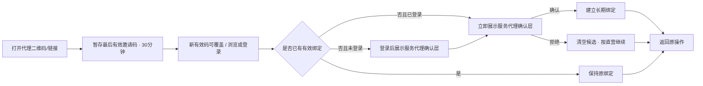
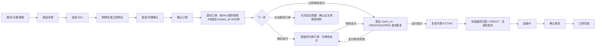

# 洗化产品私域商城三端原型设计方案

> 设计基线：PRD v2.4.8 / CH-022
> 更新日期：2026-08-29
> 当前状态：B0 至 B9 development 已完成并维持 `GO`；B10.0 已在 SHA `8cd5781eed9349d6f110fa43510e78c7f525a482` 取得普通 CI Run `33242561514`、Supabase development migration Run `33243979003`、rollback-only smoke Run `33244107293` 三项成功证据并以 `P0=0/P1=0` 完成。B10.1 Provider/支付意图/Mock Inbox 本地实现与验收已完成并以 `P0=0/P1=0` 退出，现暂停等待用户批准进入 B10.2；B10.2 未开始，B10 尚未 `GO`，CH-021 继续有效。静态验证已通过 `97 responsive renders / 21 MP / 9 AGT / 22 ADM / 17 miniapp flows / 19 admin-agent flows`；真实微信、真实支付、staging/production 尚未准入

## 1. 文档目的

本文定义洗化产品私域商城当前版本的三端页面原型、关键交互、响应式规则与 Figma 重建设计规范。原型用于需求评审、角色权限核对和后续技术设计输入，不是生产前端工程，也不替代 PRD 的业务规则。

CH-022 不增加或删除页面，继续使用 `21 MP + 9 AGT + 22 ADM`。B10 静态原型复用 MP-09/10/11 展示 Mock 支付、继续支付、处理中、成功/失败/取消、迟到退款和人工处理；复用 ADM-10 展示最小只读对账待办与幂等触发。B10.1 工程本地验收虽已完成，本原型自身仍不构成 Provider、支付意图、Mock Inbox 或真实资金链路证据；Supabase Auth、Storage、Data API/PostgREST/Realtime 均不进入原型范围。

关联文档：

- `product-materials/docs/01-需求调研/MVP方案.md`
- `product-materials/docs/01-需求调研/三端角色与代理需求确认.md`
- `product-materials/docs/02-方案设计/PRD产品需求文档.md`
- `product-materials/docs/04-风控管理/需求变更记录.md`
- `product-materials/prototype/index.html`
- `product-materials/prototype/admin.html`
- `product-materials/prototype/agent.html`
- `product-materials/prototype/figma-handoff.md`
- `product-materials/prototype/agent-figma-handoff.md`

## 2. 原型交付范围

本阶段已冻结三套原型的 CH-005 页面/交互规范与 Figma 重建要求。可点击 HTML 用于设计和契约验证，不是生产前端工程。

| 交付物 | 用户 | 基准尺寸 | 重点验证 |
|---|---|---|---|
| 消费者小程序原型 | `CUSTOMER` | 375 × 812，兼容 414 宽度 | 浏览、购买、履约、售后、首次代理绑定 |
| 一级代理工作台原型 | `AGENT_ADMIN` | 1440 × 1000、1024 宽度、390 移动 H5 | 推广、SKU 预计佣金、脱敏客户与订单、订单项佣金快照、银行卡、提现 |
| 总部管理后台原型 | `SUPER_ADMIN` | 1440 × 1000，兼容 1024 宽度 | 统一经营、代理管理、统一佣金规则、归属转移、提现审核 |
| PNG 画面导出 | 评审参与者 | 与画板一致 | 评审、汇报和视觉对照 |
| Figma 重建规范 | 设计师 | Auto Layout + Variables | 组件库、页面和状态重建 |

当前不直接生成云端 `.fig` 文件。PRD v2.4.8、本文与通过专项验证的 HTML 共同构成交互真相来源；设计师可依据 `product-materials/prototype/figma-handoff.md` 和 `product-materials/prototype/agent-figma-handoff.md` 重建 Figma 组件与画板。

## 3. 三端体验原则

1. 角色清楚：消费者、一级代理与总部超级管理员拥有独立入口和导航，不混用角色名称。
2. 总部统一经营：消费者始终向总部商城购买，代理界面不出现改价、库存、收款、发货或售后处理动作。
3. 单层代理：所有页面只出现一级代理，不设计下级、团队或层级树。
4. 数据最小化：代理端只显示已验证账户手机号后四位，未授权显示“未绑定”；订单地址只显示城市，不设计查看明文入口。
5. 账务可解释：预计佣金、可提现、冻结、退款冲正和负余额使用明确名称和流水，不用单一“收益”模糊表达。
6. 规则一致：所有一级代理共用平台商品佣金规则；代理界面不出现独立比例配置，总部通过 `ADM-22` 管理平台默认、一级分类默认和 SKU 覆盖。
7. 授权与佣金分离：自定义商品白名单只限制推广可见和物料生成；绑定客户购买全店任意 SKU 仍按统一规则计佣。
8. 状态可恢复：网络失败、登录中断、支付取消/超时、退款失败、二维码生成失败和提现上传失败均保留上下文并支持重试。
9. 隐私最小化：账户手机号独立可空，未授权显示“未绑定”，不得使用收货地址手机号替代。
10. 界面克制：运营工具保持紧凑、可扫描；消费者端由商品视觉承担主要表达。
11. 单包裹一致：任一活动售后占用阻断整单发货，页面不得提供“先发其余商品”的隐含拆包路径。
12. 服务端裁决：支付结果、售后金额、归因、脱敏昵称、退款双轴和可发数量均展示服务端结果，前端不得自行推导或覆盖。
13. 角色专用投影：消费者、代理与总部列表/详情只渲染各自契约字段和聚合口径，不接收超范围宽字段后通过隐藏控件做权限隔离。

## 4. 品牌与视觉方向

原型继续使用“青序生活”作为视觉占位品牌，不构成最终命名。视觉关键词：清新植物、现代日用护理、专业可信、克制高级。

### 4.1 色彩令牌

| Token | 色值 | 用途 |
|---|---|---|
| `color/sage/600` | `#496859` | 主操作、选中态、植物护理语义 |
| `color/blue/600` | `#2F6578` | 信息、物流、代理渠道辅助重点 |
| `color/coral/500` | `#E27766` | 价格、负向冲正、风险提醒 |
| `color/amber/600` | `#A66B18` | 待审核、预计佣金、冻结状态 |
| `color/charcoal/900` | `#202522` | 标题和主文本 |
| `color/neutral/600` | `#68706B` | 次要文本 |
| `color/neutral/200` | `#E7EAE8` | 边框和分隔线 |
| `color/neutral/050` | `#F7F8F7` | 页面浅背景 |
| `color/white` | `#FFFFFF` | 内容背景 |

禁止大面积渐变、装饰性光斑、过度圆角和单一色系铺满界面。状态除颜色外必须包含文字或图标。

### 4.2 栅格与尺寸

| 项目 | 小程序 | 代理工作台 | 总部后台 |
|---|---|---|---|
| 基础网格 | 4px | 4px | 4px |
| 页面边距 | 16px | PC 24-32px；H5 16px | 24-32px |
| 常用间距 | 8/12/16/24px | 8/12/16/24/32px | 8/12/16/24/32px |
| 卡片圆角 | 8px | 6-8px | 6-8px |
| 输入框高度 | 44px | PC 40px；H5 44px | 36-40px |
| 最小点击区域 | 44 × 44px | H5 44 × 44px；PC 36 × 36px | 36 × 36px |
| 表格最小行高 | 不适用 | 48px | 48px |

### 4.3 字体层级

使用系统中文字体栈：`-apple-system, BlinkMacSystemFont, "Segoe UI", "PingFang SC", "Microsoft YaHei", sans-serif`。

| 层级 | 字号/行高 | 字重 |
|---|---|---|
| 页面主标题 | 22-24/30-32 | 600-700 |
| 区块标题 | 18/26 | 600 |
| 卡片/表格标题 | 14-16/22 | 600 |
| 正文 | 14/22 | 400 |
| 辅助信息 | 12/18 | 400-500 |
| 关键金额 | 20-28/32 | 700 |

页面标题在紧凑经营端不使用超大字号，不通过视口宽度动态缩放字体。

## 5. 消费者小程序原型

### 5.1 页面矩阵

| 原型导航 | PRD 页面 | 主要内容 | 关键交互 |
|---|---|---|---|
| 01 首页 | MP-01 | Banner、分类、热销、新品 | 搜索、分类与商品跳转 |
| 02 分类选购 | MP-02 | 分类、品牌、仅 `ACTIVE` 商品/SKU 的消费者列表、真实空状态 | 分类/品牌筛选，综合/价格/销量/新品排序，清空筛选，详情；无管理字段 |
| 03 搜索结果 | MP-03 | 商品名关键词、品牌/分类筛选 | 搜索、清空筛选、详情 |
| 04 商品详情 | MP-04、MP-05 | 与当前 SPU 绑定的图集、品牌、介绍、规格、成分、用法、价格、库存 | 切换真实商品/SKU 后全部内容同步，收藏、加购、立即购买 |
| 05 购物车 | MP-06 | 游客本地/登录后服务端购物车、五类状态、选择、数量与合计 | 修改、删除、合并重试；登录且存在已选可售项时进入 B9 结算 |
| 06 登录与协议 | MP-07 | 服务端三份法律文本；登录固定同意用户协议/隐私政策，手机号授权说明独立 | Mock 微信登录、版本冲突、限流/失败重试、返回原操作 |
| 07 确认订单 | MP-08 | 脱敏地址、SKU 报价行、价格/库存 blocker、金额、归因候选；无买家备注 | 地址/数量变化后重新报价、确认并创建待付款订单；不发起支付 |
| 08 支付结果 | MP-09 | Mock 支付处理中、成功、失败、取消、关单、迟到退款与人工处理 | 只展示服务端确认投影，不信任客户端成功参数；静态演示不代表真实支付 |
| 09 我的订单 | MP-10 | 商品/SKU 摘要、`display_status`、金额、截止时间和服务端可用动作 | 待付款显示支付/继续支付与取消；状态不确定时禁用重复动作 |
| 10 订单详情 | MP-11 | 商品/地址快照、状态轴、支付处置、金额、截止时间与时间线 | 展示 PAY/CANCEL、支付确认中、迟到退款/人工处理；物流和普通售后仍关闭 |
| 11 物流详情 | MP-12 | 包裹项、承运商、运单号、人工节点 | 复制、刷新、失败重试 |
| 12 售后申请 | MP-13 | 类型、SKU 项、可退/占用数量、服务端试算金额、原因/说明/凭证 | 仅提交数量等允许字段、pending 防重复 |
| 13 售后详情 | MP-14 | 审核、取消、退货地址快照、物流、验货通过/异常、`REFUND_FAILED` 和退款时间线 | 允许阶段取消、填物流、查看验货处置/重试 |
| 14 地址列表 | MP-15 | 默认地址、选择、空状态；收件人、手机号与门牌使用服务端掩码投影 | 新增、编辑、删除、默认自动提升、409 刷新 |
| 15 地址编辑 | MP-16 | 本人详情接口返回的完整收货人、地址手机号、省市区、详细地址与 version | 保存、校验、If-Match、默认地址 422；完整响应禁止缓存 |
| 16 收藏 | MP-17 | `SALEABLE/OUT_OF_STOCK/UNAVAILABLE` 收藏及可空图片/价格 | 商品名搜索、取消 pending、进入可用详情 |
| 17 个人中心 | MP-18 | 本人最小资料、手机号状态、服务代理和隐私入口 | 资料编辑；开放收藏/地址，订单仍提示未开放 |
| 18 服务代理 | MP-19 | 首次候选确认/拒绝；当前代理仅 ID、展示名和绑定时间 | 候选过期/不匹配、并发结果、只读查看 |
| 19 手机号授权 | MP-20 | 可选账户手机号、掩码、验证来源和手机号授权说明 | 授权/重新授权/撤回、409 刷新、失败重试；无客户端 Provider 选择 |
| 20 账号删除 | MP-21 | 5 分钟资格预览、闭合阻断/影响和同步完成态 | 不合格不签能力；二次确认、同步提交、全部会话失效 |

### 5.2 代理绑定交互

首次有效来源流程：



确认层必须包含：代理名称、候选剩余有效时间、总部商城标识、“价格、发货和售后由总部商城统一负责”、明确确认和拒绝。匿名候选 TTL 30 分钟；只有客户端携带有效旧候选 token 时新候选才能替换旧候选，未携带时旧候选自然过期；拒绝立即清空。不得使用“成为下级”“团队”或分佣文案。

邀请码轮换、白名单撤权或商品下架后的旧推广链接仍可展示总部普通商品页，但不显示绑定确认、不设置新候选。页面不得把“该代理无权推广”原因暴露给消费者；已有长期绑定不受影响。

并发确认两个不同代理时不允许最后点击覆盖：按钮提交后进入 pending 并携带同一幂等键，服务端首个绑定成功者胜出，后到响应展示当前服务代理。候选代理在确认或支付前失效时统一降级为直营并继续原购物流程，不显示阻断购买的错误页。

个人中心“服务代理”使用只读详情行。消费者不可改绑或查看佣金；需要变更时提示联系商城客服。

### 5.3 购买主流程



“支付取消”仅表示 Provider 操作取消，订单保持待付款；“主动取消订单”是独立动作。主动取消、超时和支付确认按服务端顺序裁决：`CREATING/OPEN/CLOSE_PENDING` 未收敛前显示“正在确认结果”，不重复创建支付；确认 Provider 不可支付后才关闭订单并释放库存。迟到支付成功进入“已关闭订单收到付款，正在原路退款”，不恢复发货按钮；自动退款失败显示人工处理中，不向用户要求重复付款。

### 5.4 必备状态

- 邀请码无效或代理停用：不覆盖仍有效候选，不阻断购物，不展示内部停用原因。
- 已绑定用户打开其他代理链接：维持原关系，不展示改绑按钮。
- 商品下架、售罄、SKU 不可售、价格变化和库存不足。
- Store 目录响应只含 `ACTIVE` 商品/SKU 与消费者字段；软删除、内部状态/版本、成本、锁定库存和审计字段不得进入页面状态或调试视图。
- 购物车按 SKU 分行，有效/失效分组；同商品不同 SKU 不合并，创建订单前服务端复核。
- 待付款订单、稍后支付、继续支付、Mock 支付成功/失败/取消/处理中、支付超时和迟到支付自动退款。
- 支付意图创建/关闭结果未知、主动取消与支付/超时版本冲突、对账恢复和退款失败人工处理。
- 物流未录入、运输中、已签收和状态更新失败。
- 售后客户端无金额输入，覆盖剩余可退、进行中占用、服务端金额试算、并发额度不足、允许阶段取消、拒绝、退货地址/物流、验货通过/异常/处置、退款双轴、`REFUND_FAILED` 和重试中。
- 未发货部分退款后，须等整单所有活动占用解决才可一次发出最终剩余数量；全额退款显示“退款完成”且无发货/确认收货操作。已发货全退保留物流时间线并显示 `FULL_REFUND_AFTER_SHIPMENT` 完成原因。
- 账户手机号未绑定、授权中、授权失败、已验证；地址手机号在地址页独立展示，不作为账户手机号。
- 账号删除资格检查中、存在订单/售后/未结清支付退款/财务异常阻断、可提交、处理中和已完成。

## 6. 一级代理工作台原型

### 6.1 页面矩阵

| 原型页面 | PRD 页面 | 主要内容 | 关键操作 |
|---|---|---|---|
| 登录与改密 | AGT-01 | 账号、密码、统一错误、停用、限流、首次改密 | 登录、显示密码、强制改密、等待后重试 |
| 概览 | AGT-02 | 归属销售、订单、客户、预计、可提现、冻结、趋势 | 日期切换、跳转明细 |
| 推广中心 | AGT-03 | 默认全部当前/未来在售商品或自定义推广白名单、各 SKU 当前预计比例/佣金、主页推广、二维码与链接 | 搜索、切换 SKU、生成、复制、下载；固定说明白名单仅限制推广 |
| 客户 | AGT-04 | 仅当前有效绑定客户、服务端脱敏资料、当前归属期消费汇总、最近商品 | 筛选、查看只读详情、带客户条件跳订单；无已结束范围，转出后移除 |
| 订单 | AGT-05 | 仅支付成功冻结本人快照的归属订单、商品/SKU、客户城市、金额、状态轴、售后 | 筛选、查看关闭/完成原因、支付处置和只读时间线；无待付款候选 |
| 佣金 | AGT-06 | 预计、入账、退款冲正、订单项规则来源与支付快照 | 日期/类型筛选、按订单项查看计算口径 |
| 钱包与提现 | AGT-07 | 可提现、冻结、负余额、银行卡和一笔进行中限制 | 填写金额、二次确认、幂等提交/冲突反馈 |
| 提现记录 | AGT-08 | 四种状态、时间、原因、凭证摘要 | 筛选、查看详情、重复提交返回同一结果 |
| 账户安全 | AGT-09 | 档案、统一商品规则说明、密码、银行卡 | 改密、当次完整卡号输入、保存后掩码、退出 |

### 6.2 桌面布局

- 左侧固定 216-232px 导航，内容区最大宽度 1440px 内自适应。
- 顶部显示代理名称、账号状态和用户菜单，不显示总部管理功能。
- 概览首行使用稳定四列指标，1024px 时重排为两列。
- 表格筛选区保持单层；金额、订单和客户字段按扫描优先级排列。
- 列表详情使用侧边抽屉或独立页，不在卡片内再嵌套卡片。

### 6.3 移动 H5 布局

- 390px 使用单列布局，底部主导航固定为概览、推广、订单、钱包、更多。
- 客户、佣金与账户放入“更多”，保留清晰返回路径。
- 桌面表格在移动端转换为摘要行，不直接缩小整个表格。
- 摘要行固定展示订单号/客户掩码、金额、状态和日期，点击进入详情。
- 二维码以完整正方形显示，复制和下载使用图标按钮并提供 tooltip/反馈。
- 提现确认使用底部操作层，长银行卡号必须掩码并换行，不允许撑出容器。

### 6.4 隐私与权限呈现

- 客户示例格式：`周** · 手机尾号 4821 · 杭州`；昵称掩码必须由服务端返回，前端不接收完整昵称自行处理。城市取最近一笔本人归属已支付订单，无订单显示“暂无”；未授权账户手机号使用 `周** · 手机未绑定 · 杭州`。
- 订单地址仅显示城市，例如“浙江省杭州市”，不展示街道和门牌。
- 页面不提供“查看完整手机号”“查看完整地址”或任何越权入口。
- 商品卡没有改价、改库存、上下架、发货和售后按钮。
- 订单详情没有代付款、代客下单、发货、退款或改状态按钮。
- 客户转出后从当前列表和详情移除；原代理仅在历史订单看到支付时冻结的脱敏昵称、手机后四位和该订单城市快照。账号删除完成后，历史昵称替换为不可逆客户代号并清空手机号尾号。
- 客户筛选不提供 `UNBOUND/ENDED` 或已转出范围，次数和净消费明确标注“当前归属期”；订单筛选不能请求待付款候选，详情仍完整呈现只读状态轴、关闭/完成原因和支付处置。
- 停用状态只允许显示联系总部的静态说明，不展示业务数据。
- 禁止从订单地址手机号生成代理端尾号；尾号只能来自支付时已验证账户手机号快照。

### 6.5 佣金与钱包状态

- 预计佣金使用琥珀色信息标签，文案“待订单完成后转为可提现”。
- 推广商品按 SKU 显示当前有效预计比例和单件预计佣金，固定附注“最终以订单支付时规则为准”；空值继承不向代理暴露配置空值，`0%` 明确显示“无佣金”。
- 多 SKU 订单的佣金详情按订单项展示 SKU、命中来源（SKU/一级分类/平台默认）、支付比例、净商品实付和佣金金额；订单顶部只显示各项金额之和，不展示平均比例。
- 可提现余额使用主色，并直接提供“申请提现”按钮。
- 完成前退款保留原订单项佣金快照，另列 `EXPECTED_REDUCED`/`EXPECTED_CANCELLED` 流水；全退汇总显示 `CANCELLED`。完成后退款使用 `REFUND_DEBIT` 珊瑚色负数和关联原因，原 `AVAILABLE` 正向记录仍可查看，禁止将原金额直接改成负数。
- 负余额必须显示金额、原因和“当前不可提现，后续佣金将优先抵扣”。
- 冻结金额显示关联提现单，不与预计佣金混为一项。同一代理已有 `PENDING/APPROVED` 时禁用新申请并可跳转当前申请；pending 状态禁止重复点击，超时重试复用原幂等键。

### 6.6 提现状态

| 状态 | 页面表现 | 可执行动作 |
|---|---|---|
| `PENDING` | 琥珀标签“待审核” | 只读；当前版本不可撤回 |
| `APPROVED` | 蓝色标签“已通过，待打款” | 只读 |
| `REJECTED` | 珊瑚标签“已拒绝”并显示原因 | 可返回钱包重新申请 |
| `PAID` | 绿色标签“已支付”并显示支付时间 | 查看凭证摘要 |

演示数据必须同时包含 `APPROVED` 待打款、负余额钱包、`CANCELLED` 预计佣金，以及原 `AVAILABLE` 与 `REFUND_DEBIT` 并列记录。桌面与移动 H5 的主导航名称和顺序保持一致，移动端“更多”只承载低频入口。

银行卡新增/更换时，完整卡号仅存在于当前输入和提交请求；保存成功后表单立即清空，详情、列表、接口日志和再次编辑均只使用掩码，不预填完整卡号或可逆密文。

## 7. 总部管理后台原型

### 7.1 页面矩阵

| 原型页面 | PRD 页面 | 主要内容 | 关键操作 |
|---|---|---|---|
| 登录 | ADM-01 | 超级管理员账号、密码 | 登录、错误和安全提示 |
| 数据看板与销售分析 | ADM-02 | 概览、日/月销售报表、商品销量排行、客户消费排行、渠道和待办 | 标签切换、日期筛选、加载/空/错误/重试 |
| 商品列表/编辑 | ADM-03、ADM-04 | 动态商品、SKU 数、nullable 最低活动价、生命周期、只读库存摘要、活动预占和 SKU 推荐 | 固定草稿/停用创建、编辑、图集、preview-confirm 上下架/归档、恢复、库存只读下钻 |
| 品牌管理 | ADM-05 | 动态品牌、排序、状态和在售引用 | 新增、编辑、停用/软删除阻断 |
| 分类管理 | ADM-06 | 一级分类、排序、在售商品引用 | 新增、编辑、停用阻断、迁移提示 |
| Banner 管理 | ADM-07 | READY/PUBLIC 图片、typed target、排序、有效期、状态和版本 | 固定草稿创建、资料编辑、启停、DELETE 归档、恢复 |
| 库存管理 | ADM-08 | SKU 状态、实物、锁定、活动预占、可售、版本和闭合流水 | 检索、preview-confirm 调整、409/422、只读归档 SKU |
| 订单列表/详情 | ADM-09、ADM-10 | 动态订单记录；B10 仅追加支付对账只读待办 | 查询、查看、幂等触发 reconcile；不得直接修改订单/intent/attempt |
| 发货操作 | ADM-11 | 单包裹门禁、活动售后占用、最终可发 SKU 数量、包裹项、物流 | 占用时整单阻断，预览唯一包裹，确认前取消 |
| 售后列表/详情 | ADM-12、ADM-13 | 服务端计价、地址快照、退货物流、实收/批准退款数量、PASS/ABNORMAL、四类处置、退款双轴、回库、佣金 | 审核、验货数量守恒、退款/补偿、失败重试 |
| 客户 | ADM-14、ADM-15 | 消费、当前代理、绑定历史 | 查看、转移归属 |
| 账户与业务规则 | ADM-16 | 账户安全、TOTP/恢复码、总部退货地址、最低提现金额、售后申请天数 | 绑定/恢复、改密、地址/规则版本、审计提示 |
| 一级代理 | ADM-18、ADM-19 | 账号、邀请码、状态、当前客户/归属净销售/余额/创建时间、全部在售/白名单授权 | 创建、编辑、授权、停用、重置密码；按目标下钻客户/订单/佣金/钱包/提现/审计；无独立比例 |
| 佣金规则 | ADM-22 | 平台默认、一级分类默认、SKU 覆盖、有效比例/来源、版本与影响预览 | 搜索、设置、清空继承、保存新版本、查看审计 |
| 提现审核 | ADM-20、ADM-21 | 申请、余额、银行卡快照、TOTP 短时收款账号、凭证 | 通过、拒绝、TOTP 查看/复制、上传凭证、标记已支付 |
| 审计 | ADM-17 | 关键操作、原因、影响、前后值、幂等/冲突和结果 | 搜索、筛选、查看详情 |

### 7.2 代理管理交互

- 代理列表主列：代理名称/编号、状态、绑定客户、归属净销售、可提现余额、创建时间；不显示可编辑的代理比例。
- 创建成功后临时密码只展示一次，支持复制，不在列表回显。
- 创建/编辑表单仅包含账号、名称、联系方式和状态，不出现佣金比例；只读说明“所有一级代理共用商品佣金规则”，可跳转 `ADM-22`。
- 商品授权默认“全部在售商品”，说明自动包含未来上架商品；切换“自定义白名单”后提供商品搜索、批量选择和空白名单警告。
- 授权区域固定提示：“白名单仅控制代理可见及推广物料；已绑定客户购买全店商品仍按统一规则计佣。”白名单变更预览不显示佣金清零影响。
- 停用确认按 PRD HR-01 展示禁止登录/新绑定、会话、邀请码和候选归因影响；并发支付由服务端裁决，停用先提交只降级直营，不阻断购买。重新启用不追溯停用期订单。
- 邀请码提供轮换、单独停用和有效期管理；按 HR-02 展示旧码立即失效、已有绑定不变，不自行增减高风险字段。
- 代理详情包含概览、客户、订单、佣金、提现、操作日志标签页，不出现下级或团队标签页。
- 代理详情各标签请求均绑定当前代理 ID：客户仅当前有效绑定，订单仅已支付归属，佣金/钱包显示不可变流水，审计使用目标类型与目标 ID 筛选；切换代理时清空全部旧标签响应。

### 7.3 客户归属转移交互

- 客户详情展示当前归属、绑定时间和历史绑定时间线。转出后，原代理当前客户视图立即移除该客户。
- 转移弹窗支持选择 ACTIVE 一级代理或“转为直营”。
- 按 PRD HR-04 必须填写原因并预览“与订单提交按绑定版本串行；先提交的既有订单保留候选，转移后新订单使用新归属；支付快照与历史佣金不变”。
- 二次确认后显示成功反馈、新的有效起始时间和审计编号；409 时保留选择并提示刷新最新绑定。

### 7.4 提现审核交互

- 列表默认突出待审核和已通过待付款，可按代理、金额、状态、时间筛选。
- 详情默认显示申请金额、申请时余额、当前余额、银行卡掩码和状态时间线。
- “审核通过”和“标记已支付”是两个独立按钮与权限动作。
- 仅 `APPROVED` 待付款状态显示“查看收款账号”；点击后验证本人 TOTP，再在带倒计时的受控区域短时显示并允许一次性查看/复制，使用、超时或离页立即清除明文。
- 倒计时固定 60 秒且授权绑定当前管理员和提现申请；查看或复制后立即失效。TOTP 连续失败 5 次时展示 15 分钟锁定状态和剩余时间，密码/TOTP 永不预填。
- 提现拒绝按 HR-10 原因必填并提示解冻金额；审核通过按 HR-11 不要求虚构原因，但必须预览余额与卡快照并二次确认。
- 标记已支付按 HR-12 不要求业务原因，必须上传凭证并复核金额/卡快照；上传失败时保持 `APPROVED`。
- 已支付后金额、银行卡快照和凭证均只读，不允许覆盖历史。

### 7.5 佣金规则管理交互

- 页面顶部为平台默认比例，保存后生成新规则版本。比例输入支持 `0.0000%` 至 `100.0000%`（含边界、最多四位小数）；超范围前后端均拒绝，`0%` 显示“无佣金”，空值只允许出现在分类和 SKU 层并显示“继承”。
- 一级分类区直接读取现有商品一级分类，字段为分类、配置比例、有效比例、来源、覆盖 SKU 数和操作；清空后继承平台默认。所有设置和清空操作均要求原因、影响预览和确认。
- SKU 区展示全部 SKU，包括当前继承的 SKU；支持按一级分类、商品名称和 SKU 编码检索，字段为商品/SKU、分类、SKU 覆盖值、有效比例、来源和操作。搜索继承 SKU 后可直接设置自定义比例、`0%` 或恢复继承。
- 页面固定展示优先级 `SKU 覆盖 > 商品一级分类默认 > 平台默认`，不提供代理选择器、固定金额、阶梯或活动条件。
- 保存前弹窗展示目标、旧值、新值、受影响 SKU 数和“只影响保存后支付订单”的提示；二次确认后生成新版本并展示版本号、操作人和生效时间。
- 规则历史抽屉只读展示版本、目标、前后值和审计。订单项解释抽屉展示支付时版本、命中来源、分类、商品、SKU、比例、公式 `基数 × 比例 / 100`、订单项 `HALF_UP` 两位和金额。
- 空值、0%、加载、无搜索结果、保存冲突、权限拒绝和规则解析异常均有独立状态。

### 7.6 高风险动作

本文件不再维护第二张动作规则表。所有高风险动作必须按 PRD 13.4 的 `HR-01` 至 `HR-15` 唯一矩阵实现；Figma 组件和 HTML 原型只负责呈现矩阵要求，不得把“原因必填 + 影响预览 + TOTP”一刀切到所有动作。

- 所有矩阵动作提交中禁用按钮并保持同一幂等键；409 显示当前最新记录、刷新/重新预览入口，不静默覆盖。
- 需要预览的动作必须先取得绑定当前管理员、会话、动作、目标、请求哈希和资源版本的短时凭证，再进入二次确认。临时密码、TOTP 绑定 URI/恢复码、邀请码明文、银行卡查看授权、预览/确认能力令牌和签名文件 URL 只在签发当次展示，响应均 `Cache-Control: no-store`；刷新、离页、消费或到期后页面不得从缓存恢复。
- HR-08/09 在售后详情展示数量/金额占用、消费者影响、库存与佣金影响；HR-14 在 ADM-16 展示配置/退货地址新版本和历史不回写。
- HR-15 在 ADM-16 承载 TOTP 绑定、恢复码、失败锁定、会话撤销；全凭据丢失的双人离线恢复不设计为可绕过验证的普通网页按钮，只展示受控完成记录。

所有表格详情抽屉必须绑定当前选中记录。订单、发货、客户、代理、佣金和售后抽屉切换记录时，标题、商品项、状态、地址、代理、佣金和操作按钮必须整体更新，不得保留静态跨记录示例。

商品/品牌/分类/Banner/库存/业务规则与审计必须在现有 ADM-03 至 ADM-08、ADM-16、ADM-17 内完成真实增改停用/软删除、校验、流水和版本交互。退货地址、TOTP、验货和金额补偿分别复用 ADM-16、ADM-13，不新增页面。

ADM-13 的验货结果与异常解决必须分开呈现：`PASS` 可零证据，`ABNORMAL` 至少一份，两个结果的证据清单提交后均封存；异常解决只显示 `CONTINUE_REFUND/REJECT_AFTER_RETURN`，继续退款原因必填，解决提交后不可修改。

ADM-16 中订单支付超时仅以只读“数据库固定 `pay_expires_at = created_at + 30 分钟` 且不可修改”展示，法定记录保留年限仅显示外部合规配置快照；两者均不得出现普通后台编辑按钮。退货验货必须一次精确覆盖全部售后项，并实时验证“批准退款 + 退回客户 = 实收”“批准退款 = 回库 + 损坏 + 报废”；提交后的 PASS/ABNORMAL 结论、证据清单及类型化异常解决不可改写。

### 7.7 CH-006 品牌、分类与文件交互

- ADM-05 品牌创建和 ADM-06 分类创建固定显示“保存为草稿”，不提供可编辑状态下拉；品牌/分类排序为非负整数输入，创建必填，编辑可修改，列表按排序值再按稳定 ID 展示。
- 普通编辑只包含契约支持的名称、Logo/Icon、描述和排序字段。不得显示或提交品牌/分类编码、分类说明、佣金来源、商品数量或 SKU 数量等当前 DTO 不支持的数据。
- 行内动作按当前状态展示：DRAFT/INACTIVE 可“启用”或“归档”，ACTIVE 可“停用”，ARCHIVED 可“恢复为草稿”。ACTIVE 不出现直接归档，恢复后不自动启用。
- 启用、停用和归档共用 lifecycle preview-confirm 弹窗，展示动作、目标、原因、版本和 ACTIVE 商品影响。存在阻断依赖时允许查看预览，但确认提交以 `ACTIVE_PRODUCT_DEPENDENCY` 422 阻断，不伪装成功。
- 默认列表不显示 ARCHIVED；状态筛选明确提供“已归档”，详情/抽屉在归档状态保持可读并只开放恢复。恢复只要求原因、版本和确认，不显示 restore-preview；成功后刷新为 DRAFT。
- 409 必须丢弃旧 preview、刷新最新记录并要求重新确认，不自动覆盖新版本；重复同幂等请求只显示同一结果。
- Logo/Icon 上传前在浏览器计算 SHA-256，前端只允许 JPEG/PNG 且最大 5 MiB；上传 URL、签名请求头和下载 URL 只存在内存。上传完成前显示校验中，`FILE_CONTENT_MISMATCH` 422 时清除暂存结果并要求重新选择文件。

### 7.8 CH-010 商品与 SKU 交互

- ADM-03 列表固定按 `published_at DESC NULLS LAST,id DESC` 展示；没有 ACTIVE SKU 时最低活动价显示“—”，不能伪造 0 元。默认不显示 ARCHIVED，显式“已归档”筛选允许进入只读详情和恢复。
- ADM-04 新建 Product 固定显示“保存为草稿”，新建 SKU 固定为 INACTIVE；不提供“保存并发布”或普通状态下拉。SPU/SKU code 创建后只读，恢复也不允许换码。
- 商品图集通过既有 `PRODUCT_IMAGE` 文件流程维护，最多 8 张；编辑提交完整替换集合，界面顺序对应 `sort_order,id`，第一张为主图。上传中、校验失败和保存失败都不得伪装为已挂接成功。
- Product 详情始终列出全部 SKU，包括 ARCHIVED，并按创建时间和稳定 ID 排序。SKU 创建成功时库存摘要显示实物 0、锁定 0、可售 0；B4 只读展示/下钻，不提供库存编辑、佣金字段或 Banner 控件，推荐开关只放在 SKU。
- Product/SKU 行内动作按状态显示：Product 的 DRAFT/INACTIVE、SKU 的 INACTIVE 可启用或归档；ACTIVE 可停用；ARCHIVED 可恢复。Product 恢复为 DRAFT，SKU 恢复为 INACTIVE，父级操作不自动改动子 SKU。
- ACTIVATE、DEACTIVATE、SOFT_DELETE 共用 HR-06 preview-confirm；Product 启用预览展示品牌、分类、主图和 ACTIVE SKU 条件，Product 归档展示 ACTIVE SKU/活动预占，SKU 归档展示活动预占。restore 只要求原因和版本确认，不显示 preview。
- `PRODUCT_PRIMARY_IMAGE_REQUIRED`、`PRODUCT_ACTIVE_SKU_REQUIRED`、`ACTIVE_SKU_DEPENDENCY`、`ACTIVE_INVENTORY_RESERVATION` 422 分别显示可执行的修复入口；409 必须刷新最新资源、丢弃旧 preview 并要求重新确认，不能自动覆盖或复用 token。
- 首次 Product 启用后的发布时间只读展示；停用后重新启用不改变原发布时间。操作成功后同时刷新 Product、SKU、最低活动价、库存摘要、状态和 ETag。

### 7.9 CH-012 Banner 与库存交互

- ADM-07 不录入人工 Banner 编码或自由文本跳转。图片必须来自既有上传流程的 `READY / PUBLIC / BANNER` 文件；原型以实际图片和文件状态模拟该信号，上传未完成时不得保存为已挂接。
- target_type 闭合为 `NONE / PRODUCT / CATEGORY / URL`：NONE 不带目标值，PRODUCT/CATEGORY 选择有效目标 ID，URL 只接受 `https://mall.qingxu.example` 同源地址。`sort_order` 为非负整数；开始与结束时间均可空，同时存在时必须开始早于结束。
- Banner 创建固定为 `DRAFT`，普通资料编辑不改变状态。`DRAFT/INACTIVE` 可 `ACTIVATE` 或 `DELETE`，`ACTIVE` 只可 `DEACTIVATE`，不得直接归档；`ARCHIVED` 仅在显式筛选中返回，恢复要求原因与 If-Match，结果固定为 `DRAFT`。
- Banner `ACTIVATE/DEACTIVATE` 不要求原因；`DELETE/restore` 要求 2–500 字原因。DELETE 可复用确认弹窗，但不是 `BannerStatusAction` preview 分支，界面和审计均不得出现或暗示 `preview_token`。文件或目标在启用前失效统一返回 `STATE_CONFLICT` 409，并要求回编辑刷新；普通编辑、生命周期和恢复的 409 均不得静默覆盖。
- Banner 列表固定 `sort_order ASC,id ASC`；当前公开投影只呈现 ACTIVE 且命中有效期的 Banner，并沿用同一稳定排序。重复提交使用同一业务结果，不得新增重复记录或重复审计。
- ADM-08 只展示 `physical_qty`、`locked_qty`、活动预占、`available_qty = physical_qty - locked_qty` 与余额版本。低库存开关/阈值、预警值、售后占用、独立备注不属于本页契约。
- 人工调整绑定当前 SKU，只提交非零整数 `physical_delta` 和 2–500 字原因；preview 展示实物、锁定、可售和版本的前后值，confirm 使用新幂等键、未消费确认凭据与 `If-Match`。重复确认只产生一次余额变化、流水和审计。
- `physical_after < locked_qty` 返回 `STOCK_INSUFFICIENT` 422，超 PostgreSQL INTEGER 返回 `INVENTORY_QUANTITY_OUT_OF_RANGE` 422，版本冲突返回 409；失败时不改变记录。ARCHIVED SKU 可查看余额与流水，但不开放调整。
- 库存流水只允许 `INITIAL / MANUAL_INCREASE / MANUAL_DECREASE / ORDER_PAID_DEDUCT / ORDER_RESERVE / ORDER_RELEASE / REFUND_RESTOCK / RETURN_RESTOCK / RETURN_DAMAGED / COMPENSATION`，按同一 SKU 展示只追加事实。

### 7.10 CH-014 消费者匿名目录交互

- MP-01 首页按 Banner、分类、热销、新品四区独立渲染。每区只接受 `READY/UNAVAILABLE`；失败区显示空内容、原因与重试，其余 READY 区继续可操作。静态原型使用 `index.html?screen=home&home=partial` 直达分类区失败状态。
- 首页最多展示 10 个 Banner、8 个分类、4 个热销和 4 个新品；PRODUCT Banner 目标无法解析为当前公开商品时不渲染。首页商品卡只来自 ACTIVE Product、ACTIVE 品牌/分类、合法公开图片与 ACTIVE SKU 投影。
- MP-02 分类与品牌选项使用全部 ACTIVE 主数据并按 `sort_order,id` 展示，不出现分页控件。商品列表继续分页，排序项为综合、热销、最新、价格升序和价格降序。
- 综合排序固定为 `is_hot DESC,is_new DESC,sales_count DESC,published_at DESC NULLS LAST,product_id ASC`；热销使用净销量，新品使用首次发布时间，价格使用 ACTIVE SKU 最低价，所有并列项以商品 ID 收口。
- MP-03 只搜索 trim 后的商品名称，输入长度限制 1–200 且大小写不敏感；品牌、分类和描述命中不得伪装为商品名搜索结果，空输入停留在搜索历史。
- MP-04/05 展示全部 ACTIVE SKU。零库存 SKU 显示“售罄”且 `is_salable=false`，不可确认数量；全部 SKU 售罄时商品卡和详情仍可打开，但加入购物车与立即购买禁用。
- B6 未实现微信身份和交易。B6.3 已将游客加购与 MP-06 版本化本地购物车接入工程：同 SKU 合并、不同 SKU 分行，进入购物车时回源刷新，结算只提示登录且不调用服务端 Cart/Order。收藏、立即购买和“我的”仍只提示登录，不显示业务成功。
- 匿名目录 429 必须保留当前筛选/分页上下文，展示准确重试时间并在到期后允许重试；500、慢请求、图片解码失败、首页局部失败和整页失败均有独立状态，不以旧数据冒充最新响应。

### 7.11 CH-016 消费者身份与隐私交互

- MP-07 首先匿名读取用户协议、隐私政策、手机号授权说明三份服务端当前快照。登录只勾选前两份且必须逐项当前版本；版本变化返回 `CONSENT_VERSION_MISMATCH` 409 并要求重新阅读，页面不得创建“已登录”假状态。development/test 使用 Mock 身份 Provider，界面不提供 Provider 选择。
- 登录成功态只代表 `role=CUSTOMER`、`assurance=WECHAT`、`audience=qingxu-store` 的 Store 会话；管理端会话不可复用。当前固定一个消费者微信 AppID，原型不提供 AppID 切换或 union_id 合并入口。
- MP-18 只展示本人最小资料、掩码手机号状态、服务代理和隐私入口；昵称、HTTPS 头像与城市编辑使用当前 profile version 提交，409 时刷新最新资料并要求重新保存；退出仅撤销当前会话。B7 结束时收藏、服务端购物车、地址、订单和交易仍未开放，该历史边界由 CH-018 对前三项取代。
- MP-19 候选只呈现服务端解析的代理展示名、目标和剩余时间。确认/拒绝覆盖 30 分钟过期、token 不匹配 409、并发已裁决和无候选状态；当前服务代理只读展示 `agent_id/display_name/bound_at`，不出现绑定 ID、客户 ID、版本或佣金。
- MP-20 单独展示并同意 PHONE_AUTHORIZATION 当前版本，只提交 Provider credential；授权、重新授权、撤回都具备 pending、If-Match 409 后刷新、失败和成功状态。客户端不选择 Provider，手机号与收货地址电话明确分域。
- MP-21 preview 请求先明确不可逆影响。`eligible=false` 仍展示 blockers/impacts，但无 token/hash/expiry 和确认按钮；`eligible=true` 才展示 5 分钟倒计时与七类影响。confirm 同步完成去标识化并使当前会话失效；出现新阻断返回 422 并停留在阻断态，不提供异步进度或 current 查询，也不把重复请求伪装为再次成功。

### 7.12 CH-018 登录后购物基础交互

- MP-04/17 登录后读取并展示单商品收藏状态。登录前点击收藏会保存一次性受保护动作，认证成功后恢复且只执行一次；提交期间禁用重复点击。失效收藏保留在列表，按 `SALEABLE/OUT_OF_STOCK/UNAVAILABLE` 显示，图片/价格可为空，搜索只匹配商品名。
- MP-06 未登录继续使用版本化本地购物车；登录后只使用服务端购物车，服务异常不得静默降级回游客模式。合并保存固定幂等键和精确本地条目的 journal，丢包使用同一键重试，服务端确认后才删除对应本地项。只有 selected 且 SALEABLE 项计入合计，数量上限为 `min(99,available_stock)`。
- MP-06 的服务端状态闭合为 `SALEABLE/INSUFFICIENT_STOCK/OUT_OF_STOCK/INACTIVE/DELETED`；空购物车对应 `cart_id=null`。结算与立即购买在 B8 只显示“B9 开放”，不得进入确认订单画板或调用订单接口。
- MP-15 列表只展示脱敏摘要；MP-16 只向本人展示完整详情。省/市/区独立输入，手机号为 11 位 ASCII 数字；PATCH/DELETE 携带 version/If-Match，409 刷新后要求重新提交。存在其他地址时取消唯一默认显示 `DEFAULT_ADDRESS_REQUIRED` 422；删除默认地址后按稳定顺序提升下一条。
- MP-18 开放收藏和地址入口，订单继续未开放。13 个个性化 operation 的 401/404/409/422/429/500、慢请求和网络失败均保留当前上下文，不显示伪成功；所有个性化数据禁止进入截图文件名、日志示例或持久响应缓存。

### 7.13 CH-020 订单报价与库存预占交互

- MP-04 的“立即购买”与 MP-06 的“去结算”只在 CUSTOMER 已登录且当前条目可售时进入 MP-08。`BUY_NOW` 固定提交一个 SKU；`CART` 精确提交服务端当前已选购物车项，客户端不得自行补入未选项或失效项。
- MP-08 先选择本人地址并请求 5 分钟报价。页面展示脱敏地址摘要、商品/SKU/公开图片、单价、库存、行金额、固定 `0.00` 运费和总额；`CART_SELECTION_CHANGED/ITEM_UNAVAILABLE/INSUFFICIENT_STOCK` 仍以 200 显示阻断原因，但无 token、confirmation hash、有效期或提交按钮。
- 可提交报价显示明确倒计时。地址、价格、库存、商品状态、购物车选择或会话发生变化，以及 409 `CHECKOUT_QUOTE_EXPIRED/CHECKOUT_QUOTE_MISMATCH/CHECKOUT_REQUOTE_REQUIRED`，都必须清除旧确认能力、重新报价并要求再次确认，禁止复用旧 token 或 hash。
- 订单提交期间禁用重复操作。用户确认后才把 CUSTOMER 绑定的精确请求和固定幂等键保存为受控短期 journal：H5 使用 `sessionStorage`，小程序使用应用沙箱，最长 24 小时。响应丢失只允许原请求原键重试；获得确定成功或确定失败后才清理。journal 不进入 URL、日志、埋点或通用缓存，未知结果不得换新键再次下单。
- MP-10 开放全部、待付款和已关闭列表，按服务端稳定顺序展示商品/SKU 摘要、金额、支付截止时间、关闭原因与可用动作；MP-11 只向订单本人展示地址快照和时间线，并只在服务端返回 `CANCEL` 时开放主动取消。
- 主动取消携带当前 `If-Match`。409 时刷新最新订单，不自动覆盖；用户已取消的精确幂等重放展示当前投影。支付意图、支付按钮、MP-09 支付结果、物流、售后、Admin/Agent 订单在 B9 均不开放，也不显示伪业务成功。
- MP-08/10/11 需要覆盖 375/390/414/1024/1440 五视口，以及 loading、empty、401、404、409、422、429、500、慢请求、重复点击、响应丢失、倒计时归零和无横向溢出。B9.4 工程实现与 Mock API 浏览器证据已交付；B9.5 真实 browser → Nest → PostgreSQL/Redis/MinIO → Worker `1/1` 及精确清理已通过，最终本地独立复审为 `P0=0/P1=0/P2=1`。

### 7.14 CH-022 Mock 支付与最小对账交互

- MP-10/11 只按服务端 `available_actions` 展示 PAY/CANCEL。支付请求 pending、intent 为 `CREATING/OPEN/CLOSE_PENDING` 或结果未知时，支付与取消按钮都不得重复触发。
- 发起支付后进入 MP-09。结果页覆盖处理中、成功、失败、取消、订单超时/关单中、迟到退款中、退款完成和 `MANUAL_REQUIRED`；成功文案必须来自服务端查询，不从 URL 或客户端 Mock 选择直接推导。
- 失败或取消且订单仍在支付期内时返回 MP-11 继续支付；超时或已关闭订单不提供再次支付。迟到支付不显示“订单恢复”或“继续履约”。
- 支付 journal 仅保存订单 ID、订单版本和固定幂等键；Mock capability 只存在于当前内存。静态原型不展示或持久化 Provider payload、交易号、签名、客户标识或支付 token。
- ADM-10 追加 `PAYMENT_INTENT | PAYMENT_SETTLEMENT | LATE_PAYMENT_REFUND` 三类最小只读对账待办：展示订单/intent 的脱敏标识、原因、最后查询时间和当前处置，只有“触发对账”命令。触发为幂等操作，200 显示已收敛，202 显示仍待 Provider 确认；列表和结果均不得携带 capability，不存在状态下拉、人工成功/失败、直接退款或发货控件。
- 所有 B10 支付文字均标记为 Mock/静态演示；本节不代表 Payment Provider、API、Worker、迁移或真实微信回调已完成验收。B10.1 Provider、支付意图与 Mock Inbox 已完成独立的本地验收并暂停待批 B10.2；B10.2 尚未开始。

## 8. Figma 文件结构

建议建立一个 Figma 文件：

```text
00_Cover
01_Foundations
02_Components_MiniProgram
03_Components_Agent
04_Components_Admin
10_MiniProgram_Flow
20_Agent_Desktop_Flow
21_Agent_Mobile_Flow
30_Admin_Flow
80_Edge_Cases
90_Archive
```

### 8.1 画板命名

小程序示例：

- `MP/01/Home/Default`
- `MP/04/Product/SKU-Sheet`
- `MP/07/Login/Agent-Binding`
- `MP/09/Payment/Late-Success-Refunding`
- `MP/09/Payment/Intent-Recovering`
- `MP/09/Payment/Late-Refund-Failed`
- `MP/11/Order/Full-Refund-Completed`
- `MP/14/AfterSale/Refund-Failed`
- `MP/14/AfterSale/Return-Exception`
- `MP/20/Phone/Unbound`
- `MP/21/Account-Deletion/Blocked`
- `MP/19/Service-Agent/Bound`

代理工作台示例：

- `AGT/01/Login/Desktop`
- `AGT/01/Force-Password/Desktop`
- `AGT/02/Dashboard/1440`
- `AGT/03/Promotion/QR-Modal`
- `AGT/06/Commission/Refund-Reversal`
- `AGT/07/Wallet/Negative-Balance`
- `AGT/07/Withdrawal/390`

总部后台示例：

- `ADM/18/Agent-List/1440`
- `ADM/19/Agent-Detail/Commission-Ledger`
- `ADM/19/Agent-Detail/Product-Whitelist`
- `ADM/22/Commission-Rules/Default`
- `ADM/22/Commission-Rules/Category-Inherit`
- `ADM/22/Commission-Rules/SKU-Zero`
- `ADM/22/Commission-Rules/SKU-Inherited-Search`
- `ADM/22/Commission-Rules/Save-Confirm`
- `ADM/22/Commission-Rules/Version-Detail`
- `ADM/16/Business-Rules/Default`
- `ADM/16/Security/TOTP-Enroll`
- `ADM/16/Security/Recovery-Codes`
- `ADM/16/Return-Address/Version-Confirm`
- `ADM/02/Sales-Report/Month`
- `ADM/15/Customer/Transfer-Agent`
- `ADM/20/Withdrawal-List/1440`
- `ADM/21/Withdrawal/Mark-Paid`
- `ADM/21/Withdrawal/Reauth-Reveal`
- `ADM/21/Withdrawal/Reauth-Locked`
- `ADM/13/AfterSale/Refund-Failed`
- `ADM/13/AfterSale/Return-Inspection-Abnormal`
- `ADM/11/Shipment/Blocked-By-AfterSale`
- `ADM/06/Category/Disable-Blocked`

状态后缀统一为：`Default`、`Loading`、`Empty`、`Error`、`Disabled`、`Success`、`Permission-Denied`、`Version-Conflict`、`Duplicate-Submit`。

### 8.2 组件命名

```text
MP/Button/{Primary|Secondary|Text}/{Default|Pressed|Disabled}
MP/ProductCard/{Grid|List}/{Default|SoldOut}
MP/Sheet/AgentBinding/{Prompt|Bound|Invalid|RevokedLink}
MP/Payment/{Pending|Creating|Open|ClosePending|Success|Cancelled|Expired|LateRefunding|LateRefundFailed}
MP/AfterSale/{QuotaAvailable|QuotaReserved|ReturnAddress|ReturnException|RefundFailed|Cancelled}
AGT/Nav/{Sidebar|BottomBar}
AGT/Metric/{Sales|Order|Customer|Expected|Available|Frozen|Negative}
AGT/CustomerRow/{Desktop|Mobile}
AGT/CommissionRow/{Expected|ExpectedReduced|Cancelled|Available|Reversal}
AGT/WithdrawalStatus/{Pending|Approved|Rejected|Paid}
ADM/Table/{Header|Row|Empty|Loading}
ADM/Form/{Input|Select|Upload|SkuRow}
ADM/Dialog/{AgentDisable|InviteRotate|CommissionRuleChange|BindingTransfer|AfterSaleReject|Refund|AmountCompensation|WithdrawalReview|PaymentProof|CategoryDisableBlocked|ShipmentBlocked|ReturnAddressChange}
ADM/CommissionRule/{PlatformDefault|CategoryRow|SkuRow|SourceTag|VersionRow}
ADM/StatusTag/{Order|PaymentIntent|RefundProgress|RefundProcessing|Fulfillment|AfterSale|Agent|Withdrawal}
ADM/Security/{TotpEnroll|RecoveryCodes|Verification|Locked|SessionRevoked}
```

组件使用 Auto Layout；颜色、字体、间距、圆角和响应式断点建立 Variables。图标优先使用现有图标库，陌生图标提供 tooltip。

## 9. 原型数据要求

- 所有商品、订单、客户、代理、银行卡和付款凭证均为演示数据。
- 代理端昵称使用服务端脱敏值；客户手机号只使用已验证账户手机号后四位或“未绑定”样例，地址只到最近归属已支付订单城市；不得从地址手机号生成尾号。账号删除样例使用不可逆客户代号且无手机号尾号。
- 消费者本人售后详情可展示审核时冻结的总部退货地址快照，并标明“仅用于本次退货”；该授权响应禁止缓存，不得把详细地址复制到列表、错误态、日志示例或截图文件名。
- 默认银行卡示例格式：`招商银行 · 尾号 6288`。仅“本人 TOTP 后短时查看”专用状态可使用明确标注为演示数据的完整虚构账号，并同时显示倒计时与使用/离页/超时清除提示；不得在页面初始数据或截图文件名中保存完整值。
- 佣金示例必须同时包含预计、可提现和退款负向流水，以及一个多 SKU 订单的不同规则来源快照。
- 佣金示例不得修改原订单项快照；完成前减少/取消和完成后冲正均以新增流水并列展示。
- ADM-22 数据至少覆盖：平台默认、分类继承、分类 0%、SKU 覆盖、SKU 0% 和 SKU 空值继承；所有一级代理共享同一结果。
- 钱包示例至少包含正常余额、冻结金额和负余额三种状态。
- 总部代理列表至少包含 ACTIVE 与 DISABLED；提现至少包含四种状态。
- 消费者示例必须包含首次绑定确认和已绑定只读两种状态。
- 小程序至少包含两个同商品不同 SKU 的购物车/订单数据、`min(99, 可售库存)` 上限、待付款续付/主动取消、支付意图结果未知与恢复、迟到支付退款、未发货部分/全额退款、退款双轴、售后服务端试算、退货地址/物流/验货异常与 `REFUND_FAILED`。
- B8 购物车样例必须分别表达游客本地、登录后服务端、空 `cart_id=null`、合并 journal 可重试、`SALEABLE/INSUFFICIENT_STOCK/OUT_OF_STOCK/INACTIVE/DELETED` 和 selected 合计；B8 主流程不得进入订单/结算画板。
- 收藏样例必须独立于公开商品 fixture，覆盖 `SALEABLE/OUT_OF_STOCK/UNAVAILABLE`、可空图片/价格、搜索与取消 pending。地址 fixture 必须拆分省市区并包含 version/created_at，仅在本人详情态显示完整演示值。
- 账户手机号示例同时覆盖已验证和未绑定，任何收货地址手机号均不得出现在代理客户资料中。
- 总部抽屉至少使用两条字段明显不同的订单/客户/代理/售后记录验证动态绑定；高风险操作按 PRD HR 矩阵分别验证原因、预览/确认、TOTP/凭证、版本冲突与成功反馈，不得用一组通用假数据代替。
- ADM-02 演示数据可复算今日创建/有效支付、客户总数/新增注册/新增绑定和活跃代理；ADM-11 至少包含“任一售后占用整单阻断”和“占用解决后唯一包裹最终项”；ADM-16 包含 TOTP/恢复码与两个退货地址版本；ADM-13 包含验货通过、异常继续退款、验货后拒绝和金额补偿。
- ADM-13 的 PASS 样例使用零证据封存，ABNORMAL 样例至少一份证据并展示 `CONTINUE_REFUND/REJECT_AFTER_RETURN` 类型、必填继续原因和不可变结果；ADM-18/19 样例验证目标代理的佣金、钱包与审计下钻，ADM-03 样例库存摘要可与 ADM-08 SKU 流水复算。

## 10. 素材说明

商品与 Banner 素材继续使用 `product-materials/prototype/assets/` 中的无品牌占位图片，仅用于内部评审。正式上线前必须替换为具有使用权的真实品牌商品图，并完成压缩、CDN 与内容审核。

二维码由原型生成演示图形，仅验证版式和交互，不应作为真实可追踪二维码投放。

## 11. 评审检查清单

- 三端原型对 PRD 页面 ID 保持可追踪覆盖；一个综合画板可以覆盖多个相关页面 ID，不要求机械的一页一画板。
- 全部角色使用超级管理员、一级代理和消费者，游客只作为状态。
- 页面没有旧版后台角色、二级代理、下级、团队佣金或代理进货文案。
- 代理列表、代理详情和代理账户页没有独立佣金比例；所有代理共用商品规则的文案一致。
- 消费者可看见服务代理，但看不见佣金或改绑入口。
- 已登录未绑定用户打开有效代理链接可立即确认；撤权旧链接退化为普通商品页且不建立候选。
- 代理只能推广和只读查看本人脱敏数据，没有经营、履约和售后写操作。
- 三端商品、客户与订单列表使用角色专用投影：Store 仅 `ACTIVE` 目录，Agent 客户仅当前有效绑定、订单仅已支付归属，Admin 代理/商品列表具备经营汇总和目标下钻；不存在接收超范围字段后前端隐藏。
- 收货/总部兜底完成后佣金立即可提现，不出现 7 天等待期。
- 完成前全退以 `CANCELLED` 呈现；完成后退款以 `REFUND_DEBIT` 负向流水呈现；负余额有禁用提现与未来抵扣说明。
- 推广中心按 SKU 展示预计佣金；佣金详情按订单项展示支付时规则版本/来源、比例、基数与金额，不展示订单平均比例。
- 白名单只限制推广的说明在代理和总部端一致；绑定客户购买白名单外 SKU 的订单仍显示正确佣金。
- 购物车、结算和订单项均按 `sku_id` 展示规格与价格；“稍后支付”和支付取消均保留可继续支付的待付款订单。
- 订单详情能表达订单、支付、退款进度、退款处理和履约状态，支付意图结果未知/恢复、主动取消/超时并发、迟到支付退款、未发货/已发货全退完成原因均有真实路径。
- 售后客户端无金额输入，能表达服务端试算、可退额度、进行中占用、允许阶段取消、任一占用整单发货阻断、退货地址/物流、验货异常处置、退款双轴、`REFUND_FAILED` 和重试。
- 验货结果与异常解决分离：PASS 可零证据、ABNORMAL 至少一份且证据均封存，异常只可一次选择 `CONTINUE_REFUND/REJECT_AFTER_RETURN`，继续退款原因必填。
- ADM-22 覆盖平台默认、一级分类默认、SKU 覆盖、空值继承、0% 无佣金、影响预览、版本审计与订单项解释。
- ADM-22 可检索当前继承的 SKU 并新建覆盖，设置比例、0% 和恢复继承均要求原因、影响预览、二次确认和新版本。
- 佣金比例输入限制 `0.0000%-100.0000%`，示例按 `基数 × 比例 / 100`、订单项 `HALF_UP` 两位复算；分次退款累计不超原订单项佣金，尾笔全退清除舍入尾差。
- 提现区分待审核、已通过待打款、已拒绝和已支付。
- 总部审核通过与上传凭证标记支付是两个独立动作。
- 完整收款账号默认掩码，仅在付款环节本人 TOTP 后短时一次性查看/复制，并有倒计时、使用/离页/超时清除和审计反馈。
- 完整收款账号仅在 `APPROVED` 出现；60 秒单次授权、失败 5 次锁定 15 分钟和离页清除状态均可演示。
- 所有短时凭据、能力令牌和签名 URL 的签发画面都标明一次展示/no-store，刷新或离页后不可恢复；消费者本人售后退货地址是授权例外，但不得进入列表、日志或截图文件名。
- ADM-02 按 PRD 指标口径覆盖日/月销售、商品销量、客户消费排行；ADM-16 覆盖 TOTP/恢复码、退货地址版本、最低提现和售后天数；ADM-19 覆盖商品授权与邀请码。
- 小程序 375/414、代理 390/1024/1440、总部 1024/1440 无关键重叠和页面横向溢出。
- HR-01 至 HR-15 逐项满足 PRD 唯一矩阵；原因、预览/确认、TOTP/凭证只在对应项出现，所有写操作具备 pending、409、重复提交和审计反馈。
- 品牌、分类、商品和 SKU 软删除、在售商品阻断分类/品牌停用、活动预占阻断商品/SKU 删除、普通下架后合法预占可支付均可演示；历史引用不被删除。
- ADM-03/04 可演示 Product DRAFT、SKU INACTIVE 创建，8 图上限、code 只读、Product/SKU 三动作 preview-confirm、分别恢复 DRAFT/INACTIVE、nullable 最低活动价、归档 SKU、零库存摘要和四个 CH-010 422；ADM-07/08 可独立演示 CH-012 Banner DELETE/restore 与库存调整，不混入 B4 商品编辑。
- ADM-07 可演示公开图片、四类 typed target、固定 DRAFT、资料/状态分离、ACTIVE 禁止直接归档、显式 ARCHIVED、DELETE/restore 原因、稳定排序/时间规则及 409；DELETE 不显示 preview token。
- ADM-08 可演示可售公式、非零 physical_delta、原因、preview-confirm、If-Match、重复提交、409/422、归档 SKU 只读和闭合流水类型，且不出现低库存、预警值、售后占用或独立备注。
- MP-01 至 MP-05 可演示 CH-014 的四区状态、精确首页上限、商品名搜索、综合/热销/最新/价格排序、ACTIVE 零库存 SKU 与全售罄商品可浏览；售罄规格不能加购或立即购买。
- MP-07/18/19/20/21 具备法律版本 409、登录限流/失败、资料冲突、候选过期/不匹配、服务代理空态、手机号授权/撤回、注销不合格/5 分钟能力/新阻断/同步成功及会话失效状态；删除阻断包含未结清支付、退款和财务异常，代理历史快照删除后去标识化。
- MP-04/06/15/16/17/18 已覆盖收藏登录后只恢复一次、失效收藏、服务端购物车五状态、空态与 merge journal、地址掩码/详情/409/422/默认提升；CH-020 冻结的 MP-04/06/18 到 MP-08/10/11 报价、提交、列表、详情与取消交互已在 B9.4 完成工程接入并通过本地门禁。
- 同一消费者并发绑定、客户转移与订单提交、代理停用与支付、主动取消/超时与支付、订单完成与退款均有 409/最新状态或明确先后裁决表现。
- AGT-01 错误/停用/限流、AGT-04 客户筛选跳订单、AGT-07/08 一笔进行中/幂等、AGT-09 当次完整卡号输入后掩码均可真实操作。
- 订单、发货、客户、代理、佣金和售后抽屉随当前记录动态更新，不出现跨记录静态数据。
- 三端至少各有一组加载、空、网络错误、权限拒绝、版本冲突、重复提交和成功反馈状态。

## 12. 开发准入结果

v2.4/CH-005 历史文字原型规范已覆盖：

1. 三端角色、单层代理、失效代理降级直营和五类并发裁决；
2. 全代理统一商品佣金规则、`/100` 公式、比例上限、订单项舍入与不可变冲正；
3. 稳定 `intent_no`、支付意图创建/关闭恢复、主动取消/超时串行、对账补偿和迟到退款；
4. 商品售后服务端计价、金额补偿、单包裹整单门禁、退货地址快照、验货异常/处置、退款双轴和履约事实保留；
5. 可选账户手机号、服务端脱敏昵称、账号删除财务阻断和代理历史快照去标识化；
6. 管理员受控创建、TOTP/恢复码、会话撤销、双人离线恢复和 HR-01 至 HR-15 唯一矩阵；
7. 商品生命周期、库存不变量、指标口径、动态记录绑定和代表性异常/恢复状态。

页面数量保持 `21 MP + 9 AGT + 22 ADM`，对应 PRD 唯一 FR 142、AC 116、US 24。CH-014 在既有 96 个响应式渲染、21/9/22 页面契约、14 条小程序流程和 18 条后台/代理流程中追加断言，不新增页面或流程计数；消费者断言覆盖商品名搜索、COMPREHENSIVE/价格排序、ACTIVE 零库存 SKU、全售罄商品和首页单区失败恢复。

CH-016 继续不新增页面或主流程计数，在同一 96 个响应式渲染、21/9/22 页面契约、14 条小程序流程和 18 条后台/代理流程中追加 MP-07/18/19/20/21 身份与隐私断言。本轮完整静态原型验证全部通过，覆盖三份法律文本、Store 会话、未开放入口、候选/服务代理最小投影、手机号和同步注销状态，退出审查为 `P0=0/P1=0`。

CH-018 继续不新增页面或主流程计数，在既有 MP-04/06/15/16/17/18 画板上追加收藏、服务端购物车、合并 journal、地址和未开放交易断言；新增个人中心验收截图但不增加页面 ID。该段文字是 B8.0 时点的冻结记录；B8.1-B8.5 后续已完成并取得同 SHA 双绿。

CH-020 同样不新增页面、FR、AC、US 或 HR 编号，在既有 MP-04/06/08/10/11/18 上冻结报价、重新报价、提交 journal、订单列表/详情和取消边界。静态原型自动化实测通过 `97 responsive renders / 21 MP / 9 AGT / 22 ADM / 16 miniapp flows / 18 admin-agent flows`，覆盖 BUY_NOW/CART 5 分钟报价、旧能力失效、HASH_ONLY 提交 journal、QX+ULID 待付款订单、CANCEL/If-Match、预占释放及支付/物流/售后入口关闭。B9.0 契约实测为 `173 paths / 198 operations / 198 unique operationId / 325 schemas / 703 schema refs / 2,665 local refs / 0 dangling refs`，Redocly 0 warning；静态证据自身不替代工程验收，后续 B9.4 小程序工程与 B9.5 真实浏览器纵向均已分别通过本地验收。

CH-022 继续复用 `21 MP + 9 AGT + 22 ADM`，不新增页面、FR、AC、US 或 HR 编号。B10.0 静态原型在 MP-09/10/11 与 ADM-10 增加 Mock 支付结果和三类最小只读对账交互；自动化实测通过 `97 responsive renders / 21 MP / 9 AGT / 22 ADM / 17 miniapp flows / 19 admin-agent flows`。静态证据只验证信息架构和状态表达；B10.1 Provider/API/Inbox 的本地完成结论来自工程测试与退出复审，而非本原型。

CH-006 不新增页面或主流程数量，但要求更新 ADM-05/06 的草稿创建、排序、ACTIVATE preview-confirm、ARCHIVED 筛选、恢复为草稿和文件上传校验，并移除无 DTO 支持的字段。上述变更已完成静态原型与自动化回归：84 个响应式渲染、21/9/22 页面契约、14 条小程序流程和 16 条后台/代理流程全部通过；该结果是 CH-006 独立证据，不复用 CH-005 的历史结果。

当前结论：页面仍为 `21 MP + 9 AGT + 22 ADM`。B9 development `GO` 历史证据保持；CH-021/CH-022 已批准。B10.0 已在准确 SHA 取得普通 CI、Supabase development migration 与 rollback-only smoke 三项成功证据并以 `P0=0/P1=0` 完成，静态验证为 `97/21/9/22/17/19`。B10.1 Provider/支付意图/Mock Inbox 本地实现与验收已完成并以 `P0=0/P1=0` 退出，现暂停等待 B10.2 批准；B10.2 未开始，B10 尚未 `GO`，CH-021 继续有效；真实微信、真实支付、staging 和 production 均未放行。
