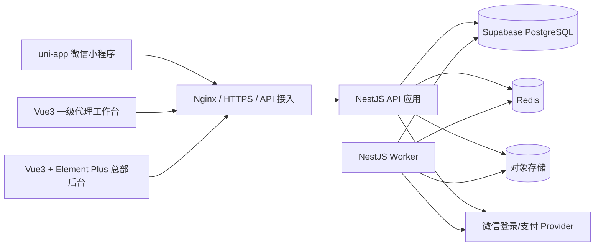

# 洗化产品私域商城技术架构说明

> 技术基线：v2.4.1 / CH-006（2026-08-13）；状态：B3.0 契约已通过验收并暂停，不代表 B3 业务已实现

## 1. 架构结论

首期采用“模块化单体 + 独立异步 Worker”，不拆微服务：

- 消费者端：uni-app 微信小程序；
- 总部管理后台：Vue 3 + TypeScript + Element Plus；
- 一级代理工作台：Vue 3 + TypeScript 响应式 Web/H5，可与后台共享基础组件但独立路由和权限入口；
- 后端：Node.js Active LTS + NestJS + Prisma；
- 主数据：Supabase 托管 PostgreSQL；Supabase 只承担数据库托管，不承接认证、业务授权、对象存储或前端数据 API；当前逻辑模型为 76 张应用表；
- 短期状态：Redis，用于会话辅助、限流、30 分钟推广候选缓存和短时锁；所有业务真相仍落 PostgreSQL；
- 文件：S3 兼容对象存储，bucket 默认私有，仅 `public/*` 可匿名 GET；售后、提现和推广 QR 固定私有；
- 异步任务：同一代码仓库中的 Worker 消费 Outbox，处理订单超时、回调、自动退款、报表和告警。

模块化单体可以在一个数据库事务中完成库存、支付归因、佣金与钱包的一致性处理，避免首期过早引入分布式事务。未来订单量或团队规模需要拆分时，以 Outbox 事件和模块边界为迁移契约。

## 2. 逻辑架构



### 2.1 Supabase 使用边界

- NestJS API 与 Worker 是 `public` schema 中 76 张应用表的唯一访问入口；三端只通过 HTTPS 调用 NestJS。
- 小程序、代理端和总部端禁止初始化 Supabase client，禁止调用 Data API，禁止持有 `anon`、`authenticated` 或 `service_role` 密钥，也不得持有数据库连接串。
- Supabase 项目在 API Settings 中关闭 Data API；撤销前端角色权限和 RLS 默认拒绝仍须保留，作为误配置时的纵深防护。
- 微信授权登录、管理员密码登录、会话、手机号授权和 RBAC 均由现有 Auth/Access Control 模块实现，不使用 Supabase Auth。
- 应用表只放在 `public`，业务外键不得指向 `auth` 或 `storage` schema。文件仍由 NestJS File 模块接入 S3 兼容对象存储，不使用 Supabase Storage 记录作为业务外键。
- `anon`、`authenticated` 对全部应用表和序列默认无权限且无 RLS policy；即使误开 Data API 也不能读取或修改业务数据。应用行级授权仍只在 NestJS 校验，数据库 RLS 仅隔离连接角色。

### 2.2 连接、角色与密钥

| 用途 | 连接模式 | 端口与限制 |
|---|---|---|
| 长驻 API/Worker，运行环境支持 IPv6 | PostgreSQL direct | `5432`；首选，允许连接池和 prepared statements |
| 长驻 API/Worker，仅支持 IPv4 | Supavisor session mode | `5432`；允许 prepared statements，连接池上限须低于项目配额 |
| Prisma migration、`pg_dump`/恢复 | PostgreSQL direct | `5432`；只能由支持 IPv6 或已配置 IPv4 add-on 的受控 CI/运维环境执行 |
| 未来 serverless/edge | Supavisor transaction mode | `6543`；当前容器不得使用；不支持 prepared statements，Prisma 连接需配置 `pgbouncer=true` |

- `mall_runtime` 仅拥有业务运行所需的表级 DML、序列使用权和专用 RLS policy；不得拥有 schema、DDL、角色管理或 `BYPASSRLS` 权限。
- 首次安装由受控的 Supabase 项目所有者账号执行角色初始化和基线 migration，随后将 76 张应用表、59 个枚举与迁移函数的所有权移交给 `mall_migrator`。后续 migration 只通过 `mall_migrator` 执行，日常运行不得使用 `postgres`、`mall_migrator` 或 Supabase `service_role`。
- 按 Prisma ORM 7 连接约定，`schema.prisma` 不保存 URL；`prisma.config.ts` 的 `datasource.url=env('DIRECT_URL')` 只供 CLI/migration 使用，NestJS API/Worker 通过 `@prisma/adapter-pg` 读取 `DATABASE_URL`。`DATABASE_URL` 指向 runtime direct/session，`DIRECT_URL` 指向 migration/`pg_dump` 使用的 direct；两者使用独立最小权限凭据。
- 数据库密码、项目引用、CA 证书、Provider 密钥和信封加密密钥进入 Secret Manager，不进入前端构建产物、日志或仓库。
- 所有数据库连接必须启用 TLS 并校验服务端证书，生产建议 `sslmode=verify-full` 并使用 Supabase 项目 CA；禁止 `sslmode=disable` 或跳过证书校验。

## 3. 后端模块边界

| 模块 | 职责 | 禁止事项 |
|---|---|---|
| Auth | 三端登录、会话、密码、手机号授权、TOTP MFA/恢复码和二次验证 | 不直接决定代理数据范围 |
| Access Control | RBAC、代理行级作用域、敏感字段投影 | 不依赖前端隐藏菜单 |
| Catalog | 品牌、一级分类、商品、SKU、Banner、素材 | 不直接修改历史订单快照 |
| Cart | CUSTOMER 服务端购物车与小程序本地游客项合并 | 不建匿名 Cart，不锁库存、不保存可信价格 |
| Attribution | 邀请码、推广素材、候选、长期绑定与转移 | 白名单不得参与已绑定订单佣金资格 |
| Order | 试算、订单、订单项快照和聚合状态 | 不信任客户端价格或代理 ID |
| Inventory | 实物、锁定、预占和库存流水 | 不允许无流水直接改余额 |
| Payment | 支付意图、回调 Inbox、迟到支付与自动退款 | 不覆盖 Provider 已成功事实 |
| Fulfillment | 包裹、包裹项、物流节点、确认收货 | 不发出被退款或售后占用数量 |
| Aftersale | 售后资格、额度占用、审核、退货和退款 | 不按当前商品价反算历史退款 |
| Commission | 全局规则版本、支付快照、入账和冲正 | 不保存代理专属比例，不修改原快照 |
| Wallet | 代理余额缓存、不可变流水和提现冻结 | 不允许余额脱离账本单独修改 |
| Withdrawal | 银行卡、提现审核、受控查看与付款凭证 | 常规接口不得返回完整卡号 |
| Reporting | 日/月报表和排行缓存 | 不作为支付、退款或佣金真相来源 |
| File | 上传意图、文件权限、签名下载 | 不接受任意本地路径和公共财务文件 |
| Audit | 关键动作、安全事件与差异记录 | 不记录密码、完整手机号、地址或银行卡 |

## 4. 推荐代码结构

```text
apps/
  miniapp/              # uni-app
  agent-web/            # Vue3 响应式代理端
  admin-web/            # Vue3 + Element Plus
  api/                  # NestJS HTTP API
  worker/               # 超时、Outbox、回调和报表任务
packages/
  contracts/            # OpenAPI 生成类型、枚举和错误码
  ui-tokens/            # 三端共享设计令牌，不共享业务权限组件
  config/               # 环境配置校验
prisma.config.ts        # Prisma 7 CLI/migration 只读取 DIRECT_URL
prisma/
  schema.prisma
  migrations/
product-materials/
  docs/
  prototype/
```

API 与 Worker 共用领域模块，但启动入口、资源限制和扩缩容策略分离。消费者、代理和总部前端分别构建，禁止通过同一个前端包仅隐藏菜单来模拟权限隔离。

## 5. 关键一致性设计

### 5.1 本地事务

所有事务只允许采用下面这一套全局锁序；某流程没有某类对象时跳过该级，不得把后级锁提前。进入事务前可无锁读取 ID，但进入后必须重新校验状态和版本：

1. `idempotency_record` / `high_risk_operation_preview` 请求守卫；
2. `account` / `customer_profile` / `agent_profile` 主体，均按 ID 升序；
3. `sales_order`，按 ID 升序；新订单先插入聚合根，再进入后续锁级；
4. `order_item`，按 ID 升序；
5. `payment_intent` / `refund` / `aftersale` / `shipment` 领域事实，先按表序、再按 ID 升序；
6. `sku` / `inventory_balance` / `inventory_reservation`，按 `sku_id` 升序；
7. `commission_rule_version` / 佣金快照与账本；
8. `agent_wallet` / `withdrawal`；
9. 仅追加 `audit_log` 与 `outbox_event`，不反向读取或锁定前级对象。

库存、钱包和订单同时使用 `version` 乐观锁；最后一件库存、售后额度和提现余额等争用路径额外使用 PostgreSQL `SELECT ... FOR UPDATE`。Provider 网络调用、对象存储和消息发布一律不得发生在数据库事务或行锁持有期间。

### 5.2 Inbox 与 Outbox

- 微信支付和退款回调先按 Provider event ID 写入 Inbox，验签失败不进入业务处理。
- 领域事务同时写 Outbox，提交后由 Worker 发布或执行副作用。
- 消费者以事件 ID 幂等；失败按指数退避重试，超过阈值转人工待办。
- 订单创建只落订单、快照、归因候选和库存预占，不创建支付意图、不调用 Provider。首次/重试支付先在短事务中创建或复用唯一非终态本地意图并提交，再以稳定 `intent_no` 幂等调用 Provider；外部成功而本地未回写时，由查询对账恢复。
- 支付成功处理可在事务外预读 `candidate_agent_id` 以定位行，但事务内必须先锁该 `agent_profile/version`，再锁订单、全部订单项和支付意图，并重读候选。代理停用使用同一代理锁；先提交者裁决本次归因，后提交者不得使用事务外旧读。
- 用户主动取消与订单超时使用同一三段流程：首个短事务按全局锁序锁订单、全部订单项和活动支付意图，将 `CREATING/OPEN` claim 为 `CLOSE_PENDING` 后提交；事务外按稳定 `intent_no` 先 query，必要时 close；只有 Provider 明确 `CLOSED/NOT_FOUND/EXPIRED/CANCELLED/FAILED` 后，最终事务再按相同锁序重锁订单、全部订单项、支付意图及库存并关闭订单、释放预占。关闭调用失败或结果未知时状态保持 `CLOSE_PENDING`，只更新 `last_error_code/next_reconcile_at`，绝不先释放库存。
- 退款首次提交和重试共享稳定商户退款号，每次新幂等键追加独立 `refund_attempt`；支付与退款回调统一先入 Inbox。
- Worker 扫描 `CREATING/OPEN/CLOSE_PENDING` 且到达 `next_reconcile_at` 的支付意图，按 `intent_no` 查询 Provider 并恢复为 `OPEN/SUCCEEDED/CLOSED/FAILED/CANCELLED/EXPIRED`；`CLOSE_PENDING` 的失败原因保存在字段而不是伪造新状态。超过重试阈值进入财务人工待办，但不得丢弃真实 Provider 事实。
- 订单完成与退款成功都在单一本地事务中依次锁订单、全部订单项、活动退款/售后、佣金快照/position 和钱包；需要退款回库时库存位于售后事实与佣金之间。完成只结转 `expected_remaining`，退款只追加 reduce/debit，账本以稳定事件键唯一。Outbox 只发布已提交事实，不能代替资金结转事务。
- 绑定确认、总部转移和创建订单统一以永远存在的 `customer_profile/version` 为串行根，先锁客户并递增 version，再读写当前 binding；活动 binding 部分唯一只作兜底。微信登录携带候选 token 时在同一客户锁下迁移候选并清除 token hash，重放或双 token 并发最多保留一个客户候选。
- 分次退款佣金先算 `HALF_UP(refund_amount*rate/100,2)`；尾笔全退用 `original_commission-reversed_total` 清差，其余取 candidate 与 remaining 的较小值。position 在退款事务中锁定，累计冲正永不超过原佣金。

### 5.3 缓存边界

Redis 可保存候选副本、普通访问限流、短时 reauth grant 和只读热点缓存。候选确认、MFA 锁、支付、售后、佣金和提现必须回到 PostgreSQL 再校验；MFA 的 `(account_id,purpose)` 失败计数与 `locked_until` 持久化，Redis 或 challenge 重建都不得绕过 5 次锁定。

CH-006 对短时能力统一采用 `HASH_ONLY`：上传意图、下载签名和品牌/分类 lifecycle preview 只保存规范化请求哈希、状态和资源标识，不缓存签名 URL、签名请求头或 preview token。B3.1 文件完成将新增闭合 `FILE_UPLOAD_COMPLETE` 响应缓存策略，用于同键同请求精确重放；该策略必须由公共内核显式白名单注册，不能让调用方自由选择 scope、TTL 或响应缓存模式，当前 B3.0 不宣称已经实现。

### 5.4 CH-006 文件完成与主数据串行

- 文件 intent 事务写 PENDING、预期 SHA-256、MIME、size、对象 key、审计和幂等事实后提交，再返回 15 分钟 presigned PUT。对象 key 使用不可猜测 ID，固定落 `staging/` 且不含原文件名。
- complete 先用 Redis owner lease 收敛并发，在数据库事务外读取对象并校验 MIME、魔数、大小、SHA-256；校验通过后幂等复制到 `public/` 或 `private/` 最终 key，再以短事务更新 READY、visibility、对象元数据、审计和幂等记录，最后尽力删除 staging。
- copy 成功而数据库提交失败时保留可重试收敛路径，不回退为重复生成新对象。PENDING/staging 只有满 24 小时才进入清理候选，Worker 删除前必须二次确认无 READY 行、无业务引用且最终 key 未被使用。
- 品牌/分类 lifecycle preview 绑定 actor、session、action、target、请求哈希和资源版本；confirm 在串行化事务中重读 ACTIVE 商品依赖、校验并消费 preview、更新状态/version、写审计和幂等事实。
- 生命周期与未来商品发布共享锁序 `brand -> category -> product IDs ASC`；不得在持有数据库锁时访问对象存储或其他外部 Provider。

## 6. Provider 抽象

```ts
interface AuthProvider {
  exchangeLoginCode(code: string): Promise<ExternalIdentity>;
  decryptPhoneCredential(credential: string): Promise<VerifiedPhone>;
}

interface PaymentProvider {
  createPaymentIntent(input: PaymentIntentInput & { intentNo: string }): Promise<ProviderPaymentIntent>;
  queryPaymentIntent(intentNo: string): Promise<ProviderPaymentIntentState>;
  closePaymentIntent(intentNo: string): Promise<CloseResult>;
  verifyCallback(headers: Record<string, string>, rawBody: Buffer): Promise<VerifiedEvent>;
  createRefund(input: RefundInput): Promise<ProviderRefund>;
  queryRefund(refundNo: string): Promise<ProviderRefundState>;
}
```

首期提供 Mock Provider 完成原型与集成测试；正式微信资质就绪后替换 Adapter，不修改订单、退款、佣金和库存领域模型。

## 7. 安全设计

- 三端登录令牌使用短期 access token + 可轮换 refresh token；refresh token 只保存哈希。消费者、代理和后台都提供 refresh、当前会话 logout、全部会话 logout、current-account 与 change-password 契约。后台密码验证通过但需要 MFA 时只返回短时 pre-auth，不创建 session；MFA 验证成功后才签发 access/refresh。
- 密码使用成熟密码哈希算法，管理员与代理登录独立限流；代理停用立即撤销全部会话。
- 数据库敏感字段使用信封加密并保存 key id；密钥由云密钥管理服务托管。
- API/Worker 使用自建微信认证和应用 RBAC；Supabase RLS 不替代租户、角色或代理数据范围校验。
- Supabase `anon`、`authenticated` 和 `service_role` 不进入任何前端或后端应用配置；运维管理令牌仅允许受控 CI/运维使用。
- 总部 MFA 固定采用 RFC 6238 TOTP：密钥信封加密，恢复码只存哈希，时间步防重放；enroll 必须先验证挑战，恢复码消费后立即失效。所有 challenge 创建/验证均检查 PostgreSQL 中跨 challenge 的账户+目的失败守卫，连续失败 5 次锁 15 分钟。完整银行卡查看仅接受当前管理员本人 TOTP，不要求再次输入密码或恢复码；grant 强关联当前 `auth_session`、动作和提现单，60 秒且单次消费。
- 高风险动作只按 PRD `HR-01` 至 `HR-15` 矩阵施加控制。矩阵标记预览的写操作使用短时预览 token、确认哈希和 `If-Match` 绑定主体、会话、动作、目标、请求体与资源版本；`HR-09` 金额补偿不要求 TOTP，`HR-11/12` 不要求原因，`HR-13` 只做明确风险提示和本人 TOTP。`HR-15` 预览不携带凭据，确认才提交当前 TOTP/恢复码并原子消费，凭据不进入预览哈希、影响摘要或日志。
- 首个管理员使用受控 bootstrap CLI 只创建密码主体；首次登录返回 enrollment-required pre-auth，仅允许 enroll/verify，现场验证 TOTP 后才签业务 session。密码/TOTP 同时丢失时不开放 HTTP 恢复，只允许两名不同在职管理员离线审批后由受控 CLI 执行，记录凭据指纹、撤销全部会话并写不可变审计。
- `AMOUNT_COMPENSATION` 在订单项层只占可退金额、不占数量且不回库；成功退款按实际补偿金额和原订单项佣金快照追加佣金减少或 `REFUND_DEBIT`，失败则保留金额占用供受控重试。
- 业务规则与退货地址使用不可变版本；各自同时最多一个 PUBLISHED。订单完成冻结规则版本与售后截止时刻，售后同意由服务端复制唯一当前退货地址及来源版本，客户端不能选择旧/DRAFT 地址。
- 商品创建/更新以 `images[{file_id,sort_order}]` 原子替换活动图集，文件必须 READY 且归属合法；发布商品至少一张图，最小排序为主图。Product 不保存价格，SKU 只保存唯一零售价和推荐状态，不存在会员价。
- 品牌/分类创建固定 DRAFT，列表固定 `sort_order ASC,id ASC`。两类主数据使用专用 ACTIVATE/DEACTIVATE/SOFT_DELETE 状态机；Product/SKU 的共享生命周期类型不因 CH-006 获得 ACTIVATE。ACTIVE 商品依赖在 preview 中可见、在 confirm 中以 422 阻断；ARCHIVED 恢复固定回 DRAFT。
- 完整银行卡响应强制 `no-store`，不得写入幂等响应体、日志或审计前后值。
- 文件只接受 JPEG/PNG 且最大 5 MiB；upload intent 必须携带预期 SHA-256，complete 必须从对象内容复核 MIME/魔数/大小/哈希。上传签名 15 分钟、私有下载签名 5 分钟，所有签名响应 no-store。
- 日志采用字段白名单，集中脱敏；错误响应不返回 ORM、SQL、堆栈和 Provider 原报文。
- 微信支付/退款正式接入必须原样读取 HTTP body，验证 `Wechatpay-Timestamp`、`Wechatpay-Nonce`、`Wechatpay-Serial` 和 `Wechatpay-Signature`，校验平台证书与重放窗口后才写 Inbox；正式证书、ACK 语义和故障演练未通过前只能启用 Mock Provider。

## 8. 性能与可观测

- 核心 API 初始目标为约定 50 并发下 P95 小于 500ms；订单创建、支付和退款单独监控事务耗时与锁等待。
- 商品、订单、客户、佣金、提现和审计全部分页；图片生成缩略图并懒加载。
- 指标至少覆盖请求率、错误率、P95、数据库连接/慢查询、锁等待、Outbox/Inbox 积压、自动退款失败、库存差异和钱包差异。
- 每个请求携带 request ID；业务日志同时记录 order/refund/withdrawal 等对象 ID，但不记录敏感内容。
- 建立库存、钱包、销售日报三类每日复算任务和差异告警。
- 报表按 `Asia/Shanghai` 业务日生成，响应必须携带 `timezone` 和 `as_of`；GLOBAL、DIRECT 与逐代理范围分开统计，注册用户只在 GLOBAL 计一次，新增绑定按渠道归属。支付件数、退款件数分别非负，净件数允许在退款集中日为负。

## 9. 部署拓扑

首期建议两类无状态容器：API 至少 2 副本、Worker 至少 1 副本；PostgreSQL 使用 Supabase 托管，Redis 和对象存储使用独立托管服务。长驻 API/Worker 优先走 direct `5432`，IPv4-only 环境改用 Supavisor session `5432`；migration、`pg_dump` 和恢复固定走 direct。Nginx/云负载均衡终止 HTTPS，管理后台和代理端静态资源通过 CDN 发布，小程序仅访问已备案且配置到微信后台的 HTTPS 域名。

环境至少区分 development、staging、production，每个环境使用独立 Supabase 项目与凭据。生产环境禁止启用 Mock 支付成功入口；Provider 密钥、数据库凭据、加密密钥、CA 证书和对象存储凭据全部由 Secret 管理，不写入仓库。上线前按所选 Supabase 套餐确认自动备份保留期和 PITR 可用性，并完成 staging 恢复演练。生产项目区域必须在真实微信用户网络下完成延迟测试，并经隐私、数据驻留与跨境传输合规评审后确定；评审完成前不得写入真实手机号、地址或银行卡数据。

## 10. 扩展边界

- 多级代理：新增代理关系和分佣链，不改现有订单项佣金快照的不可变原则。
- 多仓：库存余额增加 warehouse 维度，订单预占和包裹项保留现有结构。
- 多包裹：解除订单单包裹唯一约束，现有 `shipment_item` 已支持拆分。
- 优惠券/积分：增加订单项级优惠分摊事实，再将净商品实付作为佣金基数。
- 正式支付：替换 Provider Adapter，保留 raw-body Inbox、稳定商户号查询/关单、对账、幂等、迟到成功和自动退款机制。

## 11. 技术设计验收

- API、数据库和 Prisma 中的状态枚举、金额精度、角色和表述一致。
- 订单创建、正常支付、超时关闭、迟到支付、退款、售后占用、佣金入账和提现均有明确事务边界。
- 白名单只影响推广接口，支付与佣金模型不存在商品授权快照或代理专属规则。
- 原型中的 SKU、订单和状态可以一一映射到 API 字段与数据库事实。
- Provider、缓存和异步任务失败均有可重试、告警和人工补偿路径。
- 所有事务伪代码遵循唯一锁序，Provider 调用不持有数据库锁；`CREATING/OPEN/CLOSE_PENDING` 均可通过稳定 `intent_no` 对账恢复，关闭失败保留在 `CLOSE_PENDING + last_error_code`。
- CH-006 保持 172 paths、196 operations 和 196 个唯一 operationId，schema 数由本轮解析实测；Product/SKU ACTIVATE 必须被闭合 schema 拒绝。
- Prisma/schema/`0001_initial` 逐字节不变，Prisma validate 与 migration diff 为零；不通过时停止 B3.0。
- B3.0 验收后暂停；B2 Supabase development rollback-only 是进入 B3.1 的硬门禁，本地/临时 PostgreSQL 和 MinIO 证据不得替代。

## 12. 官方实现依据

- [Supabase：连接 PostgreSQL](https://supabase.com/docs/guides/database/connecting-to-postgres)
- [Supabase：Prisma 集成](https://supabase.com/docs/guides/database/prisma)
- [Supabase：保护或关闭 Data API](https://supabase.com/docs/guides/api/securing-your-api)
- [Supabase：数据库备份](https://supabase.com/features/database-backups)
- [Prisma：PostgreSQL 与 Prisma 7 连接配置](https://www.prisma.io/docs/orm/core-concepts/supported-databases/postgresql)
