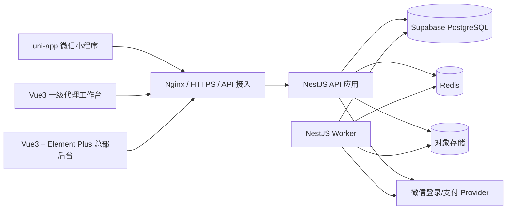

# 洗化产品私域商城技术架构说明

> 技术基线：产品/API 仍为 v2.4.8 / CH-022；数据库修复 CH-023（2026-08-30）。状态：B0-B9 development 已完成并维持 `GO`；B10.2/0004 已在准确 SHA `dc045fbc15d6abdd48959915ec14df9e90bc4306` 通过普通 CI `33253341654`、development migration `33279894978` 与 rollback-only smoke `33280068003`；B10.3 已开始并通过本地关单/对账定向验收，远端三项证据 pending。B10 不得 `GO`，CH-021 继续有效；仅允许 Mock Provider 和脱敏 development，staging、production 与真实支付均为 `NO-GO`

## 1. 架构结论

首期采用“模块化单体 + 独立异步 Worker”，不拆微服务：

- 消费者端：uni-app 微信小程序；
- 总部管理后台：Vue 3 + TypeScript + Element Plus；
- 一级代理工作台：Vue 3 + TypeScript 响应式 Web/H5，可与后台共享基础组件但独立路由和权限入口；
- 后端：Node.js Active LTS + NestJS + Prisma；
- 主数据：Supabase 托管 PostgreSQL；Supabase 只承担数据库托管，不承接认证、业务授权、对象存储或前端数据 API；当前逻辑模型为 76 张应用表；
- 短期状态：Redis，用于会话辅助、限流、30 分钟推广候选缓存和短时锁；所有业务真相仍落 PostgreSQL；
- 文件：S3 兼容对象存储，bucket 默认私有，仅 `public/*` 可匿名 GET；售后、提现和推广 QR 固定私有；
- 异步任务：同一代码仓库中的 Worker 消费 Outbox，处理订单超时、回调、自动退款、报表和告警。

模块化单体可以在一个数据库事务中完成库存、支付归因、佣金与钱包的一致性处理，避免首期过早引入分布式事务。未来订单量或团队规模需要拆分时，以 Outbox 事件和模块边界为迁移契约。

## 2. 逻辑架构



### 2.1 Supabase 使用边界

- NestJS API 与 Worker 是 `public` schema 中 76 张应用表的唯一访问入口；三端只通过 HTTPS 调用 NestJS。
- 小程序、代理端和总部端禁止初始化 Supabase client，禁止调用 Data API，禁止持有 `anon`、`authenticated` 或 `service_role` 密钥，也不得持有数据库连接串。
- Supabase 项目在 API Settings 中关闭 Data API；撤销前端角色权限和 RLS 默认拒绝仍须保留，作为误配置时的纵深防护。
- 微信授权登录、管理员密码登录、会话、手机号授权和 RBAC 均由现有 Auth/Access Control 模块实现，不使用 Supabase Auth。
- 应用表只放在 `public`，业务外键不得指向 `auth` 或 `storage` schema。文件仍由 NestJS File 模块接入 S3 兼容对象存储，不使用 Supabase Storage 记录作为业务外键。
- `anon`、`authenticated` 对全部应用表和序列默认无权限且无 RLS policy；即使误开 Data API 也不能读取或修改业务数据。应用行级授权仍只在 NestJS 校验，数据库 RLS 仅隔离连接角色。

### 2.2 连接、角色与密钥

| 用途 | 连接模式 | 端口与限制 |
|---|---|---|
| 长驻 API/Worker，运行环境支持 IPv6 | PostgreSQL direct | `5432`；首选，允许连接池和 prepared statements |
| 长驻 API/Worker，仅支持 IPv4 | Supavisor session mode | `5432`；允许 prepared statements，连接池上限须低于项目配额 |
| Prisma migration、`pg_dump`/恢复 | PostgreSQL direct | `5432`；只能由支持 IPv6 或已配置 IPv4 add-on 的受控 CI/运维环境执行 |
| 未来 serverless/edge | Supavisor transaction mode | `6543`；当前容器不得使用；不支持 prepared statements，Prisma 连接需配置 `pgbouncer=true` |

- `mall_runtime` 仅拥有业务运行所需的表级 DML、序列使用权和专用 RLS policy；不得拥有 schema、DDL、角色管理或 `BYPASSRLS` 权限。
- 首次安装由受控的 Supabase 项目所有者账号执行角色初始化和基线 migration，随后将 76 张应用表、59 个枚举与迁移函数的所有权移交给 `mall_migrator`。后续 migration 只通过 `mall_migrator` 执行，日常运行不得使用 `postgres`、`mall_migrator` 或 Supabase `service_role`。
- 按 Prisma ORM 7 连接约定，`schema.prisma` 不保存 URL；`prisma.config.ts` 的 `datasource.url=env('DIRECT_URL')` 只供 CLI/migration 使用，NestJS API/Worker 通过 `@prisma/adapter-pg` 读取 `DATABASE_URL`。`DATABASE_URL` 指向 runtime direct/session，`DIRECT_URL` 指向 migration/`pg_dump` 使用的 direct；两者使用独立最小权限凭据。
- 数据库密码、项目引用、CA 证书、Provider 密钥和信封加密密钥进入 Secret Manager，不进入前端构建产物、日志或仓库。
- 所有数据库连接必须启用 TLS 并校验服务端证书，生产建议 `sslmode=verify-full` 并使用 Supabase 项目 CA；禁止 `sslmode=disable` 或跳过证书校验。

## 3. 后端模块边界

| 模块 | 职责 | 禁止事项 |
|---|---|---|
| Auth | 三端登录、会话、密码、手机号授权、TOTP MFA/恢复码和二次验证 | 不直接决定代理数据范围 |
| Access Control | RBAC、代理行级作用域、敏感字段投影 | 不依赖前端隐藏菜单 |
| Catalog | 品牌、一级分类与素材；ProductCatalog 子模块负责管理端商品、SKU、图集和只读库存投影；Banner 为 B5 独立子模块；B6 使用独立 StoreCatalog 公开只读投影 | 不直接修改历史订单快照，不在商品编辑中写库存，不复用宽管理 DTO 向匿名端返回 |
| Favorites | CUSTOMER 收藏写入、失效商品安全投影与单商品收藏状态 | 不因商品失效删除偏好，不复用只表达 ACTIVE 商品的公开目录 DTO |
| Cart | CUSTOMER 服务端购物车与小程序本地游客项合并 | 不建匿名 Cart，不锁库存、不保存可信价格 |
| Address | CUSTOMER 收货地址、加密、脱敏、默认地址与乐观锁 | 不向非所有者返回存在性，不在审计/日志记录完整 PII |
| Attribution | 邀请码、推广素材、候选、长期绑定与转移 | 白名单不得参与已绑定订单佣金资格 |
| Order | B9 独立 Checkout/Order 子模块负责签名报价、订单/地址/归因快照、预占、本人查询与无支付意图关单 | 不信任客户端价格、库存或代理 ID；B9 不创建 payment_intent 或调用 Provider |
| Inventory | 实物、锁定、预占和库存流水 | 不允许无流水直接改余额 |
| Payment | B10 独立 Provider Adapter、支付意图、结果 Inbox、对账、迟到支付与自动退款 | 不在数据库事务内调用 Provider，不覆盖 Provider 已成功事实，不向客户端暴露 Provider 选择 |
| Fulfillment | 包裹、包裹项、物流节点、确认收货 | 不发出被退款或售后占用数量 |
| Aftersale | 售后资格、额度占用、审核、退货和退款 | 不按当前商品价反算历史退款 |
| Commission | 全局规则版本、支付快照、入账和冲正 | 不保存代理专属比例，不修改原快照 |
| Wallet | 代理余额缓存、不可变流水和提现冻结 | 不允许余额脱离账本单独修改 |
| Withdrawal | 银行卡、提现审核、受控查看与付款凭证 | 常规接口不得返回完整卡号 |
| Reporting | 日/月报表和排行缓存 | 不作为支付、退款或佣金真相来源 |
| File | 上传意图、文件权限、签名下载 | 不接受任意本地路径和公共财务文件 |
| Audit | 关键动作、安全事件与差异记录 | 不记录密码、完整手机号、地址或银行卡 |

## 4. 推荐代码结构

```text
apps/
  miniapp/              # uni-app
  agent-web/            # Vue3 响应式代理端
  admin-web/            # Vue3 + Element Plus
  api/                  # NestJS HTTP API
  worker/               # 超时、Outbox、回调和报表任务
packages/
  contracts/            # OpenAPI 生成类型、枚举和错误码
  ui-tokens/            # 三端共享设计令牌，不共享业务权限组件
  config/               # 环境配置校验
prisma.config.ts        # Prisma 7 CLI/migration 只读取 DIRECT_URL
prisma/
  schema.prisma
  migrations/
product-materials/
  docs/
  prototype/
```

API 与 Worker 共用领域模块，但启动入口、资源限制和扩缩容策略分离。消费者、代理和总部前端分别构建，禁止通过同一个前端包仅隐藏菜单来模拟权限隔离。

## 5. 关键一致性设计

### 5.1 本地事务

所有事务只允许采用下面这一套全局锁序；某流程没有某类对象时跳过该级，不得把后级锁提前。进入事务前可无锁读取 ID，但进入后必须重新校验状态和版本：

1. `idempotency_record` / `high_risk_operation_preview` 请求守卫；
2. `account` / `customer_profile` / `agent_profile` 主体，均按 ID 升序；
3. 已存在的 `sales_order` 按 ID 升序；CH-020 首次下单没有既有 order，使用下述专用序列并在共享前级事实通过后插入；
4. `order_item`，按 ID 升序；
5. `payment_intent` / `refund` / `aftersale` / `shipment` 领域事实，先按表序、再按 ID 升序；
6. Catalog 路径依次锁 `brand -> category -> product -> sku -> inventory_balance -> inventory_reservation`，每类按 ID 升序；非 Catalog 交易路径跳过 brand/category/product，并继续按 `sku_id -> inventory_balance -> inventory_reservation` 升序；
7. `commission_rule_version` / 佣金快照与账本；
8. `agent_wallet` / `withdrawal`；
9. 仅追加 `audit_log` 与 `outbox_event`，不反向读取或锁定前级对象。

库存、钱包和订单同时使用 `version` 乐观锁；最后一件库存、售后额度和提现余额等争用路径额外使用 PostgreSQL `SELECT ... FOR UPDATE`。Provider 网络调用、对象存储和消息发布一律不得发生在数据库事务或行锁持有期间。

CH-020 冻结两条不可混用的子序列。首次下单没有既有 order 且 B9 不创建 payment intent，使用 `idempotency -> account/customer -> CART/cart items（仅 CART）-> address -> binding/agent -> brand -> category -> product -> SKU ID ASC -> inventory_balance ID ASC -> insert order/reservation/snapshots -> ledger -> audit/outbox`。主动取消/Worker 使用 `idempotency（Worker 跳过） -> order -> payment_intent -> SKU ID ASC -> inventory_balance ID ASC -> inventory_reservation ID ASC -> ledger -> audit/outbox`。候选 reservation/SKU ID 可在加锁前无锁读取，但只用于定位，锁内必须重验状态、版本和归属；严禁先锁 reservation 再回头锁 SKU/balance。Quote 与其他无锁预读均不得作为提交裁决事实。

B9 Quote 使用 Repeatable Read，只生成 5 分钟签名能力而不写数据库或锁库存。签名密钥从当前/历史幂等哈希密钥通过 HKDF 和 `qingxu:store-checkout-quote:v1` 域派生，token 内只放服务端事实摘要和 key ID；创建事务先查询已完成 HASH_ONLY 幂等事实，再校验 token、confirmation hash 与锁内当前事实。这样响应丢失后的同键重放不受 token 后续过期影响，而首次提交绝不接受过期或漂移报价。

### 5.2 Inbox 与 Outbox

- 微信支付和退款回调先按 Provider event ID 写入 Inbox，验签失败不进入业务处理。
- 领域事务同时写 Outbox，提交后由 Worker 发布或执行副作用。
- 消费者以事件 ID 幂等；失败按指数退避重试，超过阈值转人工待办。
- 订单创建只落订单、快照、归因候选和库存预占，不创建支付意图、不调用 Provider。首次/重试支付先在短事务中创建或复用唯一非终态本地意图并提交，再以稳定 `intent_no` 幂等调用 Provider；外部成功而本地未回写时，由查询对账恢复。
- 支付成功处理可在事务外预读 `candidate_agent_id` 以定位行，但事务内必须先锁该 `agent_profile/version`，再锁订单、全部订单项和支付意图，并重读候选。代理停用使用同一代理锁；先提交者裁决本次归因，后提交者不得使用事务外旧读。
- B9 创建不产生 payment_intent。主动取消与超时 Worker 只处理完全不存在 payment_intent 的订单，共用本地原子关闭函数；取消写 `USER_CANCELLED/RELEASED`，数据库时间到期写 `PAYMENT_TIMEOUT/EXPIRED`，两者按同一订单和升序 SKU/balance 锁序释放且依赖库存流水条件唯一索引防止重复。发现任何 payment_intent 一律 fail closed，不查询 Provider、不释放库存，交由 B10。
- CH-022 将关闭扩展为三段 Provider 流程：首个短事务 claim `CREATING/OPEN` 为 `CLOSE_PENDING`，事务外按稳定 `intent_no` query/close，明确不可支付后再在最终事务关单释放；未知结果继续保持占用。B10.1 与 B10.2 本地范围已实现；B10.3 已开始，定向关单/对账验收通过，远端三项证据 pending。
- 退款首次提交和重试共享稳定商户退款号，每次新幂等键追加独立 `refund_attempt`；支付与退款回调统一先入 Inbox。
- Worker 扫描 `CREATING/OPEN/CLOSE_PENDING` 且到达 `next_reconcile_at` 的支付意图，按 `intent_no` 查询 Provider 并恢复为 `OPEN/SUCCEEDED/CLOSED/FAILED/CANCELLED/EXPIRED`；`CLOSE_PENDING` 的失败原因保存在字段而不是伪造新状态。超过重试阈值进入财务人工待办，但不得丢弃真实 Provider 事实。
- 订单完成与退款成功都在单一本地事务中依次锁订单、全部订单项、活动退款/售后、佣金快照/position 和钱包；需要退款回库时库存位于售后事实与佣金之间。完成只结转 `expected_remaining`，退款只追加 reduce/debit，账本以稳定事件键唯一。Outbox 只发布已提交事实，不能代替资金结转事务。
- 绑定确认、总部转移和创建订单统一以永远存在的 `customer_profile/version` 为串行根，先锁客户并递增 version，再读写当前 binding；活动 binding 部分唯一只作兜底。微信登录携带候选 token 时在同一客户锁下迁移候选并清除 token hash，重放或双 token 并发最多保留一个客户候选。
- 分次退款佣金先算 `HALF_UP(refund_amount*rate/100,2)`；尾笔全退用 `original_commission-reversed_total` 清差，其余取 candidate 与 remaining 的较小值。position 在退款事务中锁定，累计冲正永不超过原佣金。

### 5.3 缓存边界

Redis 可保存候选副本、普通访问限流、短时 reauth grant 和只读热点缓存。候选确认、MFA 锁、支付、售后、佣金和提现必须回到 PostgreSQL 再校验；MFA 的 `(account_id,purpose)` 失败计数与 `locked_until` 持久化，Redis 或 challenge 重建都不得绕过 5 次锁定。

CH-006/CH-008 对短时能力采用两类边界：上传意图与品牌/分类 lifecycle preview 使用 `HASH_ONLY`，只保存规范化请求哈希、状态和资源标识，不缓存签名 URL、签名请求头或 preview token；`GET /files/{file_id}/download-url` 没有 `Idempotency-Key`，不建立幂等记录，响应必须 no-store/private，签名 URL 不得持久化或写入日志。B3.1 文件完成使用闭合 `FILE_UPLOAD_COMPLETE` 响应缓存策略，用于同键同请求精确重放；该策略由公共内核显式白名单注册，调用方不能自由选择 scope、TTL 或响应缓存模式。

CH-012 增加闭合 `BANNER_RESOURCE_RESPONSE`，只缓存字段完整的 Banner 成功响应；库存 preview 继续使用 `HASH_ONLY`，confirm 使用 `COMMAND_RESPONSE`。任何签名 URL、preview token 或确认哈希都不得进入缓存正文。

CH-014 的 5 个匿名 Store GET 共享 Redis 60 秒固定窗口，以不可逆 HMAC 来源 IP 为 key，每 key 最多 120 次。不存储原始 IP；超限返回 429 与精确整数秒 `Retry-After`。Redis 超时、脚本错误或断连时 fail closed，不能因为缓存故障绕过公开限流。

CH-020 Quote token 不属于缓存或幂等响应正文：API 只在 no-store/private 响应中签发，不落 Redis、数据库、审计或日志。B8 个性化接口与 B9 五个订单接口共享 CUSTOMER+来源 IP 120/60 Redis 固定窗口；Redis 故障继续 fail closed。

CH-018 的 13 个登录后 Store operation 共享 Redis 60 秒固定窗口，以 CUSTOMER 与来源 IP 的用途隔离 HMAC 组合摘要为 key，每 key 最多 120 次；Redis 不保存原始客户标识或 IP。超限返回准确整数秒 `Retry-After`，Redis 异常 fail closed。8 个写 operation 统一 `HASH_ONLY`，不缓存个性化响应正文；重放仍须重新鉴权并实时投影。

API 的 Express `trust proxy` 默认固定为 false。只有 `API_TRUSTED_PROXY_CIDRS` 显式列出的直接可信代理数字 IP/CIDR 才参与代理链解析；配置拒绝 hostname、全网段、带 host bits 和语义重复项。IPv4-mapped IPv6 可信网段与请求来源统一归一化为 IPv4，再进入 HMAC，防止相同来源通过两种地址表示拆分限流桶。空配置下客户端伪造 `X-Forwarded-For` 不改变 `request.ip`。

### 5.4 CH-006 文件完成与主数据串行

- 文件 intent 事务写 PENDING、预期 SHA-256、MIME、size、对象 key、审计和幂等事实后提交，再返回 15 分钟 presigned PUT。对象 key 使用不可猜测 ID，固定落 `staging/` 且不含原文件名。
- complete 先用 Redis owner lease 收敛并发，在数据库事务外读取对象并校验 MIME、魔数、大小、SHA-256；校验通过后幂等复制到 `public/` 或 `private/` 最终 key，再以短事务更新 READY、visibility、对象元数据、审计和幂等记录，最后尽力删除 staging。
- copy 成功而数据库提交失败时保留可重试收敛路径，不回退为重复生成新对象。PENDING/staging 只有满 24 小时才进入清理候选，Worker 删除前必须二次确认无 READY 行、无业务引用且最终 key 未被使用。
- 品牌/分类 lifecycle preview 绑定 actor、session、action、target、请求哈希和资源版本；confirm 在串行化事务中重读 ACTIVE 商品依赖、校验并消费 preview、更新状态/version、写审计和幂等事实。
- 品牌/分类生命周期与 Product/SKU 发布共享锁序 `brand -> category -> product -> SKU -> inventory_balance -> inventory_reservation`，同类 ID 升序；候选 reservation ID 只能无锁定位并须在锁内重验，不得先锁 reservation；不得在持有数据库锁时访问对象存储或其他外部 Provider。

### 5.5 CH-010 Product/SKU 事务边界

- Product/SKU 使用独立 `ProductCatalogRepository`，不把商品聚合逻辑塞入只负责品牌/分类的 B3 主数据仓储。所有写操作先完成权限、规范化请求和幂等 claim，再进入短事务；商品图对象只读取已 READY 的数据库事实，事务内不访问对象存储。
- Product 创建显式写 DRAFT；SKU 创建显式写 INACTIVE，并在同一事务插入唯一 `inventory_balance(physical_qty=0,locked_qty=0)`、审计和幂等结果。SPU/SKU code 永不进入 update set，软删除后继续由现有唯一约束保留。
- Product/SKU ACTIVATE、DEACTIVATE、SOFT_DELETE 统一使用高风险 preview repository。token 只存哈希并绑定 actor、session、action、target、请求体和版本；confirm 在同一串行化事务中重查状态、品牌/分类、图集、ACTIVE SKU 与活动预占，成功后消费 preview、递增版本并写审计/幂等/outbox，失败不消费。
- Product 首次 ACTIVATE 以 `published_at = COALESCE(published_at, database_now)` 写入；停用和重新启用不覆盖。Product/SKU 状态变化不级联；Product restore 写 DRAFT，SKU restore 写 INACTIVE，均不使用 preview。
- Product 图集采用最多 8 项的完整原子替换，活动关系固定 `sort_order,id`；详情查询明确包含 ARCHIVED SKU 并按 `created_at,id`。列表的 nullable 最低活动价只聚合 ACTIVE SKU，空集合返回 null，排序固定 `published_at DESC NULLS LAST,id DESC`。
- 现有 Prisma/首迁移字段足以承载全部事实，CH-010 的结构变更数为 0；任何要求新增列或修改冻结文件的实现必须停止并另行走变更流程。

### 5.6 CH-012 Banner 与库存事务边界

- Banner 写路径使用独立 repository。创建显式 DRAFT；资料更新不含状态；ACTIVATE/DEACTIVATE 走闭合 action；DELETE 只允许 DRAFT/INACTIVE 归档，restore 固定回 DRAFT。幂等、Banner、旧/新 target、文件数据库事实、审计与 outbox 在短事务内按既有全局锁序重查；事务内不访问对象存储。
- Banner 公开投影在查询时同时校验 ACTIVE、未归档、`(starts_at IS NULL OR starts_at <= now) AND (ends_at IS NULL OR now < ends_at)`、READY/PUBLIC/BANNER 文件及 ACTIVE PRODUCT/CATEGORY target；起止均非空时 `ends_at > starts_at`。HTTPS URL 最长 500 字符且必须命中服务端 allowlist；目标失效时不回写 Banner，只从公开投影排除。ACTIVE 资料更新也按 ACTIVATE 的文件与 target 规则重查。
- 库存 preview 注册 `INVENTORY.ADJUST/INVENTORY`，绑定 actor、session、SKU、规范化请求与 `inventory_balance.version`。preview 只读并返回前后 physical/locked/available；ARCHIVED SKU 以 `STATE_CONFLICT` 409 拒绝且不签发 token，下界风险仍返回 warning，不提前消费 token。
- 库存 confirm 的锁序为 `idempotency -> high_risk_preview -> sku -> inventory_balance -> reservation IDs -> inventory_ledger -> audit/outbox`。reservation ID 可无锁预读但只用于定位；同一串行化事务在 SKU/balance 后才锁 reservation 并重查版本和活动预占，条件更新 physical/version，插入一条人工流水并消费 preview；任何 409/422 都整体回滚且不消费 preview。
- 重复同键精确重放；同 preview 换新键、并发确认或过期/篡改 token 不得新增第二条流水。ARCHIVED SKU 只读。现有 Prisma/首迁移足以承载全部事实，CH-012 结构变更数固定为 0。

### 5.7 CH-014 Store 公开目录快照

- B6.1 使用独立 `StoreCatalogRepository`，不把公开投影塞入管理端 ProductCatalog/Banner/Inventory repository。查询使用 Repeatable Read 快照，在同一快照中以参数化 SQL 完成分页、最低 ACTIVE SKU 价格和稳定排序。
- 主查询确定公开 Product ID 后，批量装配 READY/PUBLIC 图片、全部 ACTIVE SKU、库存余额、ACTIVE Brand/Category，禁止 N+1。价格与库存必须来自同一快照；缺失 `inventory_balance` 时 fail safe 为不可售。
- 公开 Product 需 Product/Brand/Category 均 ACTIVE 且至少一个 ACTIVE SKU；零库存 SKU 仍返回且 `is_salable=false`。响应只使用 Store DTO，禁止管理状态、version、file ID 和 physical/locked 库存泄露。
- 首页四区可独立失败；单区失败返回空数组与 `UNAVAILABLE`，其他分区仍为同次请求的有效只读事实。全部四区失败才返回 500。
- CH-014 不写库、不新增缓存真相、不修改 Prisma 或首迁移。搜索模糊匹配与价格排序索引只在 staging 数量级 EXPLAIN 后评估，本批不擅自迁移。
- B6.1 已实现 `/store/home`、`/store/categories`、`/store/brands`、`/store/products`、`/store/products/{product_id}` 及共享限流 guard。repository unit `9 passed`；database 全包 `332 passed / 52 环境模式跳过`；隔离 PostgreSQL full 和受控 Supabase development rollback-only 均为 `1 passed / 1 mode skip` 且事务外 fixture 为 0；API 全包 `426 passed / 26 环境模式跳过`；config `67 passed`。
- B6.2 已通过跨端 Store API 客户端复用这 5 个公开 GET，并完成 MP-01 首页、MP-02 分类、MP-03 搜索、MP-04 商品详情和 MP-05 SKU 选择层。
- B6.3 已完成 MP-06 版本化游客本地购物车：同 `sku_id` 合并、不同 SKU 分行；进入页面时按 `product_id` 去重顺序回源公开详情并刷新价格、库存和状态。404/缺 SKU 才判失效，售罄/失效项排除合计；429 与网络失败保留本地项且不误判下架。结算只提示登录，不调用服务端 Cart/订单。
- B6.3 历史本地累计验收为 miniapp unit `6 files / 84 passed`、H5 与 MP-Weixin build 均通过、B6 UI Playwright `34 passed / 56 designed skips`；覆盖 375/390/414/1024/1440 五个视口，root lint 为 0 errors（保留既有 warnings），退出审查为 `P0=0/P1=0`。
- B6.4 已完成；真实 browser -> Nest -> PostgreSQL/MinIO 纵向链路、普通 CI 与 Supabase rollback-only 已在同一最终 SHA 成功，B6 development `GO`。

### 5.8 CH-016 Store 身份、归因与同步注销

- 法律文本使用服务端配置的 USER_AGREEMENT、PRIVACY_POLICY、PHONE_AUTHORIZATION 三份当前快照；登录只校验前两份固定二元组，手机号授权单独校验第三份。法律文本 GET no-store，并使用独立 120/60 秒 HMAC IP 固定窗口。
- Provider 交换在数据库事务外完成。登录事务按 `identity/account -> customer_profile -> candidate -> consent -> session -> audit/idempotency` 锁序恢复/创建 CUSTOMER；Store token 固定 `role=CUSTOMER`、`assurance=WECHAT`、`audience=qingxu-store`。登录限流为 10/900 秒，Redis 异常 fail closed。
- 当前只配置一个消费者微信 AppID，以 `(AppID, openid)` 作为身份语义；在此边界内复用 `account.wechat_open_id` 的非空唯一约束。`wechat_union_id` 仅作可空来源元数据，不参与登录唯一性，也不得触发自动合并。扩展为多个 AppID 必须先登记变更并迁移为显式复合身份模型，不能复用当前单列唯一约束。
- profile/手机号锁序为 `idempotency -> account/customer_profile -> active phone -> consent -> audit`，通过 If-Match 拒绝并发覆盖。手机号客户端不提交 Provider；服务端按环境选择 Mock/WeChat。
- 候选创建只接收邀请码和推广物料 ID，服务端解析 target；token 仅存用途隔离的 HMAC/哈希，和幂等键、来源 IP 分别使用不同 domain/scope，固定 30 分钟有效。GET 查询不消费 token，候选替换或登录迁移原子失效 token hash；确认/拒绝消费迁移后的候选事实。确认锁序为 `idempotency -> account/customer_profile -> candidate -> current binding -> agent/invite/promotion/product validity -> customer_agent_binding -> binding_change_log -> audit -> idempotency completion`，与总部转移/订单归因共用 customer_profile 串行根；本批无异步副作用或冻结事件契约，因此不产生 outbox。
- 服务代理使用独立三字段投影。B7.4 注销 preview 不合格时只返回 blockers/impacts，不签发 token；合格时签发绑定 CUSTOMER/session/account version 的 5 分钟能力。同步 confirm 按 `idempotency/preview -> account/customer -> current session validation -> blocker facts -> binding/anonymization matrix -> audit/outbox/idempotency completion` 单事务执行，重检失败或任一步异常整体回滚。
- B7.4 confirm 使用 HASH_ONLY，不缓存或重放完成响应；事务内将全部 session 写为 revoked tombstone 并清空 refresh hash，清除登录主体/非交易 PII、结束绑定、使候选失效，并以独立随机稳定别名匿名化代理隐私投影。审计与 durable `PENDING account.anonymized` Outbox 事实同事务写入；这里只证明事件事实已持久化，不宣称已经投递或消费。full 与受控 Supabase development rollback-only 门禁已通过，退出复审 `P0=0/P1=0`。B7.5 已完成小程序工程、五视口 UI、真实纵向、full check 与最终只读复审；最终 SHA `3f844bfb9866854ceedb975ad0dc4fd7cacfb04a` 的普通 CI Run `33055090596` 与 Supabase rollback-only Run `33056078437` 双绿，B7 development `GO`，CH-015 已失效。现有 Prisma/首迁移足以承载全部事实，CH-016 结构变更数固定为 0。

### 5.9 CH-018 登录后购物基础事务边界

- Favorites 使用独立 repository。列表按 `created_at DESC,id DESC`，失效商品保留偏好但通过 `FavoriteProductView` 降级为 `UNAVAILABLE`；PUT 只允许当前公开商品，PUT/DELETE 都幂等。写锁序为 `idempotency -> customer -> product/favorite -> audit -> idempotency completion`。
- Cart GET 对空客户纯只读并返回 `cart_id=null`，首次 PUT/merge 才懒创建。写事务使用 Serializable 与统一重试，锁序为 `idempotency -> customer -> cart -> 升序 SKU/cart item -> audit`；最多 100 个不同 SKU，数量 1..99，merge 对未知 SKU 全体回滚，同一键重放不重复累加。
- Address 写入按 customer 与活动地址稳定顺序锁定；第一条自动默认，默认切换和删除后的 `created_at,id` 提升与业务写入同事务。PATCH/DELETE 使用 If-Match；手机号与详细地址 AES-256-GCM AAD 分别绑定地址 ID 和字段名，手机号 HMAC 使用独立域 `qingxu:store-address-phone:v1`。
- B8 的 8 个写 operation 只写同步事实、审计和 HASH_ONLY 幂等记录，不产生 Outbox。所有 13 个个性化 operation 的成功与错误响应均 no-store/private；审计只允许资源 ID、版本、状态、默认标志，禁止姓名、手机号、地址和用户偏好正文。
- CH-018 复用现有 `favorite/cart/cart_item/customer_address`、幂等、审计和密钥环结构，Prisma 与两份首迁移逐字节不变，结构变更数固定为 0。B8.1 收藏与 B8.2 服务端购物车 repository/API 已实现；B8.2 以严格有序的批量 advisory lock 和集合写入闭合 100 项 merge 的 15 秒事务预算。
- B8 最终实现 SHA `0fc5a8d3d1f07d3b5c9fcadf7ea4ca9560a0911a` 的普通 CI Run `33141704459` 与 Supabase rollback-only Run `33142971501` 同 SHA 成功；B8 development `GO`，CH-017 已自动失效。

### 5.10 CH-020 报价、订单与库存预占边界

- B9 Quote 由独立 Store Checkout repository 在 Repeatable Read 快照内批量读取地址、CART、品牌、分类、商品、SKU、公开图片和库存。阻断报价仍返回 200，但不签发 token、confirmation hash 或 expiry；无阻断报价签发 5 分钟无状态 HMAC 凭证，不落数据库、Redis、日志或审计。
- Store Order repository 使用 Serializable 与统一重试。首次提交按 `idempotency -> account/customer -> CART/cart items（仅 CART）-> address -> binding/agent -> brand -> category -> product -> SKU ASC -> inventory_balance ASC -> insert order/reservation/snapshots -> ledger -> audit/outbox` 重验报价、地址、购物车、公开状态、价格和库存，再原子写 ACTIVE reservation、ORDER_RESERVE 流水、审计、`order.created` Outbox 与 HASH_ONLY 幂等完成事实；本路径没有既有 order，也不创建 payment intent。完整同键重放先于 token 过期检查，只返回同一订单的当前投影。
- B9 主动取消和到期 Worker 共用本地原子关闭函数。Worker 每次通过数据库时间和 `FOR UPDATE SKIP LOCKED` 领取一个订单；候选 reservation/SKU ID 可无锁预读，但关闭加锁与重验严格为 `idempotency（Worker 跳过） -> order -> payment_intent -> SKU ASC -> inventory_balance ASC -> inventory_reservation ASC -> ledger -> audit/outbox`。发现任何 payment intent 时 fail closed；严禁 reservation 先于 SKU/balance，支付相关处置全部留到 B10。
- B9.4 小程序使用 generated contracts 与闭合解码器，创建订单精确接受 201，其余 B9 成功响应精确接受 200。用户确认提交后先写受控 journal：H5 使用 `sessionStorage`，MP-Weixin 使用应用沙箱，仅含 CUSTOMER ID、创建时间、固定幂等键和精确 `OrderSubmitRequest`，TTL 24 小时。网络/500/429/非法 201 保留原请求原键；成功、确定 4xx、退出、注销、跨客户或过期清理。任何时候都不将 journal 放入 URL、日志、埋点、通用缓存或响应持久化。
- 结算、订单列表和详情在 401 时用替换式重新认证，不在导航栈保留旧的受保护页。登录恢复只重建报价或读取页，不自动提交订单；通用下单 409 必须先查订单，只有三个明确报价 409 才重新报价并再次确认。
- `0002_b9_inventory_fact_indexes` 只增加 SKU 前导预占索引和非空 business ID 的库存流水条件唯一索引，不增表、列或枚举；两份 `0001_initial` 逐字节不变，应用回退时保留 0002。

### 5.11 CH-022 支付、对账与迟到退款边界

- B10 Payment 模块由 Provider Adapter、Intent application service、Inbox consumer 和 Reconciliation Worker 四部分组成。API 只在短事务内创建/复用本地 intent 并提交，Provider `create/query/close/refund` 全部在事务外执行，再以新事务收敛结果。
- Mock Provider 的可重试外部状态在 Redis 保留 7 天，key 使用支付域 HMAC，不保存原始客户、订单、意图或 IP；Redis 故障、Provider 超时或 UNKNOWN 均 fail closed。新建 `CREATING` 意图的 `next_reconcile_at` 固定为数据库当前时间后 60 秒，所有 Provider `create/query/close/refund` 调用都在数据库事务外。既有 `CREATING` 一律先 query，只有明确 `NOT_FOUND` 才以同一 `intent_no` create；Provider `OPEN` 在最终短事务内与订单 `PROCESSING`、订单版本递增原子提交，明确终态与订单恢复 `UNPAID` 原子提交。完整幂等重放先于 `If-Match`，陈旧版本的新命令返回 409。production 配置 Mock 时拒绝启动；Mock result 仅在 `development + MOCK` 时注册且只写 Callback Inbox，真实微信路由未配置时不注册。
- 正常成功事务按订单、SKU/余额、预占和佣金对象的固定 ID 顺序加锁，唯一写 attempt、订单支付、预占消耗、`ORDER_PAID_DEDUCT`、归因/佣金快照、审计和 Outbox。可重建的 `product.sales_count` 仅在整笔结算可收敛时按商品稳定顺序递增，`MANUAL_REQUIRED` 首次落库不递增、补偿成功只递增一次，并在 PostgreSQL `integer` 上限饱和；缓存异常不得否认 Provider 成功事实。任何 Provider 网络调用不得处于该事务内。
- 取消/超时先把活动 intent claim 为 `CLOSE_PENDING`，事务外 query/close，再在明确不可支付时关闭订单并释放库存。消费者取消尚未收敛时返回 `202 + CLOSE_PENDING` 当前投影；扫描使用稳定游标遍历全部到期候选，UNKNOWN 保持库存锁定并进入对账。
- ADM-10 只读联合待办闭合为 `PAYMENT_INTENT | PAYMENT_SETTLEMENT | LATE_PAYMENT_REFUND`，幂等触发后用互不混淆的安全 200/202 投影分别表达“已收敛”和“仍待 Provider 确认”；任何后台响应均不得携带支付 capability。迟到退款 attempt 从 `INITIATED` 开始，再进入处理或终态。
- 已关闭订单收到成功支付只保存唯一 `SUCCEEDED_LATE` 和唯一 `LATE_PAYMENT` 全额退款；不恢复订单、库存、履约、归因或佣金。退款失败/未知转 `MANUAL_REQUIRED`，ADM-10 仅只读展示并触发幂等 reconcile。
- `0003_b10_payment_fact_indexes` 只增加“每 intent 最多一个成功 attempt”和“每订单最多一个迟到退款”两个条件唯一索引；迁移前检测历史重复事实。B10.0/B10.1 已完成；B10.2/CH-023 已在准确 SHA `dc045fbc15d6abdd48959915ec14df9e90bc4306` 通过 CI `33253341654`、development migration `33279894978`、rollback-only smoke `33280068003`。B10.3 已开始并通过本地关单/对账定向验收，远端证据 pending，B10 尚未 `GO`，CH-021 继续有效。

### 5.12 CH-023 佣金触发器最小权限修复

- 真实 `mall_runtime` 写正佣金 position 时，`enforce_commission_position_snapshot()` 内的 `SELECT ... FOR SHARE` 要求不可变 snapshot 表 UPDATE 权限，与既有最小权限模型冲突。
- `0004_b10_commission_position_trigger_fix` 只通过 `CREATE OR REPLACE FUNCTION` 移除该行锁，保留 snapshot ID 不可变和原佣金一致性校验，并显式保持 `SECURITY INVOKER`。
- 0001-0003 逐字节不变；不得授予 runtime UPDATE/DELETE，不得改用 SECURITY DEFINER，也不改变模型、RLS、API、Worker 事务边界或客户端行为。
- B10.2 解阻要求完整迁移链与权限指纹、不可变表拒绝更新、真实 runtime 正佣金/0%/DIRECT 路径，以及准确 SHA 的 CI→development migration→rollback-only smoke 全部通过。

## 6. Provider 抽象

```ts
interface AuthProvider {
  exchangeLoginCode(code: string): Promise<ExternalIdentity>;
  decryptPhoneCredential(credential: string): Promise<VerifiedPhone>;
}

interface PaymentProvider {
  create(input: PaymentIntentInput & { intentNo: string }): Promise<PaymentProviderResult>;
  query(intentNo: string): Promise<PaymentProviderResult>;
  close(intentNo: string): Promise<PaymentProviderResult>;
  refund(input: RefundInput): Promise<PaymentProviderResult>;
}

type PaymentProviderResult =
  | "OPEN"
  | "SUCCEEDED"
  | "FAILED"
  | "CANCELLED"
  | "CLOSED"
  | "NOT_FOUND"
  | "UNKNOWN";
```

B10 development 只允许 Mock Provider；服务端生成稳定交易号和事件号，Mock 结果入口只写 Inbox。正式微信资质就绪后替换 Adapter，不修改订单、退款、佣金和库存领域模型；验签、证书轮换和 ACK 在 staging 单独准入。

## 7. 安全设计

- 三端登录令牌使用短期 access token + 可轮换 refresh token；refresh token 只保存哈希。消费者、代理和后台都提供 refresh、当前会话 logout、全部会话 logout、current-account 与 change-password 契约。后台密码验证通过但需要 MFA 时只返回短时 pre-auth，不创建 session；MFA 验证成功后才签发 access/refresh。
- 密码使用成熟密码哈希算法，管理员与代理登录独立限流；代理停用立即撤销全部会话。
- 数据库敏感字段使用信封加密并保存 key id；密钥由云密钥管理服务托管。
- API/Worker 使用自建微信认证和应用 RBAC；Supabase RLS 不替代租户、角色或代理数据范围校验。
- Supabase `anon`、`authenticated` 和 `service_role` 不进入任何前端或后端应用配置；运维管理令牌仅允许受控 CI/运维使用。
- 总部 MFA 固定采用 RFC 6238 TOTP：密钥信封加密，恢复码只存哈希，时间步防重放；enroll 必须先验证挑战，恢复码消费后立即失效。所有 challenge 创建/验证均检查 PostgreSQL 中跨 challenge 的账户+目的失败守卫，连续失败 5 次锁 15 分钟。完整银行卡查看仅接受当前管理员本人 TOTP，不要求再次输入密码或恢复码；grant 强关联当前 `auth_session`、动作和提现单，60 秒且单次消费。
- 高风险动作只按 PRD `HR-01` 至 `HR-15` 矩阵施加控制。矩阵标记预览的写操作使用短时预览 token、确认哈希和 `If-Match` 绑定主体、会话、动作、目标、请求体与资源版本；`HR-09` 金额补偿不要求 TOTP，`HR-11/12` 不要求原因，`HR-13` 只做明确风险提示和本人 TOTP。`HR-15` 预览不携带凭据，确认才提交当前 TOTP/恢复码并原子消费，凭据不进入预览哈希、影响摘要或日志。
- 首个管理员使用受控 bootstrap CLI 只创建密码主体；首次登录返回 enrollment-required pre-auth，仅允许 enroll/verify，现场验证 TOTP 后才签业务 session。密码/TOTP 同时丢失时不开放 HTTP 恢复，只允许两名不同在职管理员离线审批后由受控 CLI 执行，记录凭据指纹、撤销全部会话并写不可变审计。
- `AMOUNT_COMPENSATION` 在订单项层只占可退金额、不占数量且不回库；成功退款按实际补偿金额和原订单项佣金快照追加佣金减少或 `REFUND_DEBIT`，失败则保留金额占用供受控重试。
- 业务规则与退货地址使用不可变版本；各自同时最多一个 PUBLISHED。订单完成冻结规则版本与售后截止时刻，售后同意由服务端复制唯一当前退货地址及来源版本，客户端不能选择旧/DRAFT 地址。
- 商品创建/更新以最多 8 项 `images[{file_id,sort_order}]` 原子替换活动图集，文件必须 READY/PUBLIC/PRODUCT_IMAGE 且归属合法；最小排序为主图。Product 不保存价格，SKU 只保存唯一零售价和推荐状态，不存在会员价。
- 品牌/分类创建固定 DRAFT，列表固定 `sort_order ASC,id ASC`。Product 创建固定 DRAFT，SKU 创建固定 INACTIVE；二者使用独立闭合 ACTIVATE/DEACTIVATE/SOFT_DELETE DTO。Product/SKU 分别恢复 DRAFT/INACTIVE且不级联；四类启用/依赖错误在 confirm 中以 422 返回，原因写入审计。
- 完整银行卡响应强制 `no-store`，不得写入幂等响应体、日志或审计前后值。
- 文件只接受 JPEG/PNG 且最大 5 MiB；upload intent 必须携带预期 SHA-256，complete 必须从对象内容复核 MIME/魔数/大小/哈希。上传签名 15 分钟、私有下载签名 5 分钟，所有签名响应 no-store。
- 日志采用字段白名单，集中脱敏；错误响应不返回 ORM、SQL、堆栈和 Provider 原报文。
- 微信支付/退款正式接入必须原样读取 HTTP body，验证 `Wechatpay-Timestamp`、`Wechatpay-Nonce`、`Wechatpay-Serial` 和 `Wechatpay-Signature`，校验平台证书与重放窗口后才写 Inbox；正式证书、ACK 语义和故障演练未通过前只能启用 Mock Provider。
- 匿名 Store 访问日志只保留不可逆 IP HMAC 与请求运行事实，不记录原始 IP、搜索原文或任何客户标识；限流 Redis 故障必须 fail closed 为受控错误，不得默认放行。
- `AUTH_TOKEN_AUDIENCE=qingxu-admin-web` 继续只服务 B2 管理端；`STORE_AUTH_TOKEN_AUDIENCE=qingxu-store` 只服务消费者。守卫同时校验 role/assurance/audience，禁止跨端 token；Provider 不进入 token claim，只用于服务端 Adapter 选择和持久化来源。
- `STORE_IDENTITY_PROVIDER=MOCK|WECHAT`、`STORE_PHONE_PROVIDER=MOCK|WECHAT` 分别控制登录和手机号 Provider；Mock 仅允许 test/development。production 缺真实微信凭据必须启动失败，不能回退 Mock。
- 支付新增 `STORE_PAYMENT_PROVIDER=MOCK|WECHAT`、`PAYMENT_MOCK_SIGNING_KEY_BASE64` 与 `PAYMENT_PROVIDER_TIMEOUT_MS`；Mock 只允许 test/development，production 配置为 Mock 必须启动失败。支付签名密钥、Provider payload 和 capability 不进入日志、审计、Outbox、幂等正文或前端持久化。
- 固定单 AppID 凭据使用 `STORE_WECHAT_APP_ID/STORE_WECHAT_APP_SECRET`。三份法律文档分别使用 `STORE_USER_AGREEMENT_VERSION/TITLE/URL`、`STORE_PRIVACY_POLICY_VERSION/TITLE/URL`、`STORE_PHONE_AUTHORIZATION_VERSION/TITLE/URL`，这里的每个前缀都对应三个独立环境变量，URL 只允许 HTTPS；客户端不得定义当前版本。
- 限流使用 `STORE_LEGAL_RATE_LIMIT_MAX=120`、`STORE_LEGAL_RATE_LIMIT_WINDOW_SECONDS=60`、`STORE_LOGIN_RATE_LIMIT_MAX=10`、`STORE_LOGIN_RATE_LIMIT_WINDOW_SECONDS=900`、`STORE_CUSTOMER_RATE_LIMIT_MAX=120`、`STORE_CUSTOMER_RATE_LIMIT_WINDOW_SECONDS=60`；均使用 Redis 服务端时间并 fail closed。

## 8. 性能与可观测

- 核心 API 初始目标为约定 50 并发下 P95 小于 500ms；订单创建、支付和退款单独监控事务耗时与锁等待。
- 大数据量的商品、订单、客户、佣金、提现和审计列表分页；B6 公开品牌/分类按契约一次返回全部 ACTIVE 记录。图片生成缩略图并懒加载。
- 指标至少覆盖请求率、错误率、P95、数据库连接/慢查询、锁等待、Outbox/Inbox 积压、自动退款失败、库存差异和钱包差异。
- 每个请求携带 request ID；业务日志同时记录 order/refund/withdrawal 等对象 ID，但不记录敏感内容。
- 建立库存、钱包、销售日报三类每日复算任务和差异告警。
- 报表按 `Asia/Shanghai` 业务日生成，响应必须携带 `timezone` 和 `as_of`；GLOBAL、DIRECT 与逐代理范围分开统计，注册用户只在 GLOBAL 计一次，新增绑定按渠道归属。支付件数、退款件数分别非负，净件数允许在退款集中日为负。

## 9. 部署拓扑

首期建议两类无状态容器：API 至少 2 副本、Worker 至少 1 副本；PostgreSQL 使用 Supabase 托管，Redis 和对象存储使用独立托管服务。长驻 API/Worker 优先走 direct `5432`，IPv4-only 环境改用 Supavisor session `5432`；migration、`pg_dump` 和恢复固定走 direct。Nginx/云负载均衡终止 HTTPS，管理后台和代理端静态资源通过 CDN 发布，小程序仅访问已备案且配置到微信后台的 HTTPS 域名。

环境至少区分 development、staging、production，每个环境使用独立 Supabase 项目与凭据。生产环境禁止启用 Mock 支付成功入口；Provider 密钥、数据库凭据、加密密钥、CA 证书和对象存储凭据全部由 Secret 管理，不写入仓库。上线前按所选 Supabase 套餐确认自动备份保留期和 PITR 可用性，并完成 staging 恢复演练。生产项目区域必须在真实微信用户网络下完成延迟测试，并经隐私、数据驻留与跨境传输合规评审后确定；评审完成前不得写入真实手机号、地址或银行卡数据。

CH-020 的 development 前向迁移只允许由 main 分支的手动 `Supabase development migration` Workflow 执行。操作者必须提交 development `project_ref`、已在普通 CI 绿色的精确 `target_sha` 和确认短语 `DEVELOPMENT_MIGRATION_APPROVED`；Workflow 校验 TLS、项目范围、分支、SHA 与迁移前历史后，才使用 `SUPABASE_DIRECT_URL` 执行 deploy。迁移与 rollback-only smoke 共用同一数据库 concurrency group，禁止并发；代码回退不回滚加法索引。

CH-022 的 `0003` 沿用同一受控 Workflow、确认短语和数据库 concurrency group。SHA `8cd5781eed9349d6f110fa43510e78c7f525a482` 已依次取得普通 CI Run `33242561514`、development migration Run `33243979003` 和 rollback-only smoke Run `33244107293` 成功证据，B10.0 退出复审为 `P0=0/P1=0`；本地回放仍不得替代后续批次要求的远端证据。

CH-023 的 `0004` 沿用同一 main-only 受控 Workflow、确认短语和数据库 concurrency group。部署前必须在精确 SHA 上先取得普通 CI 成功，部署后才可运行 rollback-only smoke；本地回放或旧 B10.0 的 0003 证据都不能替代 0004 的远端迁移与真实 `mall_runtime` 正佣金/0% 证据。代码回退时保留 0004，不恢复旧 `FOR SHARE`。

## 10. 扩展边界

- 多级代理：新增代理关系和分佣链，不改现有订单项佣金快照的不可变原则。
- 多仓：库存余额增加 warehouse 维度，订单预占和包裹项保留现有结构。
- 多包裹：解除订单单包裹唯一约束，现有 `shipment_item` 已支持拆分。
- 优惠券/积分：增加订单项级优惠分摊事实，再将净商品实付作为佣金基数。
- 正式支付：替换 Provider Adapter，保留 raw-body Inbox、稳定商户号查询/关单、对账、幂等、迟到成功和自动退款机制。

## 11. 技术设计验收

- API、数据库和 Prisma 中的状态枚举、金额精度、角色和表述一致。
- 订单创建、正常支付、超时关闭、迟到支付、退款、售后占用、佣金入账和提现均有明确事务边界。
- 白名单只影响推广接口，支付与佣金模型不存在商品授权快照或代理专属规则。
- 原型中的 SKU、订单和状态可以一一映射到 API 字段与数据库事实。
- Provider、缓存和异步任务失败均有可重试、告警和人工补偿路径。
- 所有事务伪代码遵循唯一锁序，Provider 调用不持有数据库锁；`CREATING/OPEN/CLOSE_PENDING` 均可通过稳定 `intent_no` 对账恢复，关闭失败保留在 `CLOSE_PENDING + last_error_code`。
- CH-010 本轮实测保持 172 paths、196 operations、196 个唯一 operationId、307 schemas、685 schema refs 和 0 dangling refs；旧 `LifecycleAction` 删除，Product/SKU 专用 ACTIVATE DTO 闭合。
- Product/SKU 状态矩阵、首次 `published_at`、nullable 最低活动价、归档 SKU、8 图、零库存初值、不可变 code 和四个 422 已纳入契约门禁；对应事务、并发和真实纵向测试已在 B4.1 至 B4.4 补齐。
- CH-012 的 Banner 闭合状态机、公开投影、URL allowlist、库存统一公式、HR-07 preview-confirm、int32 边界、闭合流水类型和幂等策略已通过 B5.0 契约门禁；实测为 172 paths / 196 operations / 196 unique operationId / 312 schemas / 692 schema refs / 2,578 local refs / 0 dangling refs。B5.1 已实现 Banner repository/API；B5.2 已实现 Inventory repository/API、稳定 `sku -> balance -> active reservation IDs` 锁序、余额 CAS、只追加流水、audit/outbox 和精确重放，两批均已验收暂停。
- CH-014 实测为 172 paths / 196 operations / 196 unique operationId / 312 schemas / 691 schema refs / 2,577 local refs / 0 dangling refs；Store SKU/Product 售罄布尔投影、COMPREHENSIVE/HOT/NEWEST/价格排序、商品名搜索、无分页公开品牌/分类、首页四区状态与 HMAC IP 限流已纳入 B6.0 契约门禁。B6.1-B6.4 均已完成，B6 development `GO`。
- CH-016 专项实测为 173 paths / 197 operations / 197 unique operationId / 320 schemas / 699 schema refs / 2,617 local refs / 0 dangling refs，Redocly 0 warning。B7.1-B7.5 已完成；最终 SHA `3f844bfb9866854ceedb975ad0dc4fd7cacfb04a` 的普通 CI Run `33055090596` 与 Supabase rollback-only Run `33056078437` 双绿，B7 development `GO`，CH-015 已失效。
- CH-018 专项实测为 173 paths / 198 operations / 198 unique operationId / 323 schemas / 701 schema refs / 2,653 local refs / 0 dangling refs，Redocly 0 warning。收藏、服务端购物车、游客合并、地址与小程序已实现；最终 SHA `0fc5a8d3d1f07d3b5c9fcadf7ea4ca9560a0911a` 的普通 CI Run `33141704459` 与 Supabase rollback-only Run `33142971501` 同 SHA 成功，B8 development `GO`，CH-017 已失效。
- CH-020 实测保持 173 paths / 198 operations / 198 unique operationId，并固化为 325 schemas / 703 schema refs / 2,665 local refs / 0 dangling refs，Redocly 0 warning；Quote/Submit 精确形状、五个 CUSTOMER/no-store/限流 operation、创建 201、取消 If-Match/无 body、四个 409 和 ULID 参数均由 `check-ch020-contract` 机器门禁验证。
- CH-020 保持两份 `0001_initial` 逐字节不变，只新增前向 `0002_b9_inventory_fact_indexes`；B9.0 必须通过 Prisma validate、完整迁移链空库回放、冻结哈希、历史重复事实预检、权限/原生指纹和 migration diff=0。
- CH-020 锁序门禁必须并发覆盖 B9 下单/取消/超时释放与 Product/SKU lifecycle confirm、库存人工调整，证明无 PostgreSQL `40P01`、无反向锁序、无重复流水/释放且库存不变式保持。
- B5-B8 历史同 SHA 双绿证据继续有效。B9.5 数据库 full、B9 UI、真实 browser → Nest → PostgreSQL/Redis/MinIO → Worker、全仓回归、冻结迁移和 TR-019 完整性扫描/告警闭环均已通过，三项原 P1 已关闭，最终复审为 `P0=0/P1=0/P2=1`。最终 SHA `19f9ad57190b28d11922db805b39af95b2f7ba3b` 的普通 CI Run `33230769777` 与 Supabase development rollback-only smoke Run `33233087710` 同 SHA 且均为 `completed/success`，B9 development `GO`，CH-019 已自动失效；唯一 P2 TR-020 不阻断 development，staging、production 与真实支付仍为 `NO-GO`。
- CH-022 本地契约解析实测为 173 paths / 198 operations / 198 unique operationId / 326 schemas / 705 schema refs / 2,678 local refs / 0 dangling refs；CH-023 不改变在线契约或统计。B10.2/0004 已在准确 SHA `dc045fbc15d6abdd48959915ec14df9e90bc4306` 通过 CI `33253341654`、development migration `33279894978`、rollback-only smoke `33280068003`；B10.3 已开始并通过本地关单/对账定向验收，远端证据 pending，B10 不得 `GO`，CH-021 继续有效。

## 12. 官方实现依据

- [Supabase：连接 PostgreSQL](https://supabase.com/docs/guides/database/connecting-to-postgres)
- [Supabase：Prisma 集成](https://supabase.com/docs/guides/database/prisma)
- [Supabase：保护或关闭 Data API](https://supabase.com/docs/guides/api/securing-your-api)
- [Supabase：数据库备份](https://supabase.com/features/database-backups)
- [Prisma：PostgreSQL 与 Prisma 7 连接配置](https://www.prisma.io/docs/orm/core-concepts/supported-databases/postgresql)
