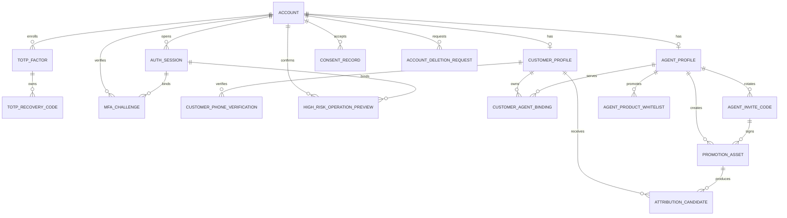
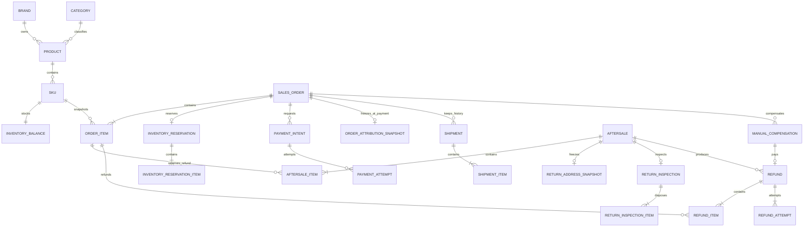
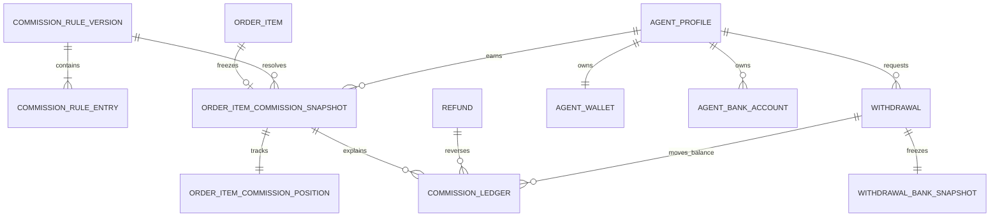

# 洗化产品私域商城数据库设计

## 文档控制

| 项目 | 内容 |
|---|---|
| 文档版本 | v2.4.8 |
| 对应基线 | MVP/PRD v2.4.8、CH-001 至 CH-023；产品/API 仍以 CH-022 为准 |
| 数据库 | Supabase 托管 PostgreSQL，生产时间统一为 UTC |
| ORM | Prisma 7.9.1，76 个实体、59 个枚举的字段级逻辑草案见 `schema.prisma` |
| 状态 | B0-B9 development 已完成并维持 `GO`；B10.6 本地数据库与总验收已完成，独立复审 `P0=0/P1=0/P2=0`。最终实现尚未提交且同 SHA 远端双绿未取得，B10 不得 `GO`，CH-021 继续有效。staging、production 与真实支付均为 `NO-GO` |
| 更新时间 | 2026-08-30 |

## 1. 设计原则

- 使用一个 Supabase 托管 PostgreSQL 主库承载首期单商户、单仓、单层代理业务；按领域划分表，不按三端重复建表。
- 主键统一为应用生成的 ULID，PostgreSQL 使用 `CHAR(26)` 并校验格式；订单号、售后号和提现号另设可读业务编号。
- 金额使用 `NUMERIC(18,2)`，佣金百分比使用 `NUMERIC(7,4)`，比例值范围为 0 至 100。
- 时间使用 `TIMESTAMPTZ(3)` 保存 UTC 时刻；报表查询转换为 `Asia/Shanghai`，业务自然日另存 `DATE`。
- 商品成交、库存和订单均以 SKU 为最小单位；历史展示只读订单快照，不回查当前商品资料。
- 支付、退款、佣金和钱包流水只追加事实记录；修正使用反向或补偿记录，不覆盖历史。
- 分类、品牌、商品、SKU、Banner 和代理资料采用软删除或状态归档；订单、支付、退款、佣金、提现和审计禁止物理删除。
- JSON 只保存 Provider 原始报文、审计前后值和非查询型快照；金额、状态、归属和规则来源必须是结构化字段。
- 所有关键写操作使用幂等记录；外部回调使用 Inbox，领域事件使用事务 Outbox。

### 1.1 Supabase 边界与连接

- Supabase 仅提供托管 PostgreSQL；项目必须关闭 Data API，不使用 Supabase Auth、Storage 或 Data API 承担业务能力。微信自建认证、会话和 RBAC 的唯一身份源仍是 `account` 等 `public` 应用表。
- 76 张应用表全部位于 `public`，不得创建指向 `auth` 或 `storage` schema 的外键、触发器或业务查询依赖。三端不得使用 Supabase client、Data API、数据库连接串或 `service_role`。
- NestJS API/Worker 是唯一数据访问入口，运行时只使用 `mall_runtime`；该角色仅获所需 DML、序列使用权及专用 RLS policy，无 DDL、schema ownership、角色管理或 `BYPASSRLS`。
- 首次安装由受控的项目所有者账号创建角色并回放基线 migration；迁移末尾将应用表、枚举和迁移函数的所有权移交给 `mall_migrator`。后续 migration 只使用 `mall_migrator`，运行时只使用 `mall_runtime`；凭据分别存入 Secret Manager 并独立轮换，禁止以 `postgres` 或 `service_role` 运行应用。
- 所有应用表启用 RLS。`anon`、`authenticated` 不授予表/序列权限且不创建 policy；`service_role` 也撤销应用表权限。只为 `mall_runtime` 建立允许访问的连接角色 policy，具体客户、代理和管理员数据范围仍由 NestJS RBAC 校验。

| 场景 | 连接 | 约束 |
|---|---|---|
| 长驻 API/Worker，支持 IPv6 | direct `5432` | 首选；使用有界连接池，可使用 prepared statements |
| 长驻 API/Worker，仅 IPv4 | Supavisor session `5432` | 可使用 prepared statements；连接池总量不得超过项目配额 |
| migration、`pg_dump` 与恢复 | direct `5432` | 仅受控 CI/运维；执行环境必须支持 IPv6 或已配置 IPv4 add-on |
| 未来 serverless/edge | Supavisor transaction `6543` | 当前不启用；不支持 prepared statements，Prisma 需 `pgbouncer=true` |

所有连接强制 TLS 并校验证书，生产建议 `sslmode=verify-full` 和 Supabase 项目 CA。按 Prisma ORM 7 约定，`schema.prisma` 不声明 URL；`prisma.config.ts` 的 `datasource.url=env('DIRECT_URL')` 只供 CLI/migration，NestJS API/Worker 通过 `@prisma/adapter-pg` 读取 `DATABASE_URL`。`DATABASE_URL` 指向 runtime direct/session，`DIRECT_URL` 指向 migration/`pg_dump` 使用的 direct；密码、CA、项目引用和加密密钥不得进入仓库、日志或前端构建产物。

## 2. 数据类型与命名

| 类型 | PostgreSQL | 约定 |
|---|---|---|
| 主键 | `CHAR(26)` | ULID，字符串排序与时间大体一致 |
| 业务编号 | `VARCHAR(32)` | 订单、售后、退款、提现等唯一编号 |
| 金额 | `NUMERIC(18,2)` | 禁止 `REAL`/`DOUBLE PRECISION` |
| 百分比 | `NUMERIC(7,4)` | 例如 12.5000 表示 12.5% |
| 时间 | `TIMESTAMPTZ(3)` | UTC 时刻；API 输出 ISO 8601 |
| 状态 | `VARCHAR(40)` 或 Prisma Enum | 数据库和 API 枚举同名 |
| 乐观锁 | `INTEGER CHECK (version >= 1)` | `version` 从 1 开始递增 |
| 非负计数 | `INTEGER`/`BIGINT` + `CHECK` | PostgreSQL 无无符号整数，库存、数量和重试次数显式校验非负 |
| JSON | `JSONB` | 仅用于非检索型快照或外部原文，禁止存明文敏感信息 |
| 软删除 | `deleted_at TIMESTAMPTZ(3) NULL` | 查询默认过滤非空记录 |

所有金额计算采用订单项级 `HALF_UP` 四舍五入保留两位后汇总。佣金公式固定为 `commission = HALF_UP(commission_base * effective_rate / 100, 2)`；退款佣金冲正使用同一比例和同一除数，不允许把 `12.5000` 当成 `12.5` 倍。数据库不承担业务舍入决策，应用服务和离线复算必须使用同一 Decimal 实现；数据库 `CHECK` 只守住范围和一致性下限。

当前 `schema.prisma` 已按 PostgreSQL `public` schema 表达 76 个实体和 59 个枚举。`0001_initial`、`0002_b9_inventory_fact_indexes` 与 `0003_b10_payment_fact_indexes` 继续逐字节冻结；CH-023 只在其后增加 `0004_b10_commission_position_trigger_fix`，不增加表、列、枚举或索引。完整链仍保持 76 张表、165 个 `CHECK`、76 张表启用 RLS、76 个 runtime policy、24 个用户触发器（45 个事件绑定）和 0003 已有的两个支付事实条件唯一索引。0004 仅替换一个既有触发器函数定义，`mall_migrator` 的对象所有权模型不变。0001→0002→0003→0004 本地回放、权限指纹和真实运行角色验收已通过；0004 的准确 SHA 远端 migration/smoke 证据尚待闭合。

## 3. 领域表清单

### 3.1 身份、授权与隐私

| 表 | 用途 | 关键约束 |
|---|---|---|
| `account` | 三类人员统一登录主体 | `role` 为 SUPER_ADMIN/AGENT_ADMIN/CUSTOMER；登录名唯一；消费者身份当前固定单微信 AppID，`wechat_open_id` 在该 AppID 内唯一 |
| `auth_session` | 访问与刷新会话 | 保存 assurance、restriction、MFA 因子/时刻、session family/rotation；受限改密会话无 refresh hash，可按账号全部撤销 |
| `customer_profile` | 消费者当前资料 | 与账户 1:1；不保存地址手机号 |
| `customer_phone_verification` | 自愿授权的账户手机号 | 手机号密文 + 哈希 + 尾号 + 来源 + 协议版本；部分唯一索引保证每客户最多一条未撤回当前记录 |
| `consent_record` | 协议同意记录 | 主体、协议类型、版本和时间不可覆盖 |
| `account_deletion_request` | 账号删除与去标识化流程 | 部分唯一索引保证同一账户最多一笔 SUBMITTED/PROCESSING 活动申请 |
| `totp_factor` | 总部 TOTP 因子 | 密钥信封加密；每账户最多一个 ACTIVE 因子；时间步防重放 |
| `totp_recovery_code` | TOTP 恢复码 | 只存强哈希，单次消费 |
| `mfa_challenge` | enroll/login/reauth/recovery 挑战 | 绑定账户、会话/因子、目的、过期和失败锁定 |
| `mfa_rate_limit` | MFA 跨挑战失败守卫 | `(account_id,purpose)` 唯一；创建和验证 challenge 均检查，5 次失败锁 15 分钟，新建 challenge 不得绕过 |
| `admin_reauth_attempt` | 银行卡二次验证审计 | 逐次记录成功/失败和脱敏原因，不作为唯一限流真相 |
| `admin_reauth_grant` | 60 秒单次敏感操作授权 | token 只存哈希，以外键绑定管理员与会话，并绑定动作和目标 |
| `admin_offline_recovery` | 管理员双人离线恢复工单 | 目标、申请人、执行人、凭据指纹、会话撤销时刻和执行事实完整留存 |
| `admin_offline_recovery_approval` | 离线恢复审批 | 同一审批人每单一票，执行前至少两名不同审批人批准 |

### 3.2 代理、邀请码与归属

| 表 | 用途 | 关键约束 |
|---|---|---|
| `agent_profile` | 一级代理档案和授权模式 | 与 AGENT_ADMIN 账户 1:1；联系电话密文/尾号/key id 同生同灭；不存在父代理字段 |
| `agent_invite_code` | 邀请码历史、启停和有效期 | code hash 唯一；轮换新增记录并结束旧记录 |
| `agent_product_whitelist` | 自定义商品推广白名单 | 仅控制推广；不得参与支付佣金资格判断 |
| `promotion_asset` | 主页或商品二维码/链接 | 保存目标、邀请码和生成时授权版本；打开时仍实时复核 |
| `attribution_candidate` | 30 分钟待确认候选 | 游客只存服务端签发 token 的哈希，不存设备 ID；token 主体或客户主体只允许一个 ACTIVE 候选 |
| `customer_agent_binding` | 消费者长期代理绑定历史 | 用 `started_at/ended_at` 保留历史；每客户最多一条当前绑定 |
| `binding_change_log` | 确认、转移、转直营和停用影响记录 | 不物理删除，关联管理员原因与审计 |

白名单撤权时不改 `customer_agent_binding`，也不改历史订单佣金。商品推广素材在打开时若目标已撤权，仅返回公开商品跳转，不创建候选。

### 3.3 商品、内容与购物

| 表 | 用途 | 关键约束 |
|---|---|---|
| `brand` | 品牌 | 名称唯一、非负 `sort_order`、version、软删除；创建固定 DRAFT，恢复固定回 DRAFT |
| `category` | 一级分类兼佣金分类 | 首期无父级字段；非负 `sort_order`；存在 ACTIVE 商品时停用/软删除确认阻断 |
| `product` | SPU 商品 | `spu_code` 全局唯一且创建后不可改；业务创建显式 DRAFT，首次 ACTIVATE 写且只写一次 `published_at`；价格不在 SPU 保存 |
| `sku` | 成交、库存和佣金最小单位 | SKU code 全局唯一且创建后不可改；业务创建显式 INACTIVE，仅保存零售价和推荐状态，不存在会员价 |
| `file_asset` | 商品图、Logo/Icon、Banner、售后、付款凭证和推广 QR | PENDING 保存预期哈希/MIME/size/key，READY 保存服务端实测对象事实；只有前四类可 PUBLIC，私有素材固定 `private/*` |
| `product_image` | 商品与 READY/PUBLIC/PRODUCT_IMAGE 素材的有序关系 | 软删除；活动 `(product_id,sort_order)` 与 `(product_id,file_id)` 分别唯一，应用层限制最多 8 张并以最小 sort_order 为主图 |
| `banner` | 首页 Banner | 有效期、启停、排序和跳转目标 |
| `favorite` | 消费者收藏 | `(customer_id,product_id)` 唯一；商品失效不删除记录，列表仍以独立安全投影返回 |
| `cart` | 登录客户购物车 | `customer_id` 普通唯一；空 GET 不建行，首次写入/合并时懒创建；游客购物车仅在小程序本地 |
| `cart_item` | SKU 购物车项 | `(cart_id,sku_id)` 唯一，持久化 `quantity/selected`，不保存可信成交价格、库存或展示快照 |
| `customer_address` | 收货地址 | 手机号/详情密文、手机号用途隔离 HMAC、`version` 与软删除；账户手机号与地址手机号完全独立 |

CH-018 直接复用这四张既有表，不新增列：收藏失效状态、购物车五状态、价格/库存/图片均由查询时的商品、SKU、文件和库存事实计算；因此 `CartResponse` 不返回数据库不存在的 version，也不持久化 `change_flags`。`cart_item.selected` 已存在，数量 1..99 与每车最多 100 个 SKU 由 repository 事务校验；`cart.customer_id` 和 `(cart_id,sku_id)` 唯一约束作为懒创建/并发写的数据库兜底。

地址手机号与详情都使用 AES-256-GCM；AAD 分别绑定 `customer_address.id` 与字段名，`encryption_key_id` 支持当前/旧密钥轮换读取。`phone_hash` 使用 Store 手机密钥环但固定独立域 `qingxu:store-address-phone:v1`，不得与账户手机号或其他 HMAC 域互换。活动默认地址的既有条件唯一索引保证每位客户最多一个默认项；第一条自动默认、默认切换和删除后的稳定提升由同一事务实现，不需要迁移。

### 3.4 库存、订单、支付与履约

| 表 | 用途 | 关键约束 |
|---|---|---|
| `inventory_balance` | 单仓 SKU 实物和锁定库存 | sku 唯一；SKU 创建事务同步插入 0/0，满足 `physical_qty >= locked_qty >= 0` |
| `inventory_reservation` | 待付款订单库存预占 | order 唯一；ACTIVE/CONSUMED/RELEASED/EXPIRED |
| `inventory_reservation_item` | 预占 SKU 数量 | reservation + sku 唯一；CH-020 增加 `(sku_id,reservation_id)` 查询索引 |
| `inventory_ledger` | 库存事实流水 | 只追加；保存变更前后与业务原因；B9 的预占/释放统一以 reservation ID 作为 business ID |
| `sales_order` | 订单聚合状态与金额 | 订单、支付、退款进度、退款处理、履约、关闭/完成原因与支付处置独立 |
| `order_item` | SKU 成交快照和可退/发货计数 | 保存商品、分类、SKU、单价、数量和累计计数 |
| `order_address_snapshot` | 支付/履约地址快照 | 与订单 1:1；敏感字段加密 |
| `order_attribution_candidate` | 提交订单时的归因候选 | 支付前不向代理展示，不保存客户昵称/手机号尾号/城市快照，不生成佣金 |
| `order_attribution_snapshot` | 支付成功时的最终归因财务事实 | 只保存渠道、代理和绑定事实；订单 1:1，去标识化不改写该财务事实 |
| `agent_customer_privacy_projection` | 代理端客户历史投影 | 支付时写不可逆 alias 与可空脱敏资料；删除账号时清空 nickname/phone_tail/city，只保留 alias 与交易关联 |
| `payment_intent` | 用户点击支付后创建的本地支付意图 | 稳定 `intent_no` 唯一；CREATING/OPEN/CLOSE_PENDING 可按商户号对账恢复；每订单最多一笔活动意图，关闭失败留在 CLOSE_PENDING 并记录错误 |
| `payment_attempt` | Provider 支付事实 | provider + transaction id 唯一；迟到成功记录为 SUCCEEDED_LATE |
| `callback_inbox` | 支付/退款回调收件箱 | 保存 raw body、签名头与验签结果；provider + event id 唯一 |
| `shipment` | 首期单包裹模型 | `order_id` 普通唯一；创建即原子 SHIPPED，承运商/运单/shipped_at 非空，不持久化 CREATED 空壳 |
| `shipment_item` | 包裹内订单项数量 | 支持发货前部分退款后只发剩余数量 |
| `logistics_event` | 人工物流节点 | 只追加；STATUS 保存状态码，TRACKING_CORRECTION 必须保存完整新承运商/运单和原因；`(shipment_id,event_key)` 幂等 |

### 3.5 售后与退款

| 表 | 用途 | 关键约束 |
|---|---|---|
| `aftersale` | 售后主单 | 类型、状态、原因、审核与退款结果 |
| `aftersale_item` | 售后订单项和额度占用 | 客户只提交数量，金额由订单项快照计算后保存；一个订单项可多次售后但不得超额 |
| `aftersale_evidence` | 售后与验货凭证关系 | 售后 + 私有文件唯一；验货证据显式关联 `return_inspection_id` 和 purpose，历史保留 |
| `return_address_snapshot` | 总部退货地址快照 | 审核通过时冻结密文地址，后续配置变化不回写 |
| `return_address_version` | 不可变退货地址版本 | DRAFT/PUBLISHED/ARCHIVED；同时最多一个 PUBLISHED，快照保存来源版本 |
| `return_shipment` | 用户退货物流 | 一个退货售后最多一条当前记录 |
| `return_inspection` | 总部验货与异常处理 | 验货人和数据库时钟均必填，处理人外键禁止置空或级联删除；PASS 不得有异常原因，ABNORMAL 必须有至少 2 个非空白字符的原因；异常处置明确落库且只能追加一次 |
| `return_inspection_item` | 逐订单项验货处置 | 保存实收、回库、损坏、报废、退回客户四类数量；四项之和严格等于实收 |
| `refund` | 退款主记录 | 稳定 `refund_no`；`origin_type` 明确 AFTERSALE/LATE_PAYMENT/MANUAL_COMPENSATION 且来源关联互斥；状态独立于订单并带 version |
| `refund_attempt` | 首次退款和失败重试尝试 | 每次新幂等键追加一条；同一退款复用原 `refund_no`，不重建退款主单 |
| `refund_item` | 退款订单项事实 | 数量、实际成功金额、是否未发货自动回库 |
| `manual_compensation` | 独立 `AMOUNT_COMPENSATION` | 绑定一个订单项，只占剩余可退金额、不占数量、不回库；成功后按实际补偿金额及原快照冲正佣金，不要求 TOTP |

创建售后时锁定相关 `order_item`，按以下公式校验并更新累计占用：

```text
remaining_refundable_qty
  = quantity - refunded_qty - aftersale_reserved_qty

remaining_refundable_amount
  = line_paid_amount - refunded_amount - aftersale_reserved_amount

server_allocated_amount(quantity)
  = HALF_UP(unit_price * quantity, 2)
```

首期没有订单项级优惠，故普通商品售后由服务端按成交单价乘数量分配金额；客户端不得提交售后或普通商品退款金额。未来增加优惠后必须冻结逐件分摊和最后一件尾差规则。驳回或允许阶段取消时减少占用；退款成功时占用转为已退款；退款失败保持占用。首期单包裹模型下，只要订单存在活动售后占用，整单禁止创建发货单；不得仅跳过占用行后发送其他商品。纯金额补偿必须走 `manual_compensation`，服务端校验 `amount <= remaining_refundable_amount` 后只增加 `aftersale_reserved_amount`，不增加 `aftersale_reserved_qty`。

### 3.6 佣金、钱包与提现

| 表 | 用途 | 关键约束 |
|---|---|---|
| `commission_rule_version` | 全局不可变规则集版本 | 每次保存生成新版本；一笔支付只读一个 PUBLISHED 版本 |
| `commission_rule_entry` | 平台、分类、SKU 配置项 | 每版本 target key 唯一；继承表示新版本中不存在覆盖行，0% 是有效行 |
| `order_item_commission_snapshot` | 支付时逐订单项佣金事实 | 与订单项 1:1；原比例、基数和金额永不修改 |
| `order_item_commission_position` | 订单项佣金当前状态缓存 | 同表冻结 `original_commission`，保存 EXPECTED/CANCELLED/AVAILABLE、预计剩余和累计冲正；CHECK 保证永不超原佣金，可由流水重建 |
| `commission_ledger` | 预计、可用、退款与提现流水 | 只追加，金额有正负，关联原快照和退款 |
| `agent_wallet` | 可复算余额缓存 | available 可为负；frozen 不得为负；带 version |
| `agent_bank_account` | 代理当前银行卡 | 卡号密文、key id、hash 和 last4；常规查询只返回掩码 |
| `withdrawal` | 提现申请 | 同一代理最多一笔 PENDING/APPROVED |
| `withdrawal_bank_snapshot` | 申请时银行卡快照 | 独立密文，换卡不影响历史申请 |
| `withdrawal_proof` | 付款凭证关系 | PAID 前至少一条有效私有文件 |

佣金规则版本保存完整有效配置：平台默认必须存在且非空；分类和 SKU 只保存非空覆盖。API 中 `configured_rate: null` 表示在新版本删除该覆盖行，`0.0000` 表示保存明确无佣金的覆盖行。

### 3.7 平台可靠性与经营分析

| 表 | 用途 | 关键约束 |
|---|---|---|
| `business_rule_version` | 最低提现、售后期及只读平台配置的不可变版本 | DRAFT/PUBLISHED/ARCHIVED；普通后台只改最低提现与售后期，支付超时固定 30 分钟，法定保留期由外部合规配置；同时最多一个 PUBLISHED，订单完成冻结来源版本和售后截止时刻 |
| `idempotency_record` | 关键写请求结果缓存 | actor + scope + key 唯一；敏感明文响应不保存 `response_body`，仅存摘要 |
| `high_risk_operation_preview` | 高风险操作短时预览确认 | token 只存哈希，绑定管理员/会话/动作/目标/请求哈希/资源版本，单次消费 |
| `outbox_event` | 事务领域事件 | 状态、重试次数和下次执行时间 |
| `audit_log` | 经营与安全审计 | 只追加，保存 request ID、幂等键、结果码；前后值必须脱敏 |
| `sales_daily_aggregate` | 可重建的日报缓存 | `GLOBAL`/`DIRECT`/`AGENT:<id>` 独立范围；保存注册、绑定、活跃代理、客户总量快照及 created/paid/refunded/net 口径，净值可为负 |

## 4. 关键 ERD

### 4.1 身份、代理与归属



### 4.2 商品、交易、售后和库存



### 4.3 佣金、钱包与提现



## 5. 核心状态字段

### 5.1 `sales_order`

| 字段 | 类型 | 说明 |
|---|---|---|
| `order_status` | enum | PENDING_PAYMENT/PENDING_SHIPMENT/SHIPPING/COMPLETED/CLOSED |
| `payment_status` | enum | UNPAID/PROCESSING/PAID |
| `refund_progress_status` | enum | NONE/PARTIAL/FULL；只反映已成功退款累计进度 |
| `refund_processing_status` | enum | IDLE/REFUNDING/FAILED；只反映是否仍有处理中或需人工处理的退款 |
| `fulfillment_status` | enum | NOT_STARTED/READY_TO_SHIP/SHIPPED/IN_TRANSIT/DELIVERED/CANCELLED |
| `close_reason` | nullable enum | USER_CANCELLED/PAYMENT_TIMEOUT/FULL_REFUND_BEFORE_SHIPMENT |
| `completion_reason` | nullable enum | CUSTOMER_CONFIRMED/ADMIN_FORCED/FULL_REFUND_AFTER_SHIPMENT |
| `payment_resolution` | enum | NORMAL/LATE_SUCCESS_REFUND_PENDING/LATE_SUCCESS_REFUNDED/MANUAL_REQUIRED |
| `pay_expires_at` | `TIMESTAMPTZ(3)` | 数据库派生的支付截止时刻，固定等于 `created_at + 30 minutes`；两列创建后均不可改写 |
| `version` | `INTEGER CHECK (version >= 1)` | 订单聚合乐观锁 |

`refund_progress_status` 只按成功退款金额计算：0 为 NONE，大于 0 且小于 `paid_amount` 为 PARTIAL，等于 `paid_amount` 为 FULL。`refund_processing_status` 在存在 PENDING/PROCESSING 退款尝试时为 REFUNDING，在存在未解决失败退款时为 FAILED，否则为 IDLE。两个轴禁止互相覆盖，例如“已部分退款，同时另一笔失败”表示 `PARTIAL + FAILED`。

`display_status` 是 API 层派生字段，不单独保存。计算按下列真值表从上到下首个命中：

| 优先级 | 条件 | 展示状态 |
|---:|---|---|
| 1 | `payment_resolution=MANUAL_REQUIRED` | 支付异常处理中 |
| 2 | `refund_processing_status=FAILED` | 退款异常待处理 |
| 3 | `payment_resolution=LATE_SUCCESS_REFUND_PENDING` 或 `refund_processing_status=REFUNDING` | 退款处理中 |
| 4 | `payment_resolution=LATE_SUCCESS_REFUNDED` 或 `refund_progress_status=FULL` | 退款完成 |
| 5 | `refund_progress_status=PARTIAL` | 部分退款 |
| 6 | `order_status=CLOSED` | 已关闭 |
| 7 | `order_status=PENDING_PAYMENT` | 待付款 |
| 8 | `order_status=PENDING_SHIPMENT` 且 `fulfillment_status=READY_TO_SHIP` | 待发货 |
| 9 | `order_status=SHIPPING` 或履约为 `SHIPPED/IN_TRANSIT` | 运输中 |
| 10 | `order_status=COMPLETED` 或履约为 `DELIVERED` | 已完成 |

`close_reason` 和 `completion_reason` 都是订单响应必返 nullable 字段。数据库中 CLOSED 订单必须有 `close_reason` 且无 `completion_reason`；COMPLETED 订单必须有 `completion_reason` 且无 `close_reason`；其他状态两者都为空。发货后全额退款不伪装为 CLOSED，而是 `COMPLETED/FULL_REFUND_AFTER_SHIPMENT`。

### 5.2 迟到支付

迟到支付不允许把订单从 `CLOSED` 改回待发货。数据库保留三个同时成立的事实：

1. `sales_order.order_status = CLOSED` 且 `close_reason = PAYMENT_TIMEOUT`；
2. `payment_attempt.status = SUCCEEDED_LATE`，真实记录已收款；当前 `payment_intent` 收敛为 `SUCCEEDED`，读取与对账同时兼容既有 `CLOSED/EXPIRED` 历史事实，任何情况均不得恢复为 `OPEN`；
3. `sales_order.payment_resolution` 进入退款处理中、已退款或人工处理。

自动退款使用独立 `refund/refund_item/refund_attempt`，不得伪造支付失败或删除 Provider 交易号。

### 5.3 未发货退款

- 部分退款成功：按 `refund_item.quantity` 增加实物库存并写 `REFUND_RESTOCK`；订单主状态仍为 `PENDING_SHIPMENT`，履约状态仍为 `READY_TO_SHIP`，实际可发数量由订单项退款与售后占用计数决定。
- 全额退款成功：所有可履约数量归零，订单转 `CLOSED/FULL_REFUND_BEFORE_SHIPMENT`，履约为 `CANCELLED`，禁止创建 shipment。
- 已发货退货：退款成功不自动增加实物库存；总部验货后使用 `RETURN_RESTOCK` 或 `RETURN_DAMAGED` 调整流水。

## 6. 关键事务

所有伪代码使用同一锁序：请求守卫 → 账户/客户/代理 → 已有订单 → 订单项 → 支付/退款/售后/包裹 → SKU → inventory_balance → inventory_reservation → 佣金 → 钱包 → 只追加审计/Outbox。同级按稳定 ID 升序；Provider 调用永远在提交之后执行，且回写使用新的短事务。CH-020 首次下单没有既有 order 且不创建 payment intent，使用 customer/cart/address/catalog→SKU/balance→insert order/reservation 专用序列；主动取消/Worker 才使用 `idempotency（Worker 跳过） -> order -> payment_intent -> SKU ID ASC -> inventory_balance ID ASC -> inventory_reservation ID ASC -> ledger -> audit/outbox`。候选 reservation/SKU ID 可无锁预读但不得用于裁决，锁内必须重验；禁止混用两条路径或先锁 reservation 再锁 SKU/balance。

### 6.1 创建订单

```text
BEGIN
  claim idempotency_record
  锁定 account/customer_profile
  CART 来源时锁定 cart 和本次提交的已选 cart_item，并精确匹配 Quote 请求
  锁定当前地址集合和目标 address
  锁定当前 attribution candidate/binding 与可空 agent
  候选 SKU ID 可无锁预读但只用于定位
  按 brand -> category -> product -> sku_id ASC -> inventory_balance ID ASC 的顺序锁定并重验全部报价事实
  校验 quote token、confirmation_hash、地址版本、购物车、状态、图片和价格
  插入 sales_order/order_item、重新加密的 address snapshot、attribution candidate
  sales_order.created_at/pay_expires_at 使用数据库默认，CHECK 固定二者相差 30 分钟
  创建 ACTIVE inventory_reservation 和 items
  inventory_balance.locked_qty += quantity
  每个 SKU 写一条 ORDER_RESERVE inventory_ledger，business_id = reservation_id
  CART 来源只删除本次提交的已选项；BUY_NOW 不修改购物车
  写 audit_log、order.created outbox_event 和完成的 HASH_ONLY idempotency_record
COMMIT
```

事务使用 Serializable 与统一重试。完整幂等重放必须先于报价过期校验，并实时返回同一订单的当前投影；首次提交才校验 5 分钟无状态 HMAC token。order/reservation/snapshot 只在全部 customer/cart/address/catalog/SKU/balance 锁与重验之后插入。并发争抢最后库存时锁 `inventory_balance` 行并再次计算 `physical_qty - locked_qty`。失败不创建半成品订单、不清理购物车；订单创建事务不得创建 `payment_intent`，也不得调用 Provider。

### 6.2 创建或复用支付意图

```text
BEGIN
  claim idempotency_record
  锁定 sales_order
  校验 PENDING_PAYMENT、UNPAID/PROCESSING 和 pay_expires_at
  锁定该订单由部分唯一索引保护的非终态 payment_intent
  有效则复用；不存在则创建稳定 intent_no、状态 CREATING、next_reconcile_at
COMMIT

事务外以 intent_no 作为商户支付号调用 Provider；新建意图可 create，任何既有 CREATING 一律先 query(intent_no)，只有明确 NOT_FOUND 才以同一 intent_no create，不得创建第二商户号

BEGIN
  按全局锁序重新锁定 order -> payment_intent
  Provider 明确存在则写 provider_intent_id/provider_state，intent -> OPEN，并原子写 order.payment_status -> PROCESSING、order.version + 1
  Provider 明确 FAILED/CANCELLED/CLOSED 则写 intent 终态，并原子恢复 order.payment_status -> UNPAID
  仍不确定则保留 CREATING 并推进 next_reconcile_at
  写审计/Outbox
COMMIT
```

Provider 调用失败、进程在外部成功后崩溃或本地回写冲突都不创建第二笔意图。完整幂等重放先于 `If-Match` 校验；新命令携带陈旧订单版本返回 409。Worker 扫描 `CREATING/OPEN/CLOSE_PENDING`，使用 `query(intent_no)` 恢复真实状态；关闭失败或未知继续保持 `CLOSE_PENDING`，只写 `last_error_code/next_reconcile_at`。只有原意图已明确 `CLOSED/FAILED/CANCELLED/EXPIRED` 且订单未过期，才允许创建新 `intent_no`。

消费者取消在 Provider 尚未确认时返回 `202 + CLOSE_PENDING` 当前投影，不释放预占。ADM-10 对账任务仅投影为 `PAYMENT_INTENT | PAYMENT_SETTLEMENT | LATE_PAYMENT_REFUND`；200/202 分别表示已收敛/仍待 Provider 确认，任何后台投影都不得包含支付 capability。迟到支付创建的首条 `refund_attempt` 状态固定为数据库既有 `INITIATED`，不新增枚举。

终态非成功 intent 已存在但订单未关闭或仍有 ACTIVE 预占时，联合任务查询继续使用 `PAYMENT_INTENT/CLOSE_PENDING` 并设置 `last_error_code=ORDER_CLOSE_INCOMPLETE`，不新增表、列或枚举。reconcile 在 Serializable 事务中依次锁定并重验 intent、订单、成功 attempt、SKU/余额和预占，确认不存在成功支付后恢复订单支付轴为 `UNPAID`，再完成关单、唯一 `ORDER_RELEASE` 流水、预占释放、审计与 Outbox；该补偿不调用 Provider，只有订单 `CLOSED` 且无 ACTIVE 预占才完成幂等事实。

### 6.3 正常支付成功

```text
事务外仅按 intent_no 预读 order_id 和 candidate_agent_id，预读结果不得作为裁决事实
BEGIN
  claim callback_inbox
  candidate_agent_id 非空时，先锁 agent_profile 并记住 version
  再按顺序锁定 order、全部 order_item、payment_intent/payment_attempt
  在锁内重读 order_attribution_candidate 并核对仍指向已锁代理及相同 version
  按 sku_id 锁定 SKU，再锁 inventory_balance，最后锁 inventory_reservation；再锁当前 rule version
  physical_qty -= reserved_qty
  locked_qty -= reserved_qty
  reservation -> CONSUMED
  仅在全部结算条件满足时，按 product_id 递增 product.sales_count，并在 integer 上限饱和
  复核提交时候选代理 ACTIVE；不满足则最终渠道降级 DIRECT
  支付时创建 order_attribution_snapshot 财务事实，并另写 agent_customer_privacy_projection
  冻结最终渠道和逐订单项 commission snapshot
  若为 DIRECT：不创建 agent 佣金快照、position、流水或佣金 Outbox
  若为 AGENT 且 commission_base/effective_rate/original_commission 任一为 0：保留规则快照，position -> NONE，金额全为 0，跳过佣金/钱包流水与佣金 Outbox
  否则 position -> EXPECTED，并按 `HALF_UP(commission_base * effective_rate / 100, 2)` 追加 EXPECTED_CREATED
  order -> PENDING_SHIPMENT / PAID
  写 outbox_event
COMMIT
```

代理停用事务也必须先锁同一 `agent_profile`，再处理其邀请码、候选和会话；支付和停用谁先提交，谁决定本次归因，后提交者在锁内看到新 version 后按最新事实裁决。整单必须使用同一个 `commission_rule_version_id`。规则解析失败时先持久化支付事实，将订单置于财务/结算异常待办，再由幂等补偿任务重试；禁止使用客户端比例或写入不完整快照。`product.sales_count` 是可重建缓存：首次进入 `MANUAL_REQUIRED` 时保持不变，补偿成功时才随其余结算事实在同一事务递增一次；缓存达到上限或需要重建都不得覆盖 Provider 成功事实。

### 6.4 主动取消、超时关闭与迟到回调

B9 只允许取消完全没有 `payment_intent` 的待付款订单。主动取消和超时 Worker 复用同一本地原子关闭函数，差异仅为订单关闭原因和 reservation 终态：

```text
BEGIN
  主动取消先 claim idempotency_record；Worker 使用数据库时间和 FOR UPDATE SKIP LOCKED 领取一个到期订单
  可无锁预读候选 reservation/SKU ID，但只用于定位
  锁 order；再锁/核验 payment_intent
  若存在任意 payment_intent：fail closed，不修改订单、预占或库存
  按 SKU ID ASC 锁并重验 SKU，再按 ID ASC 锁 inventory_balance，最后按 ID ASC 锁 inventory_reservation
  若订单已由 USER_CANCELLED 关闭：主动取消返回当前投影
  校验 PENDING_PAYMENT、ACTIVE reservation 和未过期/已到期条件
  order -> CLOSED / USER_CANCELLED 或 PAYMENT_TIMEOUT
  reservation -> RELEASED 或 EXPIRED
  inventory_balance.locked_qty -= reserved quantity
  每个 SKU 写一条 ORDER_RELEASE inventory_ledger，business_id = reservation_id
  写 audit_log、order.closed outbox_event；主动取消完成 HASH_ONLY idempotency_record
COMMIT
```

条件唯一索引确保同一 reservation、SKU、流水类型只写一次释放事实；余额条件更新持续守住 `physical_qty >= locked_qty >= 0`。取消和多 Worker 竞争时只有持有订单锁的一方完成关闭，后续执行返回或跳过当前终态，不会重复释放。任何实现都不得先锁 reservation 再锁 SKU/balance；该共享尾部与 Product/SKU lifecycle confirm、库存调整保持同序。

B10 才把该流程扩展为 Provider 三段关单和迟到成功退款：存在任何 `payment_intent` 时，B9 必须保持占用并 fail closed，不得提前 query/close Provider 或释放库存。

### 6.5 创建售后与退款

```text
BEGIN
  claim idempotency_record，锁 customer -> order -> order_item
  计算成功退款 + 有效占用后的剩余额度
  仅接收 quantity；requested_amount = reserved_amount = HALF_UP(order_item.unit_price * quantity, 2)
  创建 aftersale/aftersale_item
  增加 order_item.aftersale_reserved_qty/amount
COMMIT
```

普通商品退款请求同样只携带各售后项 quantity；服务端从已冻结的 `aftersale_item.reserved_amount/requested_qty` 按数量计算金额，禁止管理员任意填写商品退款金额。同一 `aftersale` 只允许一条稳定 `refund` 生命周期，数据库对非空 `refund.aftersale_id` 普通唯一；首次调用创建稳定 `refund_no`、`refund_item` 和第 1 条 `refund_attempt`，提交后才调用 Provider。`PENDING/PROCESSING/FAILED` 都复用该退款主单，Provider 调用失败只更新当前尝试与 `refund_processing_status`；重试必须使用新的幂等键，在同一 `refund` 下追加 `refund_attempt` 并继续传原 `refund_no`，不得并发创建第二笔待处理退款。退款回调先进入 raw-body Inbox，再按 Provider event ID 和 `provider + provider_refund_id` 幂等结转。

退款成功处理严格按 order → 全部 order_item → refund/aftersale/manual_compensation → inventory（需要回库时）→ commission snapshot/position → agent_wallet 锁序；占用转已退款，未发货商品数量自动回库，更新退款双轴，佣金按原支付快照和 `/100 + HALF_UP` 追加减少或冲正流水。完成与退款都锁同一组订单项、活动退款/售后、佣金快照/position 和钱包，因此并发结果与提交顺序无关。每条佣金流水使用稳定领域事件幂等键，`(agent_id,idempotency_key)` 唯一，绝不覆盖原流水。独立金额补偿创建时只接受 `order_item_id + amount + reason`，服务端锁订单项并占用剩余可退金额；它不创建有数量的 `refund_item`、不改变 `refunded_qty` 或库存。实际补偿成功后增加订单项/订单 `refunded_amount`、释放对应金额占用，并按该订单项原佣金快照追加 `EXPECTED_REDUCED/EXPECTED_CANCELLED` 或 `REFUND_DEBIT`；失败保留金额占用和稳定退款号供重试。

分次退款冲正逐订单项计算：`candidate = HALF_UP(refund_amount * effective_rate / 100, 2)`；若累计成功退款金额达到 `commission_base`，尾笔 `reversal = original_commission - reversed_total`，否则 `reversal = min(candidate, original_commission - reversed_total)`。同一事务锁 position，更新 `reversed_total += reversal`、`expected_remaining = max(0, expected_remaining - reversal)`；完成后退款从 available 追加 `REFUND_DEBIT`。`NONE` position 的原金额和剩余金额固定为 0，完成、退款和补偿均跳过佣金/钱包流水与佣金 Outbox。数据库 CHECK 保证累计值非负且不超过 position 原金额；触发器进一步强制 `position.original_commission` 始终等于不可变 snapshot 原金额，并禁止更换 `snapshot_id`，服务层锁内校验与每日复算作为额外防线。

### 6.6 发货与退货验收

- 创建包裹按守卫 → 管理员 → order → 全部 order_item → shipment 的锁序。首期为单包裹，只要订单存在 `PENDING_REVIEW/REFUNDING/WAITING_RETURN/WAITING_RECEIPT/RETURN_EXCEPTION/REFUNDING_AFTER_RETURN/REFUND_FAILED` 的活动售后，整单返回 `ACTIVE_AFTERSALE_BLOCKS_SHIPMENT`；不得发未占用行。
- `shipment.order_id` 普通唯一，订单整个生命周期最多一条包裹；创建事务必须同时写非空 carrier/tracking/shipped_at、全部 items 并直接置 SHIPPED，不存在 CREATED 中间记录。`shipment_item.quantity` 必须覆盖该订单全部剩余可发数量且不超过 `quantity - pre_shipment_refunded_qty - shipped_qty`。未发货退款成功同时增加 `refunded_qty` 与 `pre_shipment_refunded_qty`；发货后的退货退款只增加 `refunded_qty`，因此全量发货后仍可合法部分/全额退款。确认弹窗取消时不落包裹；记录创建后不提供取消或替换端点，承运商/运单纠错只追加带原因的物流更正事件和审计，不能删除原事实。
- 物流节点只追加，以 `(shipment_id,event_key)` 幂等；不能倒序改变已确认 DELIVERED 事实。
- 退货审核通过时冻结 `return_address_snapshot`。验货事务按唯一全局顺序先锁 `sales_order`、全部 `order_item`，再锁 `aftersale`、全部 `aftersale_item` 和 inventory；请求 `items` 集合必须在同一事务中与本售后全部 `aftersale_item.order_item_id` 精确相等，每项恰好一次，不得遗漏、重复或额外。逐项满足 `0 <= received_qty <= reserved_qty`、`approved_refund_qty + return_to_customer_qty = received_qty`、`approved_refund_qty = restock_qty + damaged_qty + scrap_qty`，四类处置之和因此严格等于实收。PASS 必须全量实收、全量批准退款且 `return_to_customer_qty=0`；少件、0 件或其他不符必须 ABNORMAL。验货人固定为当前管理员，`inspected_at` 必须由验货事务写 PostgreSQL `CURRENT_TIMESTAMP`，两者均为必填且提交后冻结；PASS 的 `abnormal_reason` 必须为空，ABNORMAL 的原因去除首尾空白后至少 2 个字符。唯一 return_inspection、延迟约束触发器、请求幂等键和稳定 inventory ledger event key 共同保证精确覆盖并使 `RETURN_RESTOCK` 只入账一次。验货父记录的售后、PASS/ABNORMAL 结论、处理人、异常原因、验货时间和证据包提交后不可改写。异常解决事务按既定锁序重锁订单、订单项、售后与验货记录，只允许首次以乐观锁追加 `resolution + resolution_note + resolved_at` 并递增 version；三字段必须同空或同非空，`resolution_note` 去除首尾空白后至少 2 个字符，且 resolution 只能是 `CONTINUE_REFUND` 或 `REJECT_AFTER_RETURN`，后续任何改写均由触发器拒绝。异常继续退款只使用验货时冻结的批准数量；未实收和退回客户部分在继续退款或验货后拒绝的终态事务释放占用。后续 refund_item 数量不得超过 `approved_refund_qty - refunded_qty`；迁移触发器同时核对 refund/aftersale/order_item 归属、剩余售后占用和冻结批准数量。只有 `restock_qty` 写 `RETURN_RESTOCK`，损坏/报废/退回客户写独立事实且不得增加可售库存。
- `return_inspection.evidence_manifest` 保存按 `file_id` 排序的 canonical 证据 ID 数组，`evidence_count` 保存数量。PASS 可使用 `[] + 0`，ABNORMAL 必须至少一条本管理员上传的 READY/AFTERSALE_EVIDENCE 私有证据。父记录与 `aftersale_evidence` 都挂延迟约束触发器，在提交时核对售后归属、排序后的完整集合和数量；提交后追加、删除、替换、换序或改绑任何证据都会使事务失败。父记录更新守卫同时禁止改写已封存清单。

### 6.7 订单完成与佣金入账

订单完成必须写 `completion_reason`。消费者确认产生 `CUSTOMER_CONFIRMED`，管理员兜底为 `ADMIN_FORCED`；当前版本没有自动确认收货。发货后全额退款为 `COMPLETED/FULL_REFUND_AFTER_SHIPMENT`，不是 CLOSED。完成事务严格锁 order → 全部 order_item → 活动 refund/aftersale → commission snapshot/position → agent_wallet，只把每个 `EXPECTED` position 当时的 `expected_remaining` 从预计结转为 `AVAILABLE_CREDIT`；`NONE` position 不写零金额流水，已经被退款减少的部分不得再次入账。订单完成、冻结当前 `business_rule_version_id`、计算 `aftersale_expires_at`、更新 position、追加唯一幂等佣金流水和钱包余额必须在一个本地数据库事务提交，Outbox 仅通知下游，不承担资金正确性。`agent_wallet.available_balance` 是缓存，事实以 `commission_ledger` 为准。

### 6.8 提现

- 提交提现锁钱包行，校验可用余额、负余额、银行卡、代理状态和进行中申请，然后追加冻结流水。
- `PENDING` 阶段若退款导致余额为负，审核通过必须被阻止。
- `APPROVED` 后视为资金已承诺；后续退款允许可用余额继续为负，但不回滚已通过提现。
- 拒绝追加释放流水；标记 PAID 追加扣冻结流水。状态和流水同事务。

### 6.9 高风险预览、TOTP 与敏感响应

- 预览接口把规范化请求体、资源版本、管理员、会话、动作和目标写入 `high_risk_operation_preview`，只保存 token 哈希与确认哈希，默认 60 秒过期。
- 确认接口必须同时校验 `preview_token`、`confirmation_hash`、`If-Match` 和幂等键；成功写入业务事实时原子设置 `consumed_at`，重复或版本变化均不执行操作。
- 完整银行卡查看不写 `idempotency_record.response_body`；幂等/安全记录仅保存状态码、`response_body_hash` 和资源 ID，HTTP 响应强制 `Cache-Control: no-store, private` 与 `Pragma: no-cache`。
- 密码登录成功但需 MFA 时只签发短时 `pre_auth_token` 和 LOGIN challenge，不创建 `auth_session`；TOTP/恢复码验证成功后才原子消费 challenge 并签发 access/refresh session。TOTP enroll 先创建 PENDING 因子和 5 分钟挑战，验证成功后原子激活并生成一次性展示的恢复码；恢复码只存哈希。所有 challenge 创建和验证都先锁 `(account_id,purpose)` 唯一 `mfa_rate_limit`；累计 5 次失败设置 `locked_until=now()+15min`，新 challenge 不能绕过。成功后清零对应 purpose 计数。`HR-13` 完整银行卡查看只验证当前管理员本人 TOTP，校验 `last_used_timestep` 防重放。`admin_reauth_grant.session_id` 是强外键，离页、logout、会话撤销或 60 秒过期立即失效。其他高风险动作只按 PRD `HR-01` 至 `HR-15` 的对应列要求原因、凭证和预览，不施加统一 TOTP。
- `auth_session` 保存 assurance/restriction/MFA 证据与 refresh family/rotation。SUPER_ADMIN 的 `restriction=NONE` 业务 session 必须 `assurance=MFA` 且绑定 ACTIVE 因子；代理临时密码 session 必须 `restriction=CHANGE_PASSWORD_ONLY`、无 refresh hash，只允许改密/logout。普通 refresh 按 family 原子轮换并撤销旧 session；旧 refresh 重放撤销整个 family并告警。
- `HR-15` 预览只包含目标、重置范围和原因，预览请求哈希、影响摘要和审计不得包含 TOTP/恢复码。确认请求才携带当前管理员 TOTP 或恢复码，并在同一事务中验证、原子消费凭据与 preview、执行重置、撤销目标全部会话；凭据原文不得持久化。

### 6.10 佣金规则原子发布

```text
BEGIN
  SELECT 当前 PUBLISHED commission_rule_version FOR UPDATE
  校验 base_version_id、If-Match、预览 token、确认哈希和当前 version_no
  以当前完整规则集为基线应用 changes，创建新版本及完整有效 entries
  校验新版本的平台默认存在、分类/SKU 目标有效、比例范围和 target_key 唯一
  当前 PUBLISHED -> ARCHIVED
  新版本 -> PUBLISHED，写 effective_at
  原子消费 high_risk_operation_preview，写幂等记录、审计和 outbox_event
COMMIT
```

旧版本必须先转为 `ARCHIVED`，新版本才能转为 `PUBLISHED`；两步处于同一事务，任一步失败都整体回滚，不能出现发布成功但没有当前规则的中间态。版本生命周期只允许 `DRAFT -> PUBLISHED -> ARCHIVED`，禁止回退；除 `status/effective_at` 的上述发布转换外，版本内容、`commission_rule_entry`、已支付订单项佣金快照和历史流水均不可修改。支付事务锁定其读取的 PUBLISHED 规则版本，整单只使用同一个 `commission_rule_version_id`。

### 6.11 业务规则、退货地址与商品图集版本

- 业务规则与退货地址的预览/确认均锁当前 PUBLISHED 版本，校验 `If-Match`，创建新不可变版本，先归档旧版本再发布新版本；两个状态变化和预览消费在同一事务。部分唯一索引分别保证每类最多一个 PUBLISHED。
- 订单完成事务锁当前 PUBLISHED `business_rule_version`，把其 ID 与按该版本计算的 `aftersale_expires_at` 一并写入订单；后续规则变化不追溯。退货审核同理，由服务端锁唯一当前 PUBLISHED `return_address_version` 并复制密文 snapshot 与 `source_version_id`，客户端不能选择旧版或 DRAFT；没有当前地址返回 `RETURN_ADDRESS_NOT_CONFIGURED`。
- Product create/update 的 `images[{file_id,sort_order}]` 表示最多 8 张的活动图集原子替换。事务先锁商品和现有图关系，校验文件 READY/PUBLIC/PRODUCT_IMAGE、用途/归属与排序唯一，再软删除被移除关系并插入新关系。发布/启用商品前必须存在至少一张活动图，最小 sort_order 为主图；重放由请求幂等键收敛，不能留下半套图集。

### 6.12 超级管理员 bootstrap 与双人离线恢复

- 首个 SUPER_ADMIN 只能由部署环境执行 `admin bootstrap` CLI：交互读取密码并仅创建密码主体与审计，不预生成或预验证 TOTP。首次密码登录返回 enrollment-required pre-auth，仅允许 ADM-16 enroll/verify；验证现场 TOTP 后才在同一事务激活因子、生成恢复码哈希并创建首个业务 session。密码、TOTP secret、恢复码原文不得出现在参数、shell history 或日志。生产已有 SUPER_ADMIN 时命令默认拒绝，break-glass 需单独变更审批。
- 密码和 TOTP 同时丢失时不开放 HTTP 恢复。受控运维 CLI 创建 `admin_offline_recovery` 时冻结 `target_account_version`；部分唯一索引限制每个目标仅一笔活动工单。两名不同且非目标账户的在职 SUPER_ADMIN 分别离线批准；执行者携带工单 `If-Match`，按 account → recovery 锁序核对未过期、至少两条 APPROVED、审批人互异且目标 version 未变化，再写新凭据指纹、递增 Account.version、撤销目标全部 session/TOTP/恢复码、记录执行人与时刻并追加审计。凭据指纹用于证明轮换而不能反推出凭据。
- 执行、拒绝、过期，以及目标账户任何密码/TOTP 变更，都会使旧工单终止或因 version 冲突失效；不得在新凭据事实后继续执行旧审批。
- REJECTED/EXPIRED/EXECUTED 工单不可复用；任一拒绝立即终止，执行必须原子完成。季度恢复演练至少覆盖审批人重复、目标自批、过期、并发执行和会话全撤销。

### 6.13 报表范围与时间口径

- `GLOBAL` 统计全店唯一 `new_registration_count`、`active_agent_count` 和 `customer_total_snapshot`；`DIRECT` 与 `AGENT:<id>` 统计各渠道订单、支付、退款、净值及 `new_binding_count`，不得把同一注册重复计入多个代理。
- 金额、订单、件数、注册和绑定可按日汇总；`active_agent_count` 是区间内代理 ID 的 DISTINCT 计数，月报和任意区间必须从事实表重算，禁止累加日报；`customer_total_snapshot` 取区间结束时最近一次全局快照，禁止求和。
- created 指订单创建业务日，paid 指支付成功业务日，refunded 指退款成功业务日，边界统一为 `Asia/Shanghai` 左闭右闭的自然日期输入、转换为 UTC 半开区间 `[from 00:00, day_after_to 00:00)` 查询。金额按两位 decimal string 输出；相同排名值以稳定资源 ID 升序打破平局。
- 聚合表仅是可重建缓存，接口返回 `as_of` 和数据新鲜度；支付/退款事实是最终来源。退款集中日的 `net_sales_amount` 和 `net_units` 可以为负。

### 6.14 客户归属共同串行根

- 绑定确认、总部客户转移和创建订单一律先锁 `customer_profile`，校验 `If-Match`（需要时）并递增 `customer_profile.version`，然后读取/结束当前 `customer_agent_binding`。binding 历史行可能不存在，因此不能把 binding 自身当共同锁根。
- 两个绑定确认并发时首个提交胜出；后到事务在客户锁后返回当前胜出绑定而不覆盖。客户转移先提交则新订单读取新绑定，订单先提交则其候选保持旧绑定。`customer_agent_binding(customer_id) WHERE ended_at IS NULL` 只作为数据库兜底，唯一冲突统一重读胜出事实。
- 微信登录携带 candidate token 时，事务锁 token 哈希候选与 customer_profile，把有效游客候选原子迁移为 customer_id 并清空 token hash；已有绑定、过期、撤权或已有客户候选均按锁内事实失效/复用。token 重放和双 token 并发不能创建两条 ACTIVE 客户候选。

### 6.15 CH-006 文件完成与品牌/分类生命周期

- CH-006 不新增 `completed_at`、`updated_at` 或其他数据库字段。`file_asset.status=READY`、最终对象 key、实测 hash/MIME/size、审计和 `idempotency_record` 联合表达完成事实；首次 `completed_at` 只存在于闭合完成响应及其幂等正文，不能从 `file_asset` 单表重构。
- upload intent 在短事务中写 PENDING 及预期 SHA-256/MIME/size/staging key；complete 的对象 GET、MIME/魔数/大小/hash 计算和 copy 均在事务外进行。最终短事务锁 `file_asset`，重读 PENDING/对象事实后写 READY、visibility、最终 key、审计和幂等结果。
- complete 同键同请求由 B3.1 的闭合 `FILE_UPLOAD_COMPLETE` 策略精确重放；不同键对 READY 再次 complete 返回 409。上传 intent 与 lifecycle preview 使用 `HASH_ONLY`，`response_body` 不保存签名 URL、请求头或 preview token。download URL 是无 `Idempotency-Key` 的 GET，不创建 `idempotency_record`，签名 URL 也不得持久化。
- 品牌/分类 confirm 按 `brand -> category -> product IDs ASC` 锁序重查 ACTIVE 商品。状态只允许 DRAFT/INACTIVE 启用、ACTIVE 停用、DRAFT/INACTIVE 软删除；soft delete 同时写 ARCHIVED/deleted_at，restore 只接受 soft-deleted ARCHIVED 并原子写 DRAFT/deleted_at NULL/version+1。
- lifecycle preview 可以返回依赖清单但不改状态；confirm 与 preview 消费、版本递增、审计和幂等记录同一串行化事务。ACTIVE 商品依赖存在时回滚并返回 422，非法/同状态或版本冲突返回 409。

### 6.16 CH-010 Product/SKU 创建与生命周期

- Product create 在幂等事务中显式写 `status=DRAFT`，校验非归档品牌/分类和最多 8 项合法活动图集；不得依赖数据库默认值绕过请求契约。`spu_code` 不进入 update set，软删除后由现有唯一约束继续保留。
- SKU create 在同一事务显式写 `status=INACTIVE`，并插入唯一 `inventory_balance(physical_qty=0,locked_qty=0,version=1)`、审计和幂等结果。冻结 schema 中 SKU 的历史数据库默认值不作为业务创建路径，Repository 与测试必须证明每次显式写 INACTIVE；`code` 不进入 update set。
- Product/SKU lifecycle confirm 的唯一锁序为 `idempotency/high_risk_preview -> brand -> category -> product -> SKU ID ASC -> inventory_balance ID ASC -> inventory_reservation ID ASC -> audit/outbox`。候选 reservation ID 可无锁预读但仅用于定位；事务内按共享尾部加锁后重新读取所有状态、版本和预占归属，不以 preview 时快照代替最终校验，禁止 reservation 先于 SKU/balance。
- Product ACTIVATE 要求关联品牌/分类均 ACTIVE、至少一条活动 READY/PUBLIC 商品图关系和至少一个 ACTIVE SKU；成功时使用 `published_at=COALESCE(published_at, transaction_timestamp())`。DEACTIVATE 和后续 ACTIVATE 均不覆盖发布时间，不级联修改 SKU。
- Product SOFT_DELETE 只允许 DRAFT/INACTIVE，且所有 SKU 中不存在 ACTIVE 状态或 ACTIVE 库存预占；SKU SOFT_DELETE 只允许 INACTIVE 且没有 ACTIVE 预占。confirm 失败整体回滚且不消费 preview；成功同时写 ARCHIVED、`deleted_at`、version、审计、幂等和 outbox。
- Product restore 只把软删除 ARCHIVED 原记录写回 DRAFT 并清空 `deleted_at`；SKU restore 同理写回 INACTIVE。恢复不级联、不走 preview，但必须校验原因、新幂等键与 `If-Match`。
- Product 列表使用现有 `(status,category_id,brand_id,published_at)` 索引并固定 `published_at DESC NULLS LAST,id DESC`；最低活动价只聚合 ACTIVE SKU，空集合投影为 null。详情查询不得以 `deleted_at IS NULL` 裁剪子 SKU，必须返回包括 ARCHIVED 在内的全部 SKU，并按 `created_at,id` 排序。
- `reason` 继续写既有 `audit_log.reason`；`PRODUCT_PRIMARY_IMAGE_REQUIRED`、`PRODUCT_ACTIVE_SKU_REQUIRED`、`ACTIVE_SKU_DEPENDENCY`、`ACTIVE_INVENTORY_RESERVATION` 是应用层 422 结果，不新增状态列或约束枚举。

### 6.17 CH-012 Banner 与库存调整

- Banner 使用现有 `file_id/title/target_type/target_id/target_url/status/sort_order/starts_at/ends_at/version/deleted_at`。应用显式写 DRAFT，普通更新不写 status；DELETE 只把 DRAFT/INACTIVE 写为 ARCHIVED 并设置 `deleted_at`，restore 写 DRAFT、清空 `deleted_at` 并递增 version。ACTIVE 不得直接归档。
- Banner 启用和公开投影复用现有 `file_asset` 触发器与应用检查：文件必须 READY/PUBLIC/BANNER；PRODUCT/CATEGORY 多态 target 没有外键，repository 必须按 target type 锁定并重查存在性和 ACTIVE 状态。URL allowlist 是服务端配置，不新增数据库列。
- `inventory_balance` 已有 physical/locked/version，统一派生 available=physical-locked。数据库没有低库存阈值，CH-012 删除 `low_stock` 与可写预警值，不以隐藏常量或 JSON 字段绕过冻结。
- 库存人工调整按 `idempotency/high_risk_preview -> SKU ID ASC -> inventory_balance ID ASC -> active inventory_reservation ID ASC -> inventory_ledger -> audit/outbox` 锁序。候选 reservation ID 只允许无锁定位，并在 SKU/balance 之后锁定重验；成功事务以条件更新 physical 和 version，插入恰好一条 `MANUAL_INCREASE/MANUAL_DECREASE` 流水并消费 preview；失败整体回滚且不消费。
- `physical_delta` 与结果都限制在 PostgreSQL INTEGER 范围，且结果必须 `physical_after >= locked_qty >= 0`。`STOCK_INSUFFICIENT` 与 `INVENTORY_QUANTITY_OUT_OF_RANGE` 是应用层 422，不新增枚举或列。
- B4 创建的零余额无需补写 INITIAL 流水；`inventory_ledger` 继续只追加。缺少 sku-first reservation 索引和 `business_id` 非唯一是 B5 的实测性能/未来事件风险，不在 CH-012 擅自迁移；不达标时另提变更。
- B5.2 已按上述锁序实现余额 CAS、活动预占锁后重读、人工流水、审计、幂等和 outbox 原子写；真实 PostgreSQL 18.3 竞态证明预占释放与库存确认串行化，受控 Supabase development rollback-only 证明事务外无残留。Prisma/首迁移字节和 migration diff 均为零。

### 6.18 CH-014 Store 公开目录只读快照

- B6.1 只读查询已使用独立 `StoreCatalogRepository` 和 Repeatable Read 快照。公开 Product 需 `product/brand/category` 均 ACTIVE、Product 未软删且至少一个 ACTIVE SKU；不以库存大于 0 作为可见条件。
- 主查询在同一快照中使用参数化 SQL 计算 ACTIVE SKU 最低价、净销量/首次发布/综合排序与稳定分页，然后按 ID 集合批量装配 SKU、`inventory_balance`、图片、Brand 与 Category，禁止 N+1。
- ACTIVE SKU 全部返回；`available_stock=physical_qty-locked_qty`，大于 0 时 `is_salable=true`，否则 false。缺失 `inventory_balance` 时 fail safe 为 false，不虚构库存事实。价格与库存必须来自同一快照。
- 公开图片关系必须指向 READY/PUBLIC 且 purpose 正确的 `file_asset`。Banner PRODUCT target 没有外键，查询时必须重查目标是否仍为公开 Product；失效 target 只从投影排除，不回写数据。
- 公开 Brand/Category 无分页，查询全部 ACTIVE 记录并以 `sort_order,id` 排序。首页四区使用各自有界上限 10/8/4/4，不将单区失败写入任何持久化状态。
- CH-014 仅增加应用只读查询口径，结构变更数为 0。B6.1 实施后 Prisma 与两份 `0001_initial` 仍逐字节不变，Prisma validate 通过，migration diff 为 `No difference detected`。
- 当前实测为 repository unit `9 passed`、database 全包 `332 passed / 52 环境模式跳过`。一次性回环 PostgreSQL full 为 `1 passed / 1 mode skip`，受控 Supabase development rollback-only 为 `1 passed / 1 mode skip`；两者均在外层事务抛出 sentinel 后以事务外查询证明全部 fixture 计数为 0。
- B6.2 只新增跨端 Store API 客户端、MP-01 至 MP-05 页面和 SKU 选择层，不写数据库。B6.3 新增的 MP-06 使用版本化本地存储；进入页面时只读取现有公开详情 API 刷新价格、库存和状态，结算不调用服务端 Cart/订单，同样不写数据库。当前累计验收为 miniapp unit `6 files / 84 passed`、H5 与 MP-Weixin build 均通过、B6 UI Playwright `34 passed / 56 designed skips`，覆盖 375/390/414/1024/1440 五个视口。
- B6.1 repository 证据已由 B6.4 最终门禁补全：最终 SHA workflow、真实 H5 纵向以及普通 CI 与 Supabase rollback-only 同一 SHA 双绿均成功，B6 development `GO`。

### 6.19 CH-016 消费者身份、归因与同步注销

- 法律文本当前版本属于服务端配置，不新增数据库表；实际同意继续逐条写入现有 `consent_record`，登录写 USER_AGREEMENT/PRIVACY_POLICY，手机号授权写 PHONE_AUTHORIZATION。
- CH-016 固定一个消费者微信 AppID，并以 `(AppID, openid)` 作为身份语义；因此现有 `account.wechat_open_id` 非空唯一约束只在单 AppID 部署边界内有效。`wechat_union_id` 仅保存可空元数据，不是唯一登录键且不得用于自动合并。未来增加第二个 AppID 时必须另走变更和数据库迁移，建立显式复合身份键，不能继续复用当前单列唯一约束。
- 登录 Provider 调用在事务外；数据库事务按 identity/account、customer_profile、candidate、consent、session、audit/idempotency 的固定顺序恢复或创建事实。Store session 使用独立 audience，refresh hash 继续按 session family 轮换。
- profile/手机号使用 `customer_profile.version` 作为 If-Match 资源版本，锁序为 idempotency -> account/customer_profile -> active phone -> consent -> audit。现有手机号活动部分唯一索引继续作为并发兜底。
- 候选目标由 promotion_asset/invite/agent 当前事实解析；token 只保存用途隔离的 HMAC/哈希，与幂等键和来源 IP 分别使用不同 domain/scope，固定 30 分钟有效。GET 查询不修改 token hash；候选替换或登录迁移原子清除旧 token hash，确认/拒绝消费迁移后的候选事实。确认、总部转移和未来订单提交继续以 `customer_profile.version` 为共同串行根。
- B7.4 注销 preview 复用现有 high-risk preview/hash/idempotency 能力并绑定 account version；只有 eligible 才签发 5 分钟 token。同步 confirm 按 `idempotency/preview -> account/customer -> current session validation -> blocker facts -> binding/anonymization matrix -> audit/outbox/idempotency completion` 锁序执行，在同一事务将全部 session 保留为 revoked tombstone 且清空 refresh hash、清理登录主体、phone/candidate/binding/允许硬删个人数据，以独立随机稳定别名匿名化 privacy projection，并写 audit/idempotency 和 durable `PENDING account.anonymized` Outbox 事实；阻断 fail closed，失败整体回滚。该事实未证明事件已投递或消费。
- 注销 confirm 为 HASH_ONLY，不保存或重放完成响应。B7.4 full 与受控 Supabase development rollback-only 门禁已通过并证明事务外无 fixture 残留，退出复审 `P0=0/P1=0`；现有 account、external identity、session、consent、customer profile/phone、candidate/binding、account deletion request、privacy projection、audit/idempotency/outbox 已足够承载 CH-016，结构变更数为 0。

### 6.20 CH-022 支付事实唯一性与迟到退款

- 正常与迟到支付结果都追加 `payment_attempt`，不覆盖 Provider 事实。`SUCCEEDED` 与 `SUCCEEDED_LATE` 共用 intent 级条件唯一保护，重复、乱序或 Worker 重启只能收敛到同一成功事实。
- 正常成功在一个 Serializable 事务中结算订单、将 reservation 置 `CONSUMED`、同时减少 `physical_qty/locked_qty`、写 `ORDER_PAID_DEDUCT`、冻结最终归因/佣金规则、写审计/Outbox。Provider 调用位于事务外。
- 已关闭订单收到成功时订单保持 `CLOSED`，不恢复库存、履约、归因或佣金；按订单创建唯一 `origin_type=LATE_PAYMENT` 的全额退款。退款失败或未知更新处置事实为 `MANUAL_REQUIRED`，不新建第二退款。
- `0003_b10_payment_fact_indexes` 创建索引前分别检查 intent 成功事实和订单迟到退款历史重复，任一重复都抛错并使整个事务型 DDL 回滚。

### 6.21 CH-023 佣金 position 触发器最小权限修复

- 冻结 `0001_initial` 的 `enforce_commission_position_snapshot()` 在插入/更新 position 时以 `SELECT ... FOR SHARE` 读取不可变 `order_item_commission_snapshot`。PostgreSQL 行锁要求表级 UPDATE 权限，而 `mall_runtime` 按设计只对该不可变事实拥有 SELECT/INSERT，因此真实正佣金路径返回 `42501`。
- `0004_b10_commission_position_trigger_fix` 使用事务型 `CREATE OR REPLACE FUNCTION`，仅移除 `FOR SHARE` 并显式声明 `SECURITY INVOKER`；snapshot ID 不可变、position `original_commission` 必须等于 snapshot 的校验和触发器绑定保持不变。
- snapshot 本身对 runtime 仍不可 UPDATE/DELETE，同事务 INSERT、外键和触发器一致性校验足以支撑 position 创建；禁止通过授予 UPDATE、改为 SECURITY DEFINER 或修改冻结 0001 绕过该冲突。
- 0004 不修改 Prisma 逻辑模型、数据行、索引、RLS、角色授权或 API 契约；代码回退时保留该前向函数修复，不执行数据库降级。

## 7. 索引与约束

### 7.1 必须唯一

- `account(login_name)` 的非空值唯一；当前固定单消费者微信 AppID，因此 `account(wechat_open_id)` 的非空值只在该 AppID 范围内唯一，`wechat_union_id` 不参与唯一登录或自动合并；
- `sku(code)`、`sales_order(order_no)`、`payment_intent(intent_no)`、`aftersale(aftersale_no)`、`refund(refund_no)`、`withdrawal(withdrawal_no)`；
- `callback_inbox(provider, provider_event_id)`；
- `payment_intent(provider, provider_intent_id)` 的非空组合；`payment_intent(order_id) WHERE status IN ('CREATING','OPEN','CLOSE_PENDING')`；
- `payment_attempt(provider, provider_transaction_id)` 的非空值；
- `payment_attempt(payment_intent_id) WHERE status IN ('SUCCEEDED','SUCCEEDED_LATE')`，每个 intent 最多一个成功事实；
- `refund(provider, provider_refund_id)` 的非空组合；
- `refund(order_id) WHERE origin_type='LATE_PAYMENT'`，每个订单最多一笔迟到支付退款；
- `refund_attempt(refund_id, attempt_no)`、`refund_attempt(refund_id, idempotency_key)`；
- `idempotency_record(actor_id, scope, idempotency_key)`；
- `customer_phone_verification(customer_id) WHERE revoked_at IS NULL`；`account_deletion_request(account_id) WHERE status IN ('SUBMITTED','PROCESSING')`；
- `commission_rule_entry(rule_version_id, target_key)`；
- `commission_rule_version(status) WHERE status='PUBLISHED'`，全局同时最多一个已发布规则版本；
- `business_rule_version(status) WHERE status='PUBLISHED'`、`return_address_version(status) WHERE status='PUBLISHED'`，两类配置各自同时最多一个当前版本；
- `order_item(order_id, sku_id)`，同一订单同一 SKU 合并为一个订单项；
- `inventory_ledger(business_id,sku_id,ledger_type) WHERE business_id IS NOT NULL`，同一预占的同类 SKU 事实最多一条；
- `cart(customer_id)`、`cart_item(cart_id, sku_id)`、`favorite(customer_id, product_id)`；
- `customer_address(customer_id) WHERE is_default=TRUE AND deleted_at IS NULL`，每位客户最多一个当前默认地址；
- `shipment(order_id)` 为普通唯一约束，每个订单整个生命周期最多一个包裹；
- `totp_factor(account_id) WHERE status='ACTIVE'`，每个总部账户最多一个当前 TOTP 因子；恢复码 hash 全局唯一；
- `mfa_rate_limit(account_id,purpose)`，MFA 失败计数跨 challenge 持久化；
- `admin_offline_recovery(target_account_id) WHERE status IN ('PENDING_APPROVAL','APPROVED')`，每个目标最多一笔活动离线恢复；
- `product_image(product_id,sort_order) WHERE deleted_at IS NULL` 与 `product_image(product_id,file_id) WHERE deleted_at IS NULL`，活动图集排序和素材不重复；
- 当前绑定、活动邀请码、匿名/登录活动候选和进行中提现使用 PostgreSQL 部分唯一索引保证“每主体最多一个”，不能只依赖业务事务中的预查询。
- 日报使用 `(business_date, scope_key)`；`scope_key` 必须是 `GLOBAL`、`DIRECT` 或 `AGENT:<agent_id>`，不可直接依赖含 NULL 的 `(business_date, channel, agent_id)` 唯一键。注册数只在 GLOBAL 聚合一次，不复制到每个代理范围。

### 7.2 高频查询索引

- 商品：`product(status, category_id, brand_id, published_at)`、`sku(product_id, status)`；PRICE 排序取公开 ACTIVE SKU 最低 `retail_price`，同价按 product ID；HOT 销量为支付数量减成功退款数量的全生命周期净销量，NEWEST 按首次 `published_at DESC NULLS LAST,product_id ASC`，COMPREHENSIVE 按 `is_hot/is_new/sales_count/published_at/product_id` 固定键排序；`product.sales_count` 只是可重建缓存并由支付/退款事务投影和每日对账维护；公开搜索模糊匹配和价格排序索引留待 staging 数量级 EXPLAIN；
- 订单：`sales_order(customer_id, created_at)`、`sales_order(order_status, created_at)`、`sales_order(final_agent_id, paid_at)`；
- 预占：`inventory_reservation_item(sku_id,reservation_id)` 支撑 SKU 生命周期依赖和升序锁定；
- 售后：`aftersale(status, created_at)`、`aftersale(order_id)`；
- 代理客户：`customer_agent_binding(agent_id, ended_at, started_at)`；
- 佣金：`commission_ledger(agent_id, occurred_at)`、`order_item_commission_snapshot(agent_id, created_at)`、`order_item_commission_position(state, updated_at)`；
- 提现：`withdrawal(agent_id, status, created_at)`、`withdrawal(status, created_at)`；
- Outbox/Inbox：`status + next_retry_at/received_at`。

### 7.3 PostgreSQL 原生约束示例

本项目不启用 Prisma `partialIndexes` preview；条件唯一、跨字段校验、RLS 和角色权限统一在 PostgreSQL SQL migration 中管理。冻结的 `0001_initial` 共有 17 个条件唯一索引；CH-020 的 `0002_b9_inventory_fact_indexes` 增加第 18 个，CH-022 的 `0003_b10_payment_fact_indexes` 再增加两个支付事实条件唯一索引。这两份索引迁移都先做历史重复预检，不引入辅助字段；CH-023 的 0004 只替换触发器函数，不改变索引数量：

```sql
CREATE UNIQUE INDEX uq_payment_intent_one_active_per_order
  ON public.payment_intent (order_id)
  WHERE status IN ('CREATING', 'OPEN', 'CLOSE_PENDING');

CREATE INDEX inventory_reservation_item_sku_id_reservation_id_idx
  ON public.inventory_reservation_item (sku_id, reservation_id);

CREATE UNIQUE INDEX uq_inventory_ledger_business_fact
  ON public.inventory_ledger (business_id, sku_id, ledger_type)
  WHERE business_id IS NOT NULL;

CREATE UNIQUE INDEX uq_customer_phone_one_current
  ON public.customer_phone_verification (customer_id)
  WHERE revoked_at IS NULL;

CREATE UNIQUE INDEX uq_account_deletion_one_active
  ON public.account_deletion_request (account_id)
  WHERE status IN ('SUBMITTED', 'PROCESSING');

CREATE UNIQUE INDEX uq_customer_one_current_agent
  ON public.customer_agent_binding (customer_id)
  WHERE ended_at IS NULL;

CREATE UNIQUE INDEX uq_agent_one_active_invite
  ON public.agent_invite_code (agent_id)
  WHERE status = 'ACTIVE';

CREATE UNIQUE INDEX uq_active_candidate_anonymous
  ON public.attribution_candidate (candidate_token_hash)
  WHERE status = 'ACTIVE' AND candidate_token_hash IS NOT NULL;

CREATE UNIQUE INDEX uq_active_candidate_customer
  ON public.attribution_candidate (customer_id)
  WHERE status = 'ACTIVE' AND customer_id IS NOT NULL;

CREATE UNIQUE INDEX uq_agent_one_inflight_withdrawal
  ON public.withdrawal (agent_id)
  WHERE status IN ('PENDING', 'APPROVED');

CREATE UNIQUE INDEX uq_commission_rule_one_published
  ON public.commission_rule_version (status)
  WHERE status = 'PUBLISHED';

CREATE UNIQUE INDEX uq_agent_one_active_bank_account
  ON public.agent_bank_account (agent_id)
  WHERE is_active = TRUE AND deleted_at IS NULL;

CREATE UNIQUE INDEX uq_customer_one_default_address
  ON public.customer_address (customer_id)
  WHERE is_default = TRUE AND deleted_at IS NULL;

CREATE UNIQUE INDEX uq_totp_factor_one_active_per_account
  ON public.totp_factor (account_id)
  WHERE status = 'ACTIVE';

CREATE UNIQUE INDEX uq_business_rule_one_published
  ON public.business_rule_version (status)
  WHERE status = 'PUBLISHED';

CREATE UNIQUE INDEX uq_return_address_one_published
  ON public.return_address_version (status)
  WHERE status = 'PUBLISHED';

CREATE UNIQUE INDEX uq_product_image_active_sort
  ON public.product_image (product_id, sort_order)
  WHERE deleted_at IS NULL;

CREATE UNIQUE INDEX uq_product_image_active_file
  ON public.product_image (product_id, file_id)
  WHERE deleted_at IS NULL;

CREATE UNIQUE INDEX uq_offline_recovery_one_active_per_target
  ON public.admin_offline_recovery (target_account_id)
  WHERE status IN ('PENDING_APPROVAL', 'APPROVED');

ALTER TABLE public.inventory_balance
  ADD CONSTRAINT chk_inventory_non_negative
  CHECK (physical_qty >= 0 AND locked_qty >= 0 AND locked_qty <= physical_qty);

ALTER TABLE public.inventory_ledger
  ADD CONSTRAINT chk_inventory_after_non_negative
  CHECK (physical_after >= 0 AND locked_after >= 0 AND locked_after <= physical_after);

ALTER TABLE public.agent_wallet
  ADD CONSTRAINT chk_wallet_frozen_non_negative
  CHECK (frozen_balance >= 0);

ALTER TABLE public.commission_rule_entry
  ADD CONSTRAINT chk_commission_rate
    CHECK (configured_rate >= 0 AND configured_rate <= 100),
  ADD CONSTRAINT chk_commission_target
    CHECK (
      (target_type = 'PLATFORM' AND target_id IS NULL AND target_key = 'PLATFORM')
      OR (target_type = 'CATEGORY' AND target_id IS NOT NULL
          AND target_key = 'CATEGORY:' || target_id)
      OR (target_type = 'SKU' AND target_id IS NOT NULL
          AND target_key = 'SKU:' || target_id)
    );

ALTER TABLE public.sales_order
  ADD CONSTRAINT chk_order_money_non_negative
    CHECK (
      goods_amount >= 0 AND shipping_amount >= 0 AND payable_amount >= 0
      AND paid_amount >= 0 AND refunded_amount >= 0 AND refunded_amount <= paid_amount
    ),
  ADD CONSTRAINT chk_order_close_reason
    CHECK (
      (order_status = 'CLOSED' AND close_reason IS NOT NULL AND completion_reason IS NULL)
      OR (order_status = 'COMPLETED' AND close_reason IS NULL AND completion_reason IS NOT NULL)
      OR (order_status NOT IN ('CLOSED', 'COMPLETED') AND close_reason IS NULL AND completion_reason IS NULL)
    ),
  ADD CONSTRAINT chk_order_refund_progress_status
    CHECK (
      (refund_progress_status = 'NONE' AND refunded_amount = 0)
      OR (refund_progress_status = 'PARTIAL' AND refunded_amount > 0 AND refunded_amount < paid_amount)
      OR (refund_progress_status = 'FULL' AND paid_amount > 0 AND refunded_amount = paid_amount)
    ),
  ADD CONSTRAINT chk_order_payment_window
    CHECK (pay_expires_at = created_at + INTERVAL '30 minutes'),
  ADD CONSTRAINT chk_order_version_positive CHECK (version >= 1);

ALTER TABLE public.payment_intent
  ADD CONSTRAINT chk_payment_intent_amount_positive CHECK (amount > 0),
  ADD CONSTRAINT chk_payment_intent_counters
    CHECK (close_attempt_count >= 0 AND reconciliation_attempt_count >= 0),
  ADD CONSTRAINT chk_payment_intent_version_positive CHECK (version >= 1);

ALTER TABLE public.payment_attempt
  ADD CONSTRAINT chk_payment_attempt_amount_positive CHECK (amount > 0);

ALTER TABLE public.order_item
  ADD CONSTRAINT chk_order_item_money_positive
    CHECK (unit_price > 0 AND quantity > 0 AND line_paid_amount = unit_price * quantity),
  ADD CONSTRAINT chk_order_item_refund_counters
  CHECK (
    refunded_qty >= 0
    AND refunded_qty <= quantity
    AND pre_shipment_refunded_qty >= 0
    AND pre_shipment_refunded_qty <= refunded_qty
    AND aftersale_reserved_qty >= 0
    AND refunded_qty + aftersale_reserved_qty <= quantity
    AND refunded_amount >= 0
    AND aftersale_reserved_amount >= 0
    AND refunded_amount + aftersale_reserved_amount <= line_paid_amount
    AND refunded_amount >= unit_price * refunded_qty
    AND aftersale_reserved_amount >= unit_price * aftersale_reserved_qty
    AND shipped_qty >= 0
    AND shipped_qty <= quantity
    AND shipped_qty + pre_shipment_refunded_qty <= quantity
  );

ALTER TABLE public.aftersale_item
  ADD CONSTRAINT chk_aftersale_item_money
    CHECK (
      requested_qty > 0 AND requested_amount > 0
      AND reserved_qty > 0 AND reserved_amount > 0
      AND refunded_qty >= 0 AND refunded_amount >= 0
      AND requested_qty = reserved_qty
      AND requested_amount = reserved_amount
      AND refunded_qty <= requested_qty
      AND refunded_amount <= requested_amount
    );

ALTER TABLE public.refund
  ADD CONSTRAINT chk_refund_amount_positive CHECK (amount > 0),
  ADD CONSTRAINT chk_refund_origin
    CHECK (
      (origin_type = 'AFTERSALE' AND aftersale_id IS NOT NULL AND manual_compensation_id IS NULL AND is_late_payment_refund = FALSE)
      OR (origin_type = 'LATE_PAYMENT' AND aftersale_id IS NULL AND manual_compensation_id IS NULL AND is_late_payment_refund = TRUE)
      OR (origin_type = 'MANUAL_COMPENSATION' AND aftersale_id IS NULL AND manual_compensation_id IS NOT NULL AND is_late_payment_refund = FALSE)
    ),
  ADD CONSTRAINT chk_refund_version_positive CHECK (version >= 1);

ALTER TABLE public.shipment
  ADD CONSTRAINT chk_shipment_created_shipped
  CHECK (status IN ('SHIPPED', 'IN_TRANSIT', 'DELIVERED') AND shipped_at IS NOT NULL AND version >= 1);

ALTER TABLE public.logistics_event
  ADD CONSTRAINT chk_logistics_event_shape
  CHECK (
    (event_type = 'STATUS' AND status_code IS NOT NULL
      AND num_nonnulls(carrier_code, carrier_name, tracking_no) = 0)
    OR
    (event_type = 'TRACKING_CORRECTION' AND status_code IS NULL
      AND carrier_code IS NOT NULL AND carrier_name IS NOT NULL
      AND tracking_no IS NOT NULL AND reason IS NOT NULL)
  );

ALTER TABLE public.refund_attempt
  ADD CONSTRAINT chk_refund_attempt_no_positive CHECK (attempt_no >= 1);

ALTER TABLE public.refund_item
  ADD CONSTRAINT chk_refund_item_money_positive
    CHECK (quantity > 0 AND amount > 0 AND commission_reversal >= 0);

ALTER TABLE public.return_inspection
  ADD CONSTRAINT chk_return_inspection_envelope
    CHECK (
      version >= 1
      AND evidence_count >= 0
      AND jsonb_typeof(evidence_manifest) = 'array'
      AND jsonb_array_length(evidence_manifest) = evidence_count
    ),
  ADD CONSTRAINT chk_return_inspection_decision
    CHECK (
      (status = 'PASS' AND abnormal_reason IS NULL)
      OR
      (status = 'ABNORMAL' AND abnormal_reason IS NOT NULL
        AND length(btrim(abnormal_reason)) >= 2)
    ),
  ADD CONSTRAINT chk_return_inspection_resolution
    CHECK (
      (resolution IS NULL AND resolved_at IS NULL AND resolution_note IS NULL)
      OR
      (status = 'ABNORMAL' AND resolution IS NOT NULL
        AND resolved_at IS NOT NULL AND resolution_note IS NOT NULL
        AND length(btrim(resolution_note)) >= 2)
    );

ALTER TABLE public.return_inspection_item
  ADD CONSTRAINT chk_return_inspection_quantities
    CHECK (
      received_qty >= 0 AND approved_refund_qty >= 0
      AND restock_qty >= 0 AND damaged_qty >= 0
      AND scrap_qty >= 0 AND return_to_customer_qty >= 0
      AND approved_refund_qty + return_to_customer_qty = received_qty
      AND approved_refund_qty = restock_qty + damaged_qty + scrap_qty
      AND restock_qty + damaged_qty + scrap_qty + return_to_customer_qty = received_qty
    );

ALTER TABLE public.business_rule_version
  ADD CONSTRAINT chk_business_rule_values
  CHECK (
    minimum_withdrawal_amount > 0
    AND aftersale_window_days BETWEEN 1 AND 365
    AND legal_record_retention_years BETWEEN 1 AND 100
    AND order_payment_timeout_minutes = 30
  );

ALTER TABLE public.agent_profile
  ADD CONSTRAINT chk_agent_contact_phone_envelope
  CHECK (
    num_nonnulls(contact_phone_ciphertext, contact_phone_last4, contact_phone_encryption_key_id) IN (0, 3)
  );

ALTER TABLE public.file_asset
  ADD CONSTRAINT chk_file_visibility_by_purpose
  CHECK (
    visibility = 'PRIVATE'
    OR purpose IN ('PRODUCT_IMAGE', 'BRAND_LOGO', 'CATEGORY_ICON', 'BANNER')
  );

ALTER TABLE public.manual_compensation
  ADD CONSTRAINT chk_manual_compensation
    CHECK (
      type = 'AMOUNT_COMPENSATION'
      AND amount > 0
      AND reserved_amount >= 0
      AND refunded_amount >= 0
      AND refunded_amount <= amount
      AND commission_reversal >= 0
      AND version >= 1
    );

ALTER TABLE public.mfa_challenge
  ADD CONSTRAINT chk_mfa_challenge_failures CHECK (failed_attempts >= 0);

ALTER TABLE public.mfa_rate_limit
  ADD CONSTRAINT chk_mfa_rate_limit
  CHECK (failed_attempts >= 0 AND version >= 1);

ALTER TABLE public.auth_session
  ADD CONSTRAINT chk_auth_session_assurance
  CHECK (
    rotation_counter >= 0
    AND (
      (restriction = 'NONE' AND refresh_token_hash IS NOT NULL)
      OR (restriction = 'CHANGE_PASSWORD_ONLY' AND assurance = 'PASSWORD' AND refresh_token_hash IS NULL)
    )
    AND (
      (assurance = 'MFA' AND mfa_factor_id IS NOT NULL AND mfa_verified_at IS NOT NULL)
      OR (assurance <> 'MFA' AND mfa_factor_id IS NULL AND mfa_verified_at IS NULL)
    )
  );

ALTER TABLE public.banner
  ADD CONSTRAINT chk_banner_target
  CHECK (
    (target_type = 'NONE' AND target_id IS NULL AND target_url IS NULL)
    OR (target_type IN ('PRODUCT', 'CATEGORY') AND target_id IS NOT NULL AND target_url IS NULL)
    OR (target_type = 'URL' AND target_id IS NULL AND target_url ~ '^https://')
  ),
  ADD CONSTRAINT chk_banner_window
  CHECK (ends_at IS NULL OR starts_at IS NULL OR ends_at > starts_at);

ALTER TABLE public.order_item_commission_snapshot
  ADD CONSTRAINT chk_commission_snapshot_money_non_negative
    CHECK (
      effective_rate >= 0 AND effective_rate <= 100
      AND commission_base >= 0 AND original_commission >= 0
    );

ALTER TABLE public.order_item_commission_position
  ADD CONSTRAINT chk_commission_position_money_non_negative
    CHECK (
      original_commission >= 0
      AND expected_remaining >= 0
      AND reversed_total >= 0
      AND expected_remaining <= original_commission
      AND reversed_total <= original_commission
      AND expected_remaining + reversed_total <= original_commission
    );

-- 账本变动允许负数，但一条事实不能三列全为 0。
ALTER TABLE public.commission_ledger
  ADD CONSTRAINT chk_commission_ledger_non_zero
    CHECK (expected_change <> 0 OR available_change <> 0 OR frozen_change <> 0);

ALTER TABLE public.withdrawal
  ADD CONSTRAINT chk_withdrawal_money
    CHECK (amount > 0 AND frozen_after >= 0),
  ADD CONSTRAINT chk_withdrawal_version_positive CHECK (version >= 1);

ALTER TABLE public.attribution_candidate
  ADD CONSTRAINT chk_candidate_one_subject
  CHECK (num_nonnulls(candidate_token_hash, customer_id) = 1);

ALTER TABLE public.sales_daily_aggregate
  ADD CONSTRAINT chk_sales_daily_scope
    CHECK (
      (channel IS NULL AND agent_id IS NULL AND scope_key = 'GLOBAL')
      OR (channel = 'DIRECT' AND agent_id IS NULL AND scope_key = 'DIRECT')
      OR (channel = 'AGENT' AND agent_id IS NOT NULL
          AND scope_key = 'AGENT:' || agent_id)
    ),
  ADD CONSTRAINT chk_sales_daily_totals
    CHECK (
      created_order_count >= 0 AND paid_order_count >= 0
      AND paid_amount >= 0 AND refunded_amount >= 0
      AND paid_units >= 0 AND refunded_units >= 0
      AND new_registration_count >= 0 AND new_binding_count >= 0
      AND active_agent_count >= 0 AND customer_total_snapshot >= 0
      AND net_sales_amount = paid_amount - refunded_amount
      AND net_units = paid_units - refunded_units
    );
```

所有 Prisma `Int`/`BigInt` 中语义为数量、次数、版本或重试计数的字段，都必须由 migration 增加 `>= 0` 或 `>= 1` 的 `CHECK`，并在 migration review 中逐列核对。部分唯一索引的谓词枚举值必须与 API、Prisma 和状态机完全同名。Provider ID 继续使用 Prisma 已声明的复合 `UNIQUE(provider, provider_*_id)`；PostgreSQL 允许多行 `NULL`，无需再建立重复的条件索引。

### 7.4 RLS、角色与不可变表

角色和 RLS 由 migration/基础设施脚本创建，密码只由 Secret Manager 注入。下列 SQL 是策略模板；正式 migration 必须显式枚举 76 张应用表，避免误改扩展对象：

```sql
CREATE ROLE mall_runtime LOGIN
  NOSUPERUSER NOCREATEDB NOCREATEROLE NOINHERIT NOBYPASSRLS;
CREATE ROLE mall_migrator LOGIN
  NOSUPERUSER NOCREATEDB NOCREATEROLE NOINHERIT NOBYPASSRLS;

GRANT USAGE ON SCHEMA public TO mall_runtime;
GRANT USAGE, CREATE ON SCHEMA public TO mall_migrator;
REVOKE CREATE ON SCHEMA public FROM PUBLIC;

-- 基线 migration 由项目所有者执行完后，显式将应用表、枚举和迁移函数
-- OWNER 移交给 mall_migrator；后续迁移须验证 mall_migrator 可 ALTER 现有对象。

-- 对每张应用表和相关序列显式执行；不使用宽泛的前端角色授权。
REVOKE ALL PRIVILEGES ON TABLE public.account
  FROM anon, authenticated, service_role;
GRANT SELECT, INSERT, UPDATE ON TABLE public.account TO mall_runtime;

ALTER TABLE public.account ENABLE ROW LEVEL SECURITY;
CREATE POLICY mall_runtime_access ON public.account
  FOR ALL TO mall_runtime
  USING (TRUE) WITH CHECK (TRUE);

-- 新建对象默认也不向 Supabase Data API 角色开放。
ALTER DEFAULT PRIVILEGES FOR ROLE mall_migrator IN SCHEMA public
  REVOKE ALL ON TABLES FROM anon, authenticated, service_role;
ALTER DEFAULT PRIVILEGES FOR ROLE mall_migrator IN SCHEMA public
  REVOKE ALL ON SEQUENCES FROM anon, authenticated, service_role;
ALTER DEFAULT PRIVILEGES FOR ROLE mall_migrator IN SCHEMA public
  GRANT SELECT, INSERT, UPDATE ON TABLES TO mall_runtime;
ALTER DEFAULT PRIVILEGES FOR ROLE mall_migrator IN SCHEMA public
  GRANT USAGE, SELECT ON SEQUENCES TO mall_runtime;
```

`mall_runtime_access` 只允许已通过 NestJS 的单一运行角色访问行，不表达客户/代理业务范围。每张应用表在无 policy 时必须先保持默认拒绝，待 runtime policy 与精确表级权限在同一 migration 中就绪后才能切流。`mall_runtime` 不得拥有任何应用表，否则表所有者可能绕过 RLS；`mall_migrator` 必须拥有现有应用对象，且只能出现在受控迁移环境。

`order_item_commission_snapshot`、`commission_ledger`、`inventory_ledger` 和 `audit_log` 等不可变事实表，对 `mall_runtime` 仅授予所需的 `SELECT`/`INSERT`，撤销 `UPDATE`/`DELETE`。CH-023 不扩大该授权；0004 将佣金 position 校验函数保持为 `SECURITY INVOKER` 并移除不必要的 `FOR SHARE`，使运行角色以 SELECT 完成不可变快照一致性校验。运行角色全局撤销 DELETE，只对账号删除流程中没有历史保留价值且 API 明确硬删除的 `favorite`、`cart_item`、`customer_phone_verification` 与 `customer_address` 四表例外授权；其他生命周期删除均走 UPDATE 软删除。四表删除只能由满足资格检查、锁定账户且写审计的账号删除事务调用，普通 CRUD 不因此获得跨客户删除能力。`callback_inbox` 的 Provider event ID、验签结果和原始 payload 不可修改，只允许更新处理状态、重试计数、处理时间和脱敏错误字段，可用 PostgreSQL 列级 `UPDATE` 授权或受控存储过程实现。佣金原始快照和原正向流水不得因退款被覆盖，退款只能追加 `EXPECTED_REDUCED`、`EXPECTED_CANCELLED` 或 `REFUND_DEBIT`。

## 8. 加密、脱敏与删除

- 账户手机号、地址电话/详情、银行卡号和代理联系电话使用字段级信封加密；需要精确去重/检索的字段另存用途隔离 HMAC hash，展示另存 last4。CH-018 地址电话/详情使用 AES-256-GCM，并分别以地址 ID + 字段名作为 AAD；地址电话哈希域固定为 `qingxu:store-address-phone:v1`。代理联系电话当前不做精确检索，因此不保存明文或确定性密文，只保存随机密文、last4 和 key id。
- 密文记录保存 `encryption_key_id`，支持密钥轮换；数据库备份不包含密钥。
- 提现申请复制一份独立银行卡密文快照，代理换卡或删除当前卡不影响待付款申请。
- 手机号授权使用接口幂等记录，事务内先结束旧当前记录再插入新记录；`revoked_at IS NULL` 部分唯一索引是并发兜底，不从地址表推导手机号。
- 账号删除完成事务先锁账户并复核无未完成订单/售后、未结清支付/退款或财务异常：`account.status=ANONYMIZED`、写 `deleted_at`，清空 `wechat_open_id/wechat_union_id/login_name/password_hash`；撤销全部 `auth_session` 并清空 refresh token hash；`customer_profile` 清空 nickname/avatar/city 并写 `anonymized_at`；结束当前代理绑定、使当前候选失效。
- 同一事务硬删除非交易 PII 与偏好：`customer_phone_verification`（密文、HMAC、last4、key id 全部消失）、`customer_address`（收件人、地区、电话/详情密文、HMAC、last4、key id 全部消失）、`favorite`、`cart_item`；不含敏感字段的空 `cart` 聚合根可保留。该删除不依赖软删标记，也不得留下可用旧密钥恢复的密文。
- 历史交易渠道/代理事实只写入不可变 `order_attribution_snapshot`；代理端展示字段写入独立 `agent_customer_privacy_projection`。未授权手机号时尾号为 NULL，订单提交时不提前复制，后续授权不回填。账号删除完成时将投影 nickname/phone_tail/city 置 NULL，别名替换为新生成的稳定不可逆代号；交易、退款、佣金、提现、同意版本和审计事实仅按上线前批准的外部合规保留策略保留，不能通过当前客户资料接口检索原主体。活动删除申请部分唯一索引在 COMPLETED/REJECTED 后自然释放。
- 品牌名称、分类名称、SPU code 和 SKU code 采用“软删除后仍全局保留、永不复用”口径；SPU/SKU code 从创建成功起即不可修改，不再以是否产生订单或流水作为改码条件。恢复必须更新原记录并校验上游依赖、`If-Match` 和状态；再次创建相同业务键返回 `SOFT_DELETED_KEY_RESERVED`，不得通过新 ID 绕过历史引用。恢复后若存在名称/展示冲突返回 409，并由管理员先处理冲突，不自动改名。

## 9. 备份、恢复与复算

- 启用所选 Supabase 套餐提供的托管备份，并在上线门禁中记录备份频率、保留期、恢复停机窗口和实际 RPO/RTO；需要更细恢复点时按套餐启用并验证 PITR，不假设所有套餐默认提供。
- 另行通过 direct `5432` 定期执行加密的逻辑备份，例如 `pg_dump --format=custom --no-owner --no-acl`，备份文件保存到独立受控存储并验证校验和；禁止通过 Supavisor transaction/session 连接执行 `pg_dump` 或恢复。
- 至少每季度在 staging 做一次完整恢复演练，核对 76 张应用表、部分唯一索引、`CHECK`、RLS、默认权限、触发器/函数及复算结果。Supabase 托管备份不保存自定义角色密码时，须由基础设施脚本和 Secret Manager 在恢复后重新设置 runtime/migration 凭据。
- 数据库备份不包含信封加密主密钥；密钥备份、对象存储文件与 PostgreSQL 备份分别保管并做关联恢复演练。
- `inventory_ledger` 可复算 SKU 库存变动，`commission_ledger` 可复算代理钱包，支付与退款事实可复算销售报表。
- 每日运行三类校验：库存余额与流水、钱包余额与账本、订单支付退款汇总与订单聚合字段。
- 发现差异只允许追加补偿流水和审计记录，不直接修改历史事实行。

## 10. 数据库验收门禁

- PostgreSQL Prisma 草案能够通过格式和关系检查；SQL migration 补齐 `CHECK`、部分唯一索引、RLS、默认权限和最小角色授权，不引入条件唯一辅助字段。
- 订单支付截止时间由数据库默认派生，必须严格等于 `created_at + 30 minutes`；任意其他窗口及创建后的时间改写均被数据库拒绝。
- 并发创建订单不会负库存；超时释放和支付成功不会同时生效。
- 订单创建不调用 Provider；并发首次/重试支付由部分唯一索引限制为一笔非终态意图，非空 Provider 意图 ID 复合唯一；外部成功但本地未回写可通过 `intent_no` 查询恢复。
- 并发售后申请无法使订单项退款成功金额与有效占用超过成交上限。
- 售后与普通商品退款输入只接受数量，金额由成交快照按数量计算；独立金额补偿只占金额、不改数量或库存，成功后按实际补偿金额与原订单项快照冲正佣金。
- 退款失败重试复用稳定商户退款号并追加新尝试；新幂等键和重复回调均不会重复结转。
- 佣金规则版本、订单项佣金快照和账本均不可覆盖，历史结果可复现。
- 未发货退款自动回库，已发货退货必须人工验货调整，两类流水原因可区分。
- PASS 验货允许 canonical 空证据清单，ABNORMAL 至少一条证据；封存后不能增删、替换或换序。异常处置明确持久化为继续退款或验货后拒绝，且只能首次追加。
- 每笔验货必须保存当前管理员和数据库时钟；PASS 不得携带异常原因，ABNORMAL 原因以及首次处置备注均不得为空白或单字符。
- 单包裹首期存在任一活动售后时整单不能发货；一个订单生命周期最多一条包裹，确认前取消不落记录，确认后只能追加物流更正和审计。发货后全额退款以 `COMPLETED/FULL_REFUND_AFTER_SHIPMENT` 收口。
- 迟到支付保留真实支付事实且不会复活订单、扣库存或生成佣金。
- 手机号当前记录、活动删除申请和高风险预览确认均有数据库并发兜底；完整银行卡响应不进入幂等响应体。
- 并发设置默认地址只保留一个未删除默认项；并发创建发货由 `shipment.order_id` 普通唯一约束保证整个订单生命周期只产生一个包裹。
- 完整银行卡只能通过一次性 reauth grant 读取，数据库和应用日志抽检无明文。
- TOTP 密钥为密文、恢复码为单次哈希；grant 强关联有效 session，退出/撤销/超时后不可用，连续 5 次失败锁定 15 分钟。
- 软删除实体仍能支撑历史订单、售后、佣金和审计查询。
- 品牌/分类/Product 创建显式 DRAFT，SKU 创建显式 INACTIVE；Product/SKU 专用状态机接受 ACTIVATE/DEACTIVATE/SOFT_DELETE，恢复目标分别为 DRAFT/INACTIVE。状态变化不级联，ACTIVE SKU 与活动预占依赖在 confirm 事务中阻断。
- Product 首次 ACTIVATE 写入且后续不覆盖 `published_at`；列表 null-last 稳定排序、nullable 最低活动价、最多 8 张图、详情包含 ARCHIVED SKU、SKU 创建同步零库存余额和不可变 code 均已形成冻结契约，数据库/API 集成验证作为 B4.1/B4.2 的强制退出条件。
- Banner 状态/target/time matrix 与库存 int32、locked 下界、preview 篡改/过期/重放、并发确认、余额/流水复算必须覆盖；ARCHIVED SKU 的调整被拒绝，失败不消费 preview。
- Store 公开目录必须覆盖同快照价格/库存、零库存 ACTIVE SKU、缺失库存 fail safe、五种稳定排序、品牌/分类无分页、失效图片/Banner target 排除与管理字段零泄露；rollback 测试结束后事务外无残留。
- CH-016 数据库门禁必须覆盖：登录 consent 类型/版本错误零半成品、Store/Admin audience 不串用、refresh 轮换重放、profile/手机号 If-Match 并发、手机号 Provider/同意记录、候选 token 哈希/过期/查询不消费/替换或迁移原子失效、并发绑定，以及注销 preview 篡改/过期/无资格不签能力/确认新增阻断/事务故障零部分去标识化/全部会话撤销。
- CH-018 数据库门禁必须覆盖：失效收藏仍可见且不泄露管理字段；空购物车 GET 零写入、懒创建并发、selected 合计、99 数量封顶、100 SKU 限制、未知 SKU merge 全体回滚与同键重放不重复累加；地址密文篡改、密钥轮换、独立 HMAC 域、脱敏、If-Match、默认地址并发/稳定提升和跨客户 404；日志、审计与幂等记录不得出现 PII 或偏好响应正文。
- CH-020 数据库门禁必须覆盖：冻结 `0001_initial` 的哈希不变；空库按 0001 登记后由 `prisma migrate deploy` 应用 0002；历史重复库存流水预检整笔失败；两个 B9 索引定义、所有权和查询计划正确；完整链恰有两条成功 migration history；最终 `migration diff=0`。
- CH-022 数据库门禁必须覆盖：既有 0001/0002 哈希不变；空库和 0001→0002 升级后应用 0003；两类历史重复支付事实均整笔阻断；两个 B10 条件唯一索引、所有权和查询计划正确；完整链恰有三条成功 migration history；最终 `migration diff=0`。
- CH-023 数据库门禁必须覆盖：0001-0003 哈希不变；空库与既有 0003 数据库都能应用 0004；函数定义不存在 `FOR SHARE` 且为 SECURITY INVOKER；`mall_runtime` 正佣金和 0% AGENT 路径成功、DIRECT 无佣金事实、不可变 snapshot UPDATE/DELETE 仍拒绝；完整链恰有四条成功 migration history；最终 `migration diff=0`。
- B9 订单门禁必须覆盖：Quote 不落库；CART 精确匹配、价格/地址/库存漂移重报；最后库存并发仅一单成功；ORDER_RESERVE/ORDER_RELEASE 每 reservation+SKU+类型恰一条；取消与多 Worker 竞争不重复释放；发现 payment intent 时 fail closed；下单、取消和超时释放分别与 Product/SKU lifecycle confirm、库存人工调整并发且 PostgreSQL `40P01` 为零、无超时互锁；始终满足 `physical_qty >= locked_qty >= 0`。
- 文件 intent/complete 覆盖 64 位小写 SHA-256、JPEG/PNG、5 MiB、MIME/魔数/大小/hash 不一致、同键重放、新键重复完成和 copy 成功/DB 失败恢复；满 24 小时候选必须二次复核后才可清理。
- `anon`、`authenticated` 通过 Data API 对应用表的读写均被拒绝；`service_role` 未进入任何运行时或前端配置，三端无法绕过 NestJS。
- API/Worker 的 runtime 账号无 DDL、无 `BYPASSRLS`、不拥有应用表；migration 账号未出现在运行时环境。direct/session 连接均通过 TLS 证书校验，transaction `6543` 未被长驻服务误用。
- `pg_dump` 只走 direct，托管备份/PITR 能力与所选套餐一致，staging 恢复演练可重建角色权限、RLS 和不可变流水复算结果。
- 正式微信支付/退款上线前完成 raw body 验签、证书轮换、重放防护、ACK/重试和稳定商户号对账演练；未通过时生产只允许关闭支付入口，不得回退到未验签回调。

CH-012 数据库结论：现有 76 models / 59 enums 已具备 Banner、InventoryBalance、Reservation、InventoryLedger、预览、幂等和审计所需字段，本轮迁移数固定为 0。根目录与本目录的 Prisma schema、`0001_initial` 必须逐字节保持原样；B5.0 只有在 `prisma validate`、冻结校验、空库回放、权限检查和 migration diff=0 全部通过后才可验收。

CH-016 数据库结论：现有 76 models / 59 enums 足以承载 B7 身份、会话、同意、资料手机号、归因绑定、隐私投影和同步注销，前提是 deployment 固定单一消费者微信 AppID，且 `wechat_union_id` 不参与登录或自动合并；迁移数固定为 0。两份 schema/首迁移逐字节校验、Prisma validate、全新 PostgreSQL回放、权限故障注入和 migration diff=`No difference detected` 已全部通过；B7.1-B7.5 已完成，最终 SHA `3f844bfb9866854ceedb975ad0dc4fd7cacfb04a` 的普通 CI Run `33055090596` 与 Supabase rollback-only Run `33056078437` 双绿，B7 development `GO`；未来多 AppID 必须另立变更和迁移。

CH-018 数据库结论：现有 `favorite`、`cart`、`cart_item`、`customer_address`、幂等、审计和密钥环结构足以承载 B8 登录后购物基础，现有 76 models / 59 enums 不变，迁移数固定为 0。根目录与文档目录的 `schema.prisma` 及两份 `0001_initial` 逐字节保持原样；B8.5 已在同一冻结模型上通过 Prisma validate、冻结校验、migration diff=`No difference detected`、`45 passed / 3 designed skips` 的本地完整数据库验收，并把 B8 rollback-only 接入 Supabase workflow。账户删除会清除购物业务行；空购物车壳和 24 小时 HASH_ONLY 幂等事实按冻结权限/保留策略留存，响应正文为空，收藏/购物车资源 ID 为空，地址命令仅保留已删除地址的伪名化 ULID，不保留购物或地址 PII 明文。

CH-020 数据库结论：现有 76 models / 59 enums 已具备 B9 报价、订单、地址/归因快照、预占、流水、审计、Outbox 与幂等所需字段，不增表、列或枚举。两份 `0001_initial` 继续逐字节不变；`0002_b9_inventory_fact_indexes` 是只增加查询与事实唯一性的前向 migration，代码回退时保留不降级。准确 main SHA `97d5f979e63994c4fc136217d870a726f92b3d93` 的普通 CI、Supabase development migration 与共用 concurrency group 的 rollback-only smoke 已全部成功，B9.0 数据库门禁完成；B9.1 报价只读集成、B9.2 待付款下单/库存预占、B9.3 查询/取消/超时释放、B9.4 小程序与 B9.5 总验收均已通过。B9.5 数据库 full 为 `4 files / 29 tests`，真实 browser → Nest → PostgreSQL/Redis/MinIO → Worker 为 `1/1` 且精确清理；TR-019 通过只读完整性扫描、无 PII 告警和损坏预占不释放的真实回滚 fixture 闭环。Prisma validate、冻结文件、完整 migration replay 与 `migration diff=0` 均通过，三项原 P1 已关闭，最终复审为 `P0=0/P1=0/P2=1`。最终 SHA `19f9ad57190b28d11922db805b39af95b2f7ba3b` 的普通 CI Run `33230769777` 与 Supabase development rollback-only smoke Run `33233087710` 同 SHA 且均为 `completed/success`，B9 development `GO`，CH-019 已自动失效；唯一 P2 TR-020 不阻断 development，staging、production 与真实支付仍为 `NO-GO`。

CH-022/CH-023 数据库结论：现有 76 models / 59 enums 足以承载 B10，不增表、列或枚举。0003 只增加两个支付事实条件唯一索引；0004 只替换触发器函数并保持 SECURITY INVOKER 和运行角色最小权限。B10.5/B10.6 不新增迁移；B10.6 本地总验收已通过完整 `0001→0004` 回放、20 个 partial indexes、冻结哈希、Prisma validate、`migration diff=0` 及 B10 数据库 85/85。TR-026、QA-005、`PAYMENT_TIMEOUT` 和跨提交恢复风险已关闭；最终同 SHA 远端双绿仍是唯一阻塞，B10 不得 `GO`，CH-021 继续有效。
